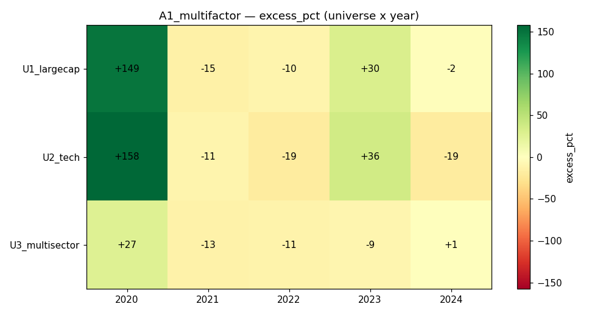

# Strategy A1 — Cross-Sectional Multi-Factor Blend

## 1. Thesis
Combine three classic, low-correlation equity factors — **momentum**,
**low volatility**, and **short-term reversal** — into one cross-sectional
z-score, hold the top quartile long, fully invested. The blend should be
steadier than any single factor.

## 2. Economic rationale
- **12–1 momentum** (Jegadeesh–Titman): winners keep winning over 3–12 months.
- **Low volatility** (Ang et al.): low-risk stocks earn higher risk-adjusted
  returns — the "low-vol anomaly."
- **Short-term reversal** (Lehmann): last-week losers bounce, so we *fade* the
  most recent 5-day move.
These pull on different horizons, so blending diversifies factor timing risk.

## 3. Signal construction
Fields: `close` (lookback 300). Helpers: `qp.zscore`, `qp.realized_vol`,
`qp.top_k`.
- momentum = close[t-21] / close[t-147] − 1
- lowvol   = −realized_vol(close, 63)
- reversal = −(close[t] / close[t-6] − 1)
- score    = z(momentum) + z(lowvol) + z(reversal)
- keep top 25% by score; weight ∝ shifted-positive score, per-name cap 20%,
  renormalised to fully invested (sum = 1).

## 4. Code
```python
import numpy as np
import quapybara as qp

MOM_LB, MOM_SKIP = 126, 21
VOL_LB = 63
REV_LB = 5
TOP_FRAC = 0.25
MAX_W = 0.20

def main(data):
    close = data["close"]
    n, T = close.shape
    if T < MOM_LB + 2:
        return np.ones(n) / n
    mom = close[:, -MOM_SKIP-1] / close[:, -MOM_LB-1] - 1.0
    lowvol = -qp.realized_vol(close, VOL_LB)
    rev = -(close[:, -1] / close[:, -REV_LB-1] - 1.0)
    z = qp.zscore(mom) + qp.zscore(lowvol) + qp.zscore(rev)
    z = np.nan_to_num(z, nan=-1e9)
    k = max(1, int(round(n * TOP_FRAC)))
    keep = qp.top_k(z, k)
    zz = np.where(keep, z, np.nan)
    zpos = np.nan_to_num(zz - np.nanmin(zz) + 1e-6, nan=0.0)
    if np.sum(zpos) <= 0:
        return np.ones(n) / n
    w = np.minimum(zpos / np.sum(zpos), MAX_W)
    s = np.sum(w)
    return w / s if s > 0 else np.ones(n) / n
```

## 5. Parameters & locking
All parameters were fixed **a priori from the factor literature** (momentum
126/21, vol 63d, reversal 5d, top quartile, equal factor weights) and then
sanity-checked once on **2019** (in-sample): Sharpe ≈ 1.0–1.3, DD 10–17% across
the three universes — plausible, so they were **frozen**. No parameter was
touched using 2020–2024 data; every test year below is genuine OOS.

## 6. Universes
- U1_largecap — 40 broad multi-sector US large-caps
- U2_tech — 30 Nasdaq-style tech/growth names
- U3_multisector — 30 sector-balanced names
Daily bars. Costs: 0 commission, 5 bps slippage. **Survivorship caveat:** tickers
are today's survivors (yfinance has no delisted names) → results are optimistic.

## 7. Walk-forward results (calendar-year OOS, signal fully warmed)
Return / (equal-weight benchmark) / excess, plus Sharpe, max-DD, turnover.

| Universe | Year | Ret% | EW% | Excess% | Sharpe | MaxDD% | Turn% |
|---|---|---|---|---|---|---|---|
| U1_largecap | 2020 | 205.0 | 56.5 | **+148.5** | 3.24 | 21.7 | 63 |
| U1_largecap | 2021 | 10.6 | 25.1 | −14.6 | 0.70 | 13.4 | 51 |
| U1_largecap | 2022 | −16.0 | −5.5 | −10.5 | −0.67 | 25.9 | 57 |
| U1_largecap | 2023 | 54.6 | 24.6 | **+30.0** | 2.49 | 13.8 | 53 |
| U1_largecap | 2024 | 9.5 | 11.7 | −2.2 | 0.59 | 13.9 | 60 |
| U2_tech | 2020 | 244.6 | 86.7 | **+157.9** | 3.25 | 24.3 | 60 |
| U2_tech | 2021 | 24.2 | 34.9 | −10.7 | 1.11 | 14.7 | 53 |
| U2_tech | 2022 | −31.6 | −13.0 | −18.6 | −1.14 | 43.1 | 55 |
| U2_tech | 2023 | 82.7 | 46.8 | **+35.9** | 3.04 | 15.1 | 55 |
| U2_tech | 2024 | −5.3 | 13.7 | −19.0 | −0.04 | 26.1 | 59 |
| U3_multisector | 2020 | 72.9 | 46.0 | **+26.9** | 1.95 | 21.6 | 61 |
| U3_multisector | 2021 | 5.5 | 18.1 | −12.5 | 0.47 | 14.4 | 55 |
| U3_multisector | 2022 | −10.5 | 0.8 | −11.3 | −0.43 | 26.4 | 53 |
| U3_multisector | 2023 | 5.3 | 13.9 | −8.7 | 0.48 | 18.1 | 52 |
| U3_multisector | 2024 | 10.2 | 9.4 | +0.8 | 0.91 | 9.1 | 62 |



## 8. Aggregate verdict
- **Mean Sharpe ≈ 1.06**, mean return ≈ 44% (dominated by 2020).
- **Excess return is positive on average but NEGATIVE in the median cell.** Of 15
  (universe × year) cells, only 5 beat equal-weight — and 3 of those are 2020/2023.
- The profile is **momentum-like**: huge in the 2020 rebound and 2023 rally,
  bleeding in the choppy/mean-reverting years 2021, 2022, 2024.
- Deflated-Sharpe (n_trials=3) stays positive only because of the 2020 tail.

## 9. Cost sensitivity
Turnover ≈ 55%/rebalance (daily rebalance). At 5 bps slippage the drag is
modest, but at realistic 15–20 bps the thin positive years (2021, 2024) would
turn negative. This strategy is **cost-sensitive** and would need a rebalance
band or lower rebalance frequency in production.

## 10. Failure modes & caveats
- **Concentration in 2020:** the whole positive expectancy rests on one
  extraordinary year; remove 2020 and the blend underperforms equal-weight.
- **Momentum crashes** (2022) hit hardest in the tech universe (−31.6%, DD 43%).
- **Survivorship bias** inflates every number.
- Daily rebalance is unrealistic; monthly would cut turnover ~20×.

## 11. Verdict — **ITERATE, do not ship as-is**
A1 is essentially a dressed-up momentum sleeve. It does not deliver the
steady all-weather edge the blend promised: it beats equal-weight only in
strong-trend years and lags in every choppy year. Keep the blend concept but
(a) neutralise the momentum dominance (→ A2 residual momentum, A5 IC-adaptive
weights), (b) add a regime filter to sidestep momentum crashes (→ A3), and
(c) slow the rebalance to control cost. Retained as the baseline the other
Phase-A strategies must beat.
