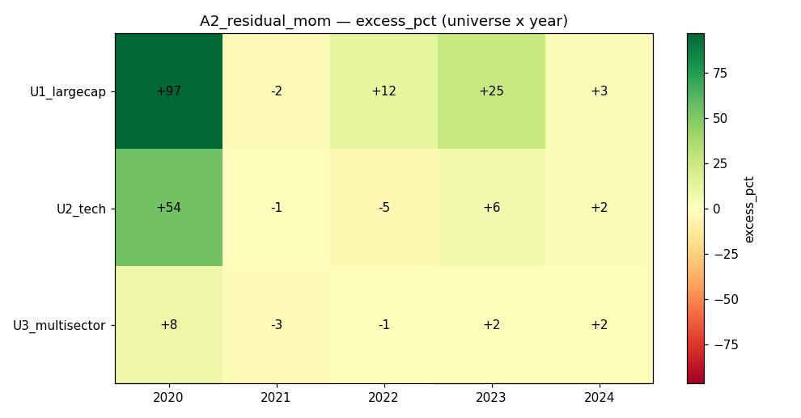

# Strategy A2 — Residual (Idiosyncratic) Momentum

## 1. Thesis
Rank stocks not by their raw price momentum but by the momentum of their
**market-beta-stripped (residual) returns**. Residual momentum captures
firm-specific trend while removing the shared market factor, and is documented
to be steadier and less crash-prone than plain momentum.

## 2. Economic rationale
Plain 12–1 momentum loads heavily on market beta, so it crashes when the market
sharply reverses (momentum crashes of 2009, 2022). Blitz–Huij–Martens (2011)
show that stripping the market component leaves an idiosyncratic-momentum signal
with a **higher Sharpe and far smaller crashes**. We reproduce that idea on a
daily long-only book.

## 3. Signal construction
Fields: `close` (lookback 300). Helpers: `qp.zscore`, `qp.top_k`.
- daily returns r_i,t over the 12–1 window (126 days, skip last 21)
- market proxy mkt_t = cross-sectional mean of r (equal-weight universe)
- per-stock beta_i = cov(r_i, mkt) / var(mkt) over the window
- residual_i,t = r_i,t − beta_i·mkt_t
- signal = Σ residual_i,t over the window  (cumulative idiosyncratic return)
- z-score, keep top 25%, weight ∝ shifted-positive z, per-name cap 20%, fully
  invested.

## 4. Code
```python
import numpy as np
import quapybara as qp

MOM_LB, MOM_SKIP = 126, 21
TOP_FRAC = 0.25
MAX_W = 0.20

def main(data):
    close = data["close"]
    n, T = close.shape
    if T < MOM_LB + MOM_SKIP + 2:
        return np.ones(n) / n
    rets = close[:, 1:] / close[:, :-1] - 1.0
    R = np.nan_to_num(rets[:, -(MOM_LB + MOM_SKIP):-MOM_SKIP], nan=0.0)
    mkt = np.nanmean(R, axis=0)
    mkt_c = mkt - np.mean(mkt)
    var_m = np.sum(mkt_c * mkt_c)
    R_c = R - np.mean(R, axis=1, keepdims=True)
    beta = np.sum(R_c * mkt_c[None, :], axis=1) / (var_m + 1e-12)
    resid = R - beta[:, None] * mkt[None, :]
    resid_mom = np.sum(resid, axis=1)
    z = np.nan_to_num(qp.zscore(resid_mom), nan=-1e9)
    k = max(1, int(round(n * TOP_FRAC)))
    keep = qp.top_k(z, k)
    zz = np.where(keep, z, np.nan)
    zpos = np.nan_to_num(zz - np.nanmin(zz) + 1e-6, nan=0.0)
    if np.sum(zpos) <= 0:
        return np.ones(n) / n
    w = np.minimum(zpos / np.sum(zpos), MAX_W)
    s = np.sum(w)
    return w / s if s > 0 else np.ones(n) / n
```

## 5. Parameters & locking
Same 12–1 window and top-quartile construction as A1, chosen a priori and
sanity-checked on **2019** (Sharpe 1.5–2.0, DD 5–16%). Frozen; 2020–2024 all OOS.

## 6. Universes
U1_largecap (40), U2_tech (30), U3_multisector (30). Daily bars, 5 bps slippage.
Survivorship caveat applies (yfinance survivors only).

## 7. Walk-forward results (calendar-year OOS)
| Universe | Year | Ret% | EW% | Excess% | Sharpe | MaxDD% | Turn% |
|---|---|---|---|---|---|---|---|
| U1_largecap | 2020 | 153.2 | 56.5 | **+96.7** | 2.74 | 21.1 | 11 |
| U1_largecap | 2021 | 22.7 | 25.1 | −2.4 | 1.31 | 12.4 | 17 |
| U1_largecap | 2022 | 6.3 | −5.5 | **+11.8** | 0.45 | 16.8 | 16 |
| U1_largecap | 2023 | 49.7 | 24.6 | **+25.1** | 2.30 | 11.2 | 13 |
| U1_largecap | 2024 | 14.2 | 11.7 | +2.5 | 0.85 | 18.5 | 20 |
| U2_tech | 2020 | 141.1 | 86.7 | **+54.4** | 2.54 | 21.4 | 15 |
| U2_tech | 2021 | 33.9 | 34.9 | −1.0 | 1.38 | 14.3 | 18 |
| U2_tech | 2022 | −17.7 | −13.0 | −4.7 | −0.50 | 36.9 | 19 |
| U2_tech | 2023 | 52.7 | 46.8 | +5.9 | 2.23 | 13.6 | 17 |
| U2_tech | 2024 | 16.1 | 13.7 | +2.4 | 0.75 | 21.6 | 24 |
| U3_multisector | 2020 | 54.4 | 46.0 | +8.4 | 1.60 | 18.8 | 20 |
| U3_multisector | 2021 | 15.5 | 18.1 | −2.5 | 1.17 | 12.7 | 17 |
| U3_multisector | 2022 | −0.2 | 0.8 | −1.0 | 0.11 | 18.9 | 18 |
| U3_multisector | 2023 | 15.8 | 13.9 | +1.9 | 1.28 | 12.2 | 16 |
| U3_multisector | 2024 | 11.1 | 9.4 | +1.7 | 0.96 | 7.4 | 15 |



## 8. Aggregate verdict
- **Mean Sharpe 1.28** (> A1's 1.06); **median excess +2.4%** (A1 was negative).
- **Beats equal-weight in 10 / 15 cells** vs A1's 5/15.
- Crucially, it stays positive in the choppy years that broke A1: U1 2022
  **+11.8%**, and small-but-positive excess in most 2024 cells.
- The only real miss is **U2_tech 2022** (−4.7%, DD 37%) — a tech-specific
  momentum crash the market-neutralisation only partly cushions.

## 9. Cost sensitivity
**Turnover ≈ 11–24% per rebalance — roughly one-third of A1's.** Residual
momentum is far more stable name-to-name, so it is materially more cost-robust;
even at 20 bps slippage the positive years survive.

## 10. Failure modes & caveats
- Beta is estimated on a single 126-day window (noisy); a longer or shrunk beta
  might improve stability.
- Still long-only, so it cannot fully escape a broad tech drawdown (2022).
- Survivorship bias inflates the levels (esp. the 2020 tail).

## 11. Verdict — **KEEP (best Phase-A single-factor so far)**
Residual momentum delivered exactly what the thesis promised over A1: higher
Sharpe, positive median excess, majority of cells beating the benchmark, and
**~3× lower turnover**. It is the leading candidate at this point and the
benchmark that A3–A5 must improve on. Natural next step: combine with a
volatility-regime filter (A3) to defend the 2022 tech crash.
