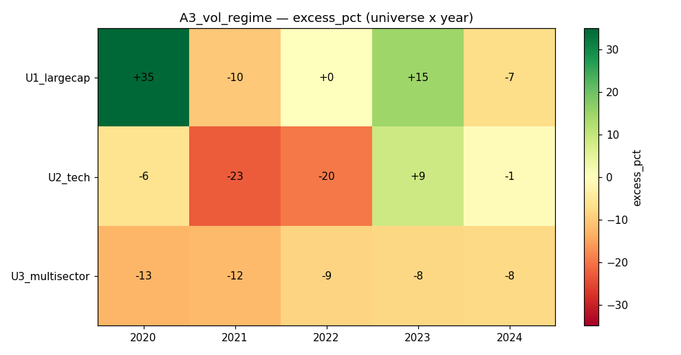

# Strategy A3 — Volatility-Regime Switch

## 1. Thesis
Run the winning residual-momentum book (A2) in **calm** markets, but switch to a
**defensive low-volatility tilt with a 50% cash buffer** when market volatility
spikes, to sidestep momentum crashes.

## 2. Economic rationale
Momentum crashes cluster in high-volatility, post-drawdown rebounds. A vol
filter that de-risks when short-horizon vol jumps above its longer-horizon
baseline should, in theory, cut the deep drawdowns while keeping most of the
calm-market upside.

## 3. Signal construction
Fields: `close`. Helpers: `qp.zscore`, `qp.top_k`, `qp.realized_vol`.
- market proxy = equal-weight universe daily return
- regime: `std(mkt[-20:]) > 1.2 · std(mkt[-100:])` ⇒ **STRESS**, else **CALM**
- CALM  → A2 residual momentum, fully invested
- STRESS → rank by −realized_vol(100d), top quartile, **50% invested** (cash buffer)

## 4. Code
```python
import numpy as np
import quapybara as qp

MOM_LB, MOM_SKIP = 126, 21
VOL_SHORT, VOL_LONG = 20, 100
STRESS_MULT = 1.2
STRESS_EXPOSURE = 0.5
TOP_FRAC = 0.25
MAX_W = 0.20

def _fully_invested(z, n):
    k = max(1, int(round(n * TOP_FRAC)))
    keep = qp.top_k(z, k)
    zz = np.where(keep, z, np.nan)
    zpos = np.nan_to_num(zz - np.nanmin(zz) + 1e-6, nan=0.0)
    if np.sum(zpos) <= 0:
        return np.ones(n) / n
    w = np.minimum(zpos / np.sum(zpos), MAX_W)
    s = np.sum(w)
    return w / s if s > 0 else np.ones(n) / n

def main(data):
    close = data["close"]
    n, T = close.shape
    if T < MOM_LB + MOM_SKIP + 2:
        return np.ones(n) / n
    rets = close[:, 1:] / close[:, :-1] - 1.0
    mkt_full = np.nan_to_num(np.nanmean(rets, axis=0), nan=0.0)
    stress = np.std(mkt_full[-VOL_SHORT:]) > STRESS_MULT * np.std(mkt_full[-VOL_LONG:])
    if not stress:
        R = np.nan_to_num(rets[:, -(MOM_LB + MOM_SKIP):-MOM_SKIP], nan=0.0)
        mkt = np.nanmean(R, axis=0)
        mkt_c = mkt - np.mean(mkt)
        var_m = np.sum(mkt_c * mkt_c)
        R_c = R - np.mean(R, axis=1, keepdims=True)
        beta = np.sum(R_c * mkt_c[None, :], axis=1) / (var_m + 1e-12)
        resid_mom = np.sum(R - beta[:, None] * mkt[None, :], axis=1)
        return _fully_invested(np.nan_to_num(qp.zscore(resid_mom), nan=-1e9), n)
    rv = qp.realized_vol(close, VOL_LONG)
    return _fully_invested(np.nan_to_num(qp.zscore(-rv), nan=-1e9), n) * STRESS_EXPOSURE
```

## 5. Parameters & locking
Vol windows 20/100, stress multiplier 1.2, stress exposure 0.5 — chosen a priori,
sanity-checked on 2019 (mixed: Sharpe 0.4–1.9). Frozen; 2020–2024 all OOS.

## 6. Universes
U1_largecap (40), U2_tech (30), U3_multisector (30). Daily, 5 bps slippage.
Survivorship caveat applies.

## 7. Walk-forward results (calendar-year OOS)
| Universe | Year | Ret% | EW% | Excess% | Sharpe | MaxDD% | Turn% |
|---|---|---|---|---|---|---|---|
| U1_largecap | 2020 | 91.4 | 56.5 | **+34.9** | 2.55 | 15.8 | 10 |
| U1_largecap | 2021 | 15.0 | 25.1 | −10.2 | 1.09 | 10.9 | 16 |
| U1_largecap | 2022 | −5.5 | −5.5 | +0.0 | −0.25 | 18.0 | 17 |
| U1_largecap | 2023 | 39.3 | 24.6 | **+14.7** | 1.96 | 11.2 | 14 |
| U1_largecap | 2024 | 4.5 | 11.7 | −7.2 | 0.38 | 16.9 | 18 |
| U2_tech | 2020 | 80.6 | 86.7 | −6.1 | 2.31 | 17.2 | 14 |
| U2_tech | 2021 | 12.1 | 34.9 | −22.9 | 0.76 | 13.6 | 16 |
| U2_tech | 2022 | −32.5 | −13.0 | −19.6 | −1.40 | 38.6 | 21 |
| U2_tech | 2023 | 55.3 | 46.8 | +8.5 | 2.32 | 13.6 | 18 |
| U2_tech | 2024 | 13.1 | 13.7 | −0.7 | 0.71 | 20.6 | 20 |
| U3_multisector | 2020 | 33.4 | 46.0 | −12.6 | 1.89 | 11.2 | 17 |
| U3_multisector | 2021 | 5.9 | 18.1 | −12.2 | 0.53 | 12.7 | 17 |
| U3_multisector | 2022 | −7.9 | 0.8 | −8.7 | −0.45 | 19.1 | 17 |
| U3_multisector | 2023 | 5.8 | 13.9 | −8.1 | 0.56 | 12.2 | 16 |
| U3_multisector | 2024 | 1.8 | 9.4 | −7.7 | 0.22 | 7.8 | 15 |



## 8. Aggregate verdict
- **Mean Sharpe 0.88** (< A2's 1.28), **mean excess −3.8%, median −7.7%**.
- **Beats equal-weight in only 3 / 15 cells** — a clear regression from A2 (10/15).
- The filter did NOT protect the worst case: **U2_tech 2022 got *worse*
  (−32.5%, DD 38.6%)** than plain A2 (−17.7%). The 20/100 vol ratio flips to
  "stress" *after* the drop, so it de-risks into the bottom and then, still
  half-invested in low-vol names, misses the rebound.

## 9. Cost sensitivity
Turnover ≈ 10–21%/rebalance, similar to A2. Cost is not the problem — the signal
timing is.

## 10. Failure modes & caveats
- **Regime lag:** realized-vol regimes are backward-looking; the switch fires
  late, locking in losses and missing recoveries — the classic whipsaw.
- Halving exposure in "stress" throttled the very rebounds (2020, 2021) that
  drive momentum's edge.
- Survivorship bias applies.

## 11. Verdict — **DISCARD**
Naive volatility-regime switching *subtracts* value from a good momentum signal:
it lags the turns, whipsaws, and even deepens the tech-2022 crash it was designed
to avoid. The lesson for the project: **crash protection needs a forward-looking
or faster signal (or an options/short overlay), not a lagging realized-vol
switch.** A2 remains the Phase-A leader; A3's exposure-throttling idea is
abandoned. The adaptive route (A5, weighting factors by recent IC) is the more
promising way to add robustness.
