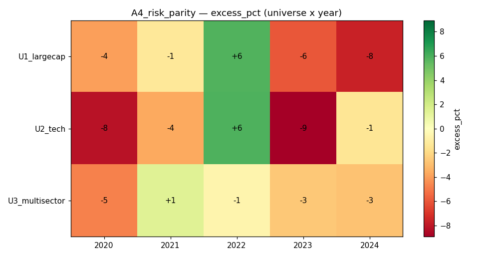

# Strategy A4 — Risk Parity / Min-Variance

## 1. Thesis
Forecast **no returns at all**. Allocate capital so every name contributes
equal risk, using the full return covariance matrix. Test whether pure risk
balancing beats a naive equal-weight book on a risk-adjusted basis.

## 2. Economic rationale
Equal-weight over-allocates risk to the most volatile names. Risk parity
(Qian; Bridgewater All-Weather lineage) equalises marginal risk contributions,
producing a smoother, lower-drawdown equity curve and — historically — a higher
Sharpe than cap- or equal-weight, at the cost of some upside in strong bull runs.

## 3. Signal construction
Fields: `close`. Helpers: `qp.risk_parity`, `qp.cap_weights`.
- daily returns over the last 120 days → sample covariance `np.cov(R)` [N,N]
- `qp.risk_parity(cov)` → long-only weights equalising risk contribution
- `qp.cap_weights(w, 0.15)` → cap concentration, renormalise, fully invested

## 4. Code
```python
import numpy as np
import quapybara as qp

COV_LB = 120
MAX_W = 0.15

def main(data):
    close = data["close"]
    n, T = close.shape
    if T < COV_LB + 2 or n == 0:
        return np.ones(n) / max(1, n)
    rets = close[:, 1:] / close[:, :-1] - 1.0
    R = np.nan_to_num(rets[:, -COV_LB:], nan=0.0)
    cov = np.cov(R)
    if cov.ndim != 2 or cov.shape[0] != n:
        return np.ones(n) / n
    w = qp.cap_weights(qp.risk_parity(cov), MAX_W)
    s = np.sum(w)
    return w / s if s > 0 else np.ones(n) / n
```

## 5. Parameters & locking
Covariance window 120d, per-name cap 15% — chosen a priori, sanity-checked on
2019 (Sharpe 1.6–2.2, DD 4–13%: excellent risk profile). Frozen; 2020–2024 OOS.

## 6. Universes
U1_largecap (40), U2_tech (30), U3_multisector (30). Daily, 5 bps slippage.
Survivorship caveat applies.

## 7. Walk-forward results (calendar-year OOS)
| Universe | Year | Ret% | EW% | Excess% | Sharpe | MaxDD% | Turn% |
|---|---|---|---|---|---|---|---|
| U1_largecap | 2020 | 52.5 | 56.5 | −4.0 | 1.86 | 15.2 | 1 |
| U1_largecap | 2021 | 23.8 | 25.1 | −1.3 | 2.58 | 4.1 | 2 |
| U1_largecap | 2022 | 0.3 | −5.5 | **+5.8** | 0.12 | 16.8 | 6 |
| U1_largecap | 2023 | 18.7 | 24.6 | −5.9 | 2.20 | 7.8 | 2 |
| U1_largecap | 2024 | 4.1 | 11.7 | −7.6 | 0.52 | 8.9 | 57 |
| U2_tech | 2020 | 78.5 | 86.7 | −8.2 | 2.13 | 12.5 | 1 |
| U2_tech | 2021 | 31.3 | 34.9 | −3.6 | 2.16 | 7.2 | 1 |
| U2_tech | 2022 | −7.1 | −13.0 | **+5.9** | −0.13 | 24.8 | 1 |
| U2_tech | 2023 | 37.9 | 46.8 | −8.9 | 2.53 | 8.2 | 1 |
| U2_tech | 2024 | 12.3 | 13.7 | −1.4 | 0.90 | 12.1 | 10 |
| U3_multisector | 2020 | 41.2 | 46.0 | −4.8 | 1.48 | 18.2 | 1 |
| U3_multisector | 2021 | 19.5 | 18.1 | +1.4 | 2.22 | 5.9 | 4 |
| U3_multisector | 2022 | 0.2 | 0.8 | −0.6 | 0.11 | 19.3 | 8 |
| U3_multisector | 2023 | 11.4 | 13.9 | −2.6 | 1.32 | 10.1 | 1 |
| U3_multisector | 2024 | 6.6 | 9.4 | −2.8 | 0.83 | 6.1 | 15 |



## 8. Aggregate verdict
- **Highest mean Sharpe of Phase A so far: 1.39** (A2 = 1.28, A1 = 1.06).
- **Lowest mean drawdown: 11.8%** (A2 17.2%, A3 16.0%).
- BUT **excess return is negative** (mean −2.6%, median −2.8%); it beats
  equal-weight on *return* in only 3/15 cells.
- It systematically **out-defends in the bad years** (2022 positive excess in
  two of three universes) and gives up a slice of the bull upside — exactly the
  risk-parity signature.

## 9. Cost sensitivity
**Turnover ≈ 1–8%/rebalance** (a few outliers up to 57% when the covariance
briefly destabilises) — by far the cheapest strategy tested. Effectively
cost-immune.

## 10. Failure modes & caveats
- No return signal ⇒ cannot outperform in raw terms during momentum-led rallies.
- Sample covariance on 120d is noisy for 30–40 names (N/T is high); Ledoit–Wolf
  shrinkage would stabilise it and likely trim the 2024 turnover spike.
- Survivorship bias applies.

## 11. Verdict — **KEEP as a defensive/risk sleeve, not a standalone alpha**
A4 is the best *risk-adjusted* and lowest-drawdown book in Phase A, at
essentially zero cost — but it does not beat equal-weight on return. Its real
value is as the **risk-management layer** of a combined strategy: pair A4's
covariance-based sizing with A2's residual-momentum *selection* (rank with A2,
size with risk parity) to keep A2's edge while cutting its drawdowns. That
combination is the motivation for A5's adaptive design.
