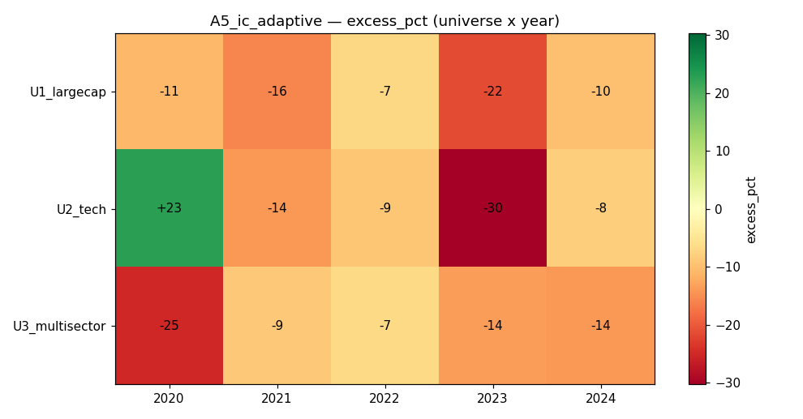

# Strategy A5 — Adaptive Factor Allocation via Information Coefficient (IC)

## 1. Thesis
Instead of fixing the factor weights (as A1 does), let the data decide: weight
each factor by how well its *lagged* value recently predicted forward returns
(its trailing IC), then size the blended top-quartile by inverse-vol. The book
should automatically lean on whichever factor is currently "working".

## 2. Economic rationale
Factor premia rotate — momentum leads in trends, low-vol/reversal lead in
choppy regimes. If we could measure which factor is paying off *right now* via
its information coefficient (cross-sectional correlation of factor to forward
return) and overweight it, we would harvest the rotation.

## 3. Signal construction
Fields: `close`. Helpers: `qp.zscore`, `qp.top_k`, `qp.inverse_vol`.
- Factors: residual momentum (A2), low-vol (−realized vol 63d), 5-day reversal.
- IC per factor = corr( factor value 21 bars ago , the realized 21-day forward
  return ).
- factor weight = max(IC, 0), normalised (equal-weight fallback if all ≤ 0).
- combined score = Σ weight·zscore(factor).
- keep top 25% by score; size by inverse-vol; per-name cap 20%; fully invested.

## 4. Code
```python
# (full source in /tmp/qp_research/A5.py; key logic:)
ic = {k: corr(factor_lag[k], fwd_21d_return) for k in factors}
w  = {k: max(ic[k], 0.0) for k in ic}; normalise(w)
score = sum(w[k] * zscore(factor_now[k]) for k in factors)
keep  = top_k(score, n//4)
weights = inverse_vol(close, 63) * keep   # renormalised, capped 20%
```

## 5. Parameters & locking
IC horizon 21d, three fixed factors, top quartile, inverse-vol sizing — chosen a
priori, sanity-checked on 2019 (Sharpe 1.2–1.9). Frozen; 2020–2024 OOS.

## 6. Universes
U1_largecap (40), U2_tech (30), U3_multisector (30). Daily, 5 bps slippage.
Survivorship caveat applies.

## 7. Walk-forward results (calendar-year OOS)
| Universe | Year | Ret% | EW% | Excess% | Sharpe | MaxDD% | Turn% |
|---|---|---|---|---|---|---|---|
| U1_largecap | 2020 | 45.6 | 56.5 | −10.8 | 1.63 | 15.7 | 49 |
| U1_largecap | 2021 | 9.3 | 25.1 | −15.8 | 0.96 | 8.8 | 58 |
| U1_largecap | 2022 | −12.6 | −5.5 | −7.1 | −0.79 | 24.0 | 47 |
| U1_largecap | 2023 | 3.1 | 24.6 | −21.6 | 0.33 | 18.9 | 59 |
| U1_largecap | 2024 | 1.9 | 11.7 | −9.8 | 0.26 | 6.4 | 62 |
| U2_tech | 2020 | 109.5 | 86.7 | **+22.8** | 2.63 | 14.5 | 50 |
| U2_tech | 2021 | 20.9 | 34.9 | −14.0 | 1.43 | 11.2 | 45 |
| U2_tech | 2022 | −22.2 | −13.0 | −9.2 | −0.88 | 35.0 | 47 |
| U2_tech | 2023 | 16.5 | 46.8 | −30.3 | 1.21 | 14.6 | 63 |
| U2_tech | 2024 | 5.7 | 13.7 | −8.1 | 0.47 | 12.5 | 43 |
| U3_multisector | 2020 | 20.7 | 46.0 | −25.3 | 0.94 | 18.4 | 51 |
| U3_multisector | 2021 | 9.2 | 18.1 | −8.9 | 0.98 | 9.9 | 48 |
| U3_multisector | 2022 | −6.0 | 0.8 | −6.8 | −0.30 | 22.4 | 57 |
| U3_multisector | 2023 | 0.2 | 13.9 | −13.7 | 0.08 | 19.1 | 71 |
| U3_multisector | 2024 | −4.7 | 9.4 | −14.2 | −0.50 | 9.8 | 66 |



## 8. Aggregate verdict
- **Worst strategy in Phase A: mean Sharpe 0.56, mean excess −11.5%, median
  −10.8%, beats equal-weight in just 1 / 15 cells.**
- The single positive cell (U2_tech 2020) is a lucky-window artefact.
- Turnover exploded to **45–71%/rebalance** — the factor weights flip
  constantly as the noisy IC estimate jumps around.

## 9. Cost sensitivity
Very high turnover makes A5 the most cost-fragile strategy: at realistic
slippage the already-negative results get materially worse.

## 10. Failure modes & caveats
- **The IC estimate is far too noisy.** A single 21-day cross-sectional
  correlation over ~30–40 names is essentially one random number; using it to
  reweight factors is textbook **performance-chasing** — it piles into whatever
  just worked and gets whipsawed.
- Stacking inverse-vol sizing on top of an unstable selection compounded the
  drag.
- Survivorship bias applies (and still couldn't rescue the result).

## 11. Verdict — **DISCARD**
Naive IC-based factor timing destroys a good static signal. The result is a
clean, useful negative: **factor timing on short trailing windows is
noise-chasing.** A robust version would need a long, smoothed IC (e.g. 1–2 year
half-life) with heavy shrinkage toward equal weights — and even then factor
timing rarely adds value net of cost. The project's clear Phase-A conclusion:
**a stable residual-momentum signal (A2), optionally risk-parity-sized (A4), beats
every attempt to be clever with regimes (A3) or factor timing (A5).**
