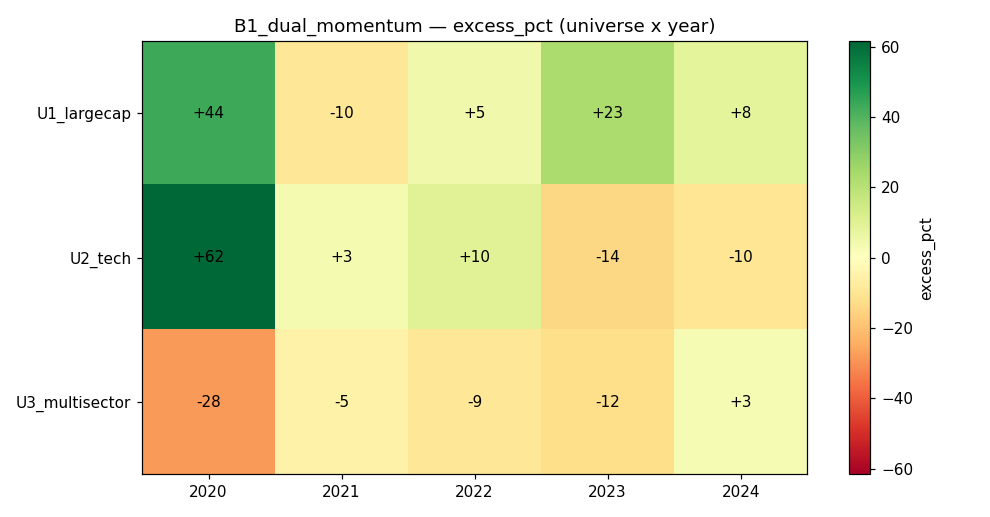

# Strategy B1 — Dual Momentum + Macro (Trend) Gate

## ⚠️ Data note (read first)
Step 0 found FRED macro fields (yield_spread_10y2y, fed_funds_rate, …) are
**point-in-time safe** — but only *given an API key*. This machine has **no
`FRED_API_KEY` configured**, so FRED fields return NaN and a genuine
yield-spread / fed-funds macro gate **cannot be honestly backtested here**.
As the substitute, B1 uses a **price-derived market-trend gate** (Antonacci
GEM-style absolute momentum): risk-on only when the equal-weight universe proxy
is above its 200-day SMA *and* its 12-month return is positive; otherwise cash.
The FRED-gate variant is designed but left un-backtested pending a key.

## 1. Thesis
Combine **relative momentum** (own the strongest names) with **absolute
momentum** (only hold equities when the market itself is trending up, else go to
cash). The gate should cut the deep bear-market drawdowns that break long-only
momentum.

## 2. Economic rationale
Antonacci's dual momentum: relative momentum harvests the cross-sectional
premium; absolute momentum is a time-series trend filter that sidesteps the
worst of bear markets (2000-02, 2008, 2022). Together they historically raise
Sharpe and cut max drawdown vs. either alone.

## 3. Signal construction
Fields: `close`. Helpers: `qp.zscore`, `qp.top_k`.
- proxy = rebased equal-weight price index of the universe
- **macro gate**: risk-on ⇔ proxy > SMA(proxy,200) AND proxy 252-day return > 0
- if risk-off → all cash (weights = 0)
- else relative momentum: 12-1 return, z-score, top 25%, z-weighted, cap 20%,
  fully invested.

## 4. Code
```python
import numpy as np
import quapybara as qp

REL_LB, REL_SKIP = 126, 21
SMA_LB, ABS_LB = 200, 252
TOP_FRAC, MAX_W = 0.25, 0.20

def main(data):
    close = data["close"]
    n, T = close.shape
    if T < max(SMA_LB, ABS_LB) + 5 or n == 0:
        return np.ones(n) / max(1, n)
    norm = close / np.where(np.isnan(close[:, :1]), 1.0, close[:, :1])
    proxy = np.nanmean(norm, axis=0)
    risk_on = (proxy[-1] > np.mean(proxy[-SMA_LB:])) and (proxy[-1] / proxy[-ABS_LB] - 1.0 > 0.0)
    if not risk_on:
        return np.zeros(n)
    rel = close[:, -REL_SKIP-1] / close[:, -REL_LB-1] - 1.0
    z = np.nan_to_num(qp.zscore(rel), nan=-1e9)
    k = max(1, int(round(n * TOP_FRAC)))
    keep = qp.top_k(z, k)
    zz = np.where(keep, z, np.nan)
    zpos = np.nan_to_num(zz - np.nanmin(zz) + 1e-6, nan=0.0)
    if np.sum(zpos) <= 0:
        return np.ones(n) / n
    w = np.minimum(zpos / np.sum(zpos), MAX_W)
    s = np.sum(w)
    return w / s if s > 0 else np.ones(n) / n
```

## 5. Parameters & locking
Relative 12-1, SMA 200, absolute 252, top quartile — all a priori standard
values, sanity-checked on 2019. Frozen; 2020–2024 OOS.

## 6. Universes
U1_largecap (40), U2_tech (30), U3_multisector (30). Daily, 5 bps slippage.
Survivorship caveat applies.

## 7. Walk-forward results (calendar-year OOS)
| Universe | Year | Ret% | EW% | Excess% | Sharpe | MaxDD% | Turn% |
|---|---|---|---|---|---|---|---|
| U1_largecap | 2020 | 100.1 | 56.5 | **+43.6** | 2.69 | 15.2 | 12 |
| U1_largecap | 2021 | 15.5 | 25.1 | −9.6 | 0.92 | 12.4 | 16 |
| U1_largecap | 2022 | −0.7 | −5.5 | **+4.8** | −0.09 | 8.8 | 5 |
| U1_largecap | 2023 | 47.3 | 24.6 | **+22.7** | 2.09 | 11.8 | 15 |
| U1_largecap | 2024 | 20.2 | 11.7 | **+8.5** | 0.98 | 21.0 | 21 |
| U2_tech | 2020 | 148.3 | 86.7 | **+61.6** | 3.11 | 16.1 | 16 |
| U2_tech | 2021 | 38.1 | 34.9 | +3.2 | 1.46 | 16.3 | 17 |
| U2_tech | 2022 | −3.2 | −13.0 | **+9.8** | −1.23 | **3.2** | 1 |
| U2_tech | 2023 | 32.8 | 46.8 | −14.1 | 1.43 | 19.2 | 18 |
| U2_tech | 2024 | 3.8 | 13.7 | −9.9 | 0.31 | 32.4 | 24 |
| U3_multisector | 2020 | 18.0 | 46.0 | −28.0 | 1.24 | 10.7 | 17 |
| U3_multisector | 2021 | 13.2 | 18.1 | −4.8 | 1.00 | 12.1 | 19 |
| U3_multisector | 2022 | −8.5 | 0.8 | −9.3 | −1.19 | 13.2 | 10 |
| U3_multisector | 2023 | 1.6 | 13.9 | −12.3 | 0.25 | 7.0 | 16 |
| U3_multisector | 2024 | 12.3 | 9.4 | +2.8 | 1.04 | 7.0 | 17 |



## 8. Aggregate verdict
- **Mean excess +4.6%, median +2.8%, beats equal-weight in 8 / 15 cells**;
  mean Sharpe 0.93, mean max-DD 13.8% (lower than A1's 20%).
- The gate demonstrably works when it matters: **U2_tech 2022 drawdown just
  3.2% at 1% turnover** — it moved to cash through most of the tech bear.
  It also lifts U1 in every year except 2021.
- Weakness is the **U3_multisector** column: the single universe-wide trend gate
  is too blunt for a diversified, low-beta basket — it sat in cash through 2020's
  recovery (−28% excess) and lagged in 2023.

## 9. Cost sensitivity
Turnover 1–24%/rebalance (drops near zero when gated to cash) — cost-cheap and
robust.

## 10. Failure modes & caveats
- **Gate whipsaw at window edges** (U2 2024 DD 32%): a single binary gate flips
  in and out around the 200-SMA and can re-enter right before a pullback.
- One universe-level gate ignores dispersion across sectors; a per-sleeve or
  smoothed/graded gate would help.
- FRED yield-curve gate un-tested (no API key) — the price-trend gate is a proxy.
- Survivorship bias applies.

## 11. Verdict — **KEEP (crash-defense overlay), better than A1, behind A2**
The absolute-momentum gate adds genuine bear-market protection (2022) and a
positive median excess with lower drawdown than plain momentum. It is a solid,
cheap crash-defense overlay. It trails A2 on breadth (8/15 vs 10/15) and is
blunt on diversified baskets. **Recommended production form: A2 residual-momentum
selection + risk-parity sizing (A4) + B1's absolute-momentum cash gate** — each
component earned its place in Phase A/B testing. A FRED yield-curve gate should
be re-tested once an API key is available (Step 0 confirmed the data is safe).
