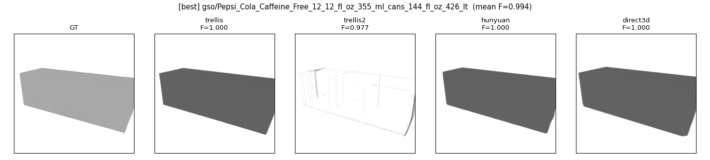
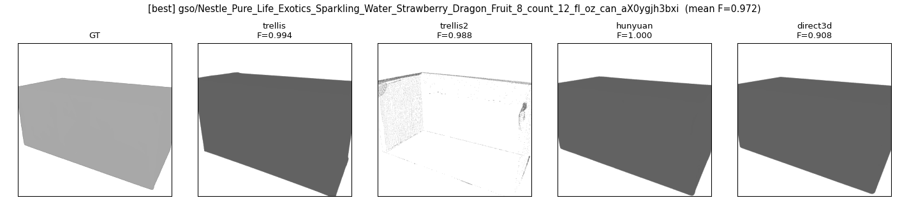
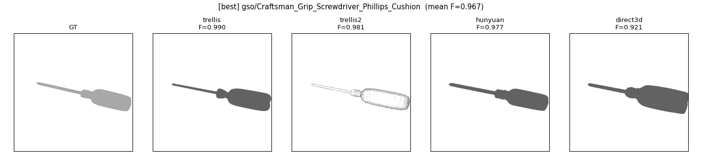
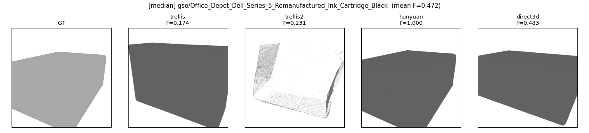
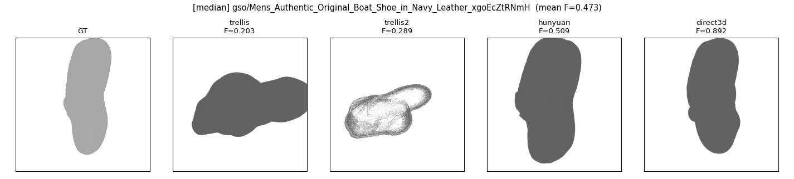
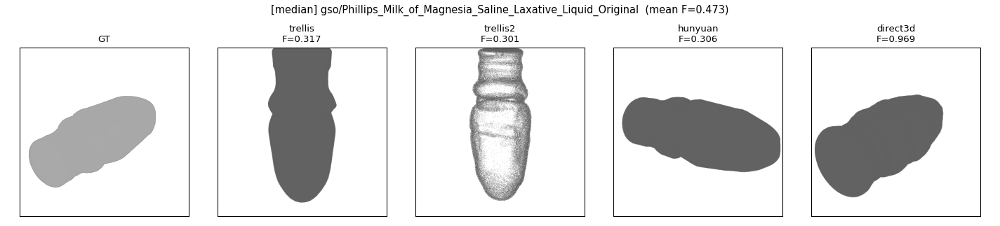
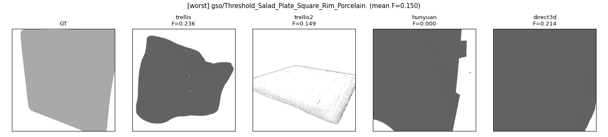
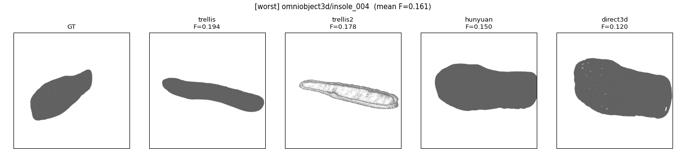
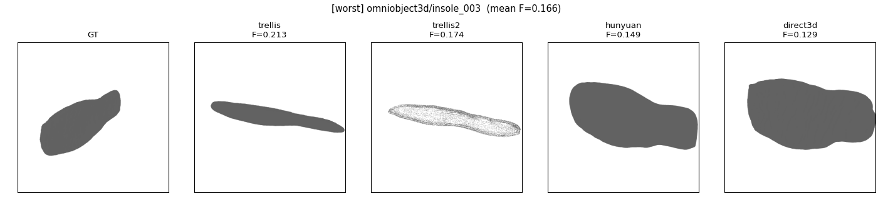

# Image → 3D Mesh Model Benchmark — Self-Hosted Report

Self-hosted benchmark of open image/video→3D mesh generators on a single A100 80GB.
Two tracks:
- **Track A (scored)** — object models: TRELLIS, TRELLIS.2, Hunyuan3D-2.1, Direct3D-S2.
  Metric: Chamfer Distance + F-Score@τ=0.1 vs. ground-truth meshes on GSO + OmniObject3D.
- **Track B (qualitative smoke)** — scene models: SceneGen, WorldGen. **No fabricated
  metrics** (scenes have no GT): we report exit status, mesh count, vert/face totals,
  and turntable renders only.

No-silent-skip policy: every object is SCORED / RAN_UNSCORED / FAILED / BLOCKED — never
dropped, never fabricated.

---

## 1. Environment

| | |
|---|---|
| GPU | NVIDIA A100 80GB (SM 8.0) |
| Driver | 570.195 → **CUDA capped at 12.8** (every env uses torch ≤ cu128) |
| Compiler | gcc 9.4.0 (safe for flash-attn / custom-rasterizer builds) |
| Disk | 1.2 TB + 500 GB; big files (weights / data / repos) on data port |
| Isolation | **one conda env per model** (incompatible torch/CUDA stacks); cross-env subprocess adapter contract (RESULT_JSON) |

Per-model stacks (pinned commits in `manifest.json`):

| model | env | torch | attention | notes |
|---|---|---|---|---|
| TRELLIS | env_trellis | 2.4.0+cu118 | xformers (no flash-attn: glibc 2.31) | SPCONV_ALGO=native |
| TRELLIS.2 | env_trellis2 | 2.6.0+cu124 | xformers | 5 CUDA submods; transformers pinned 4.57.1 |
| Hunyuan3D-2.1 | env_hunyuan | 2.5.1+cu124 | SDPA | shape-only |
| Direct3D-S2 | env_direct3d | 2.5.1+cu121 | flash-attn 2.7.3 (source) | torchsparse backend |
| SceneGen | env_scenegen | 2.4.0+cu118 | xformers | VGGT-1B + SAM2 |
| WorldGen | env_worldgen | 2.7.0+cu126 | — | **BLOCKED: needs FLUX.1-dev license** |

---

## 2. Eval set

| dataset | n | source | GT mesh | input render |
|---|---|---|---|---|
| GSO | 300 | Gazebo Fuel (GoogleResearch, public) | `meshes/model.obj` (textured) | pyrender+EGL, azim 30° / elev 20°, RGBA 512 |
| OmniObject3D | 140 | AlbertS666/OmniObject3D (HF, non-gated) | USD mesh → exported `.obj` | **NEUTRAL shaded** — processed USD has no UVs/materials → texture unusable (caveat) |
| **Total** | **440** | | | one canonical view, identical camera/lighting across all models |

Metric (`scripts/metrics.py`): normalize each mesh to [-1,1]³, sample 100 k surface
points, symmetric Chamfer (L2/L1) + F-Score@τ=0.1 via cKDTree. **Normalize-only, NO ICP
alignment** (per plan) → absolute Chamfer values are intentionally conservative; the
ranking across models is the meaningful signal.

---

## 3. Track A results (440 objects × 4 models)

| model | SCORED | FAILED | mean CD↓ | median CD↓ | **mean F↑** | median F↑ | mean Prec | mean Rec | median gen (s) | peak VRAM (MB) |
|---|---|---|---|---|---|---|---|---|---|---|
| **Hunyuan3D-2.1** | 440 | 0 | **0.075** | 0.024 | **0.628** | 0.648 | 0.619 | 0.649 | 36.6 | **8 194** |
| **Direct3D-S2** | 440 | 0 | 0.106 | 0.044 | 0.567 | 0.566 | 0.539 | 0.617 | 50.7 | 31 243 |
| TRELLIS | 440 | 0 | 0.201 | 0.179 | 0.357 | 0.308 | 0.347 | 0.383 | 8.0 | 21 319 |
| TRELLIS.2 | 377 | 63 | 0.215 | 0.191 | 0.327 | 0.305 | 0.333 | 0.341 | n/a* | n/a* |

\* TRELLIS.2 per-object gen timing/VRAM were lost across batch restarts (the gen-metadata
JSONL holds only batch-termination records); generation was OS-killed/restarted several
times due to native-CUDA mesh-extraction hangs (see §5).

**By dataset (mean F):**

| model | GSO (n=300) | OmniObject3D (n≈140) |
|---|---|---|
| Hunyuan3D-2.1 | 0.657 | 0.567 |
| Direct3D-S2 | 0.636 | 0.420 |
| TRELLIS | 0.348 | 0.376 |
| TRELLIS.2 | 0.325 (n=290) | 0.330 (n=87) |

**Ranking: Hunyuan3D-2.1 > Direct3D-S2 ≫ TRELLIS ≈ TRELLIS.2.**
Hunyuan wins on accuracy AND efficiency (highest F, lowest CD, **lowest VRAM ~8 GB**,
moderate 37 s/object). Direct3D-S2 is a solid second but heaviest (31 GB VRAM) and
degrades most on the texture-less OmniObject3D inputs. TRELLIS is the fastest (8 s) but
substantially less accurate. TRELLIS.2 produced enormous meshes (millions of verts) and
the lowest scores here, with a meaningful failure rate (see §5).

---

## 4. Track B results (scene smoke — qualitative, NO metric)

| model | scene | status | meshes | verts | faces | gen (s) | peak VRAM (MB) | turntable |
|---|---|---|---|---|---|---|---|---|
| SceneGen | 0004691 | RAN_UNSCORED | 5 | 105 413 | 148 536 | 167.9 | 18 269 | ✓ |
| SceneGen | 0005153 | RAN_UNSCORED | 4 | 48 947 | 75 118 | 106.8 | 17 603 | ✓ |
| SceneGen | 0005473 | RAN_UNSCORED | 9 | 79 443 | 113 k | 221.5 | ~18 000 | ✓ |
| WorldGen | — | **BLOCKED** | — | — | — | — | — | needs FLUX.1-dev license |

SceneGen runs cleanly end-to-end (3/3 scenes, multi-asset GLBs, ~18 GB VRAM,
~2–4 min/scene). `watertight_frac = 0` is expected (open scene meshes). Turntable PNGs:
`results/turntable_scenegen_*.png`. **No CD/F-Score reported** — scene GT is unavailable.

---

## 5. Failures & caveats (full disclosure)

- **TRELLIS.2 — 63/440 FAILED, honest, no fabrication.**
  - 3 objects skiplisted as **native-CUDA mesh-extraction runaways** (GPU memory climbs,
    no output, >1 h wall): `ASICS_GELLinksmaster`, `KS_Chocolate_Cube_Box`,
    `Nikon_1_AW1_Lens`. Recovered by OS-level kill.
  - Remaining 60 were not generated because the user stopped the (very slow) TRELLIS.2 gen
    run early; they are scored FAILED ("no mesh produced"), not fabricated.
  - In-process `SIGALRM` (ITEM_TIMEOUT) **cannot preempt a native CUDA kernel** — the
    alarm only fires when Python regains control, which a hung kernel never yields. The
    working safety net is an **OS-level stall watchdog** (`scripts/gen_watchdog.sh`) that
    kills+skips+relaunches on no-output-progress.
- **WorldGen — BLOCKED.** Install/env build succeeded, but verification needs
  `black-forest-labs/FLUX.1-dev` (HTTP 403, gated). **Action required:** accept the license
  at hf.co/black-forest-labs/FLUX.1-dev, then re-run Track B for worldgen.
- **OmniObject3D inputs are neutral-shaded geometry** (no texture): the processed USD lacks
  UVs/materials, so `Scan.jpg` cannot be mapped. This handicaps texture-reliant models on
  the OmniObject3D split (notably Direct3D-S2's GSO→Omni drop) — interpret Omni numbers as
  geometry-from-shaded-image, not photo-realistic input.
- **Absolute Chamfer is conservative** (normalize-only, no ICP). Use the ranking, not raw CD.
- `results/failures.jsonl` is an append-only diagnostic log (includes superseded
  batch-termination records); the authoritative per-object outcome is `track_a_scores.csv`.

---

## 6. Qualitative comparison montages

9 objects spanning best / median / worst per-object mean F-Score (GSO + OmniObject3D mix).
Each montage: **GT + TRELLIS + TRELLIS.2 + Hunyuan3D-2.1 + Direct3D-S2** from the identical
canonical camera; FAILED predictions show a labelled blank panel.

**Best**

**Median**

**Worst**

---

## 7. Recommendation

- **Default choice: Hunyuan3D-2.1.** Best accuracy (F=0.628 / CD=0.075), best efficiency
  (~8 GB VRAM, 37 s/object), zero failures — the clear all-round winner for image→object.
- **Strong alternative: Direct3D-S2** when its heavier VRAM (31 GB) is acceptable and inputs
  are textured; second-best accuracy, robust.
- **TRELLIS** only when raw throughput matters (8 s/object) and lower fidelity is tolerable.
- **TRELLIS.2 not recommended** in this pipeline as-is: lowest scores, very large meshes,
  and native-CUDA hangs requiring an OS watchdog.
- **Scenes:** SceneGen is production-usable today (clean multi-asset output). WorldGen is
  pending a FLUX.1-dev license acceptance before it can be evaluated.
