# Full-pipeline phase composites (bracket_v01..v20)

Each composite shows the case run through the full Origami_Gen pipeline at `resolution=2.0`:

* Row 1: P1 parse · P2 topology · P3 fold · P4 mesh
* Row 2: P5 stitch · P6 mapper · P7 dihedral · P8 fillet
* Row 3: P9 propagate · P10 bump+cut · verdict · (blank)

Source verification dir: `verification/<case>/` (10 per-phase PNGs + verdict.txt) — produced by `scripts/verify_visualize.py --resolution 2.0`.

## `bracket_v01`

## `bracket_v02`

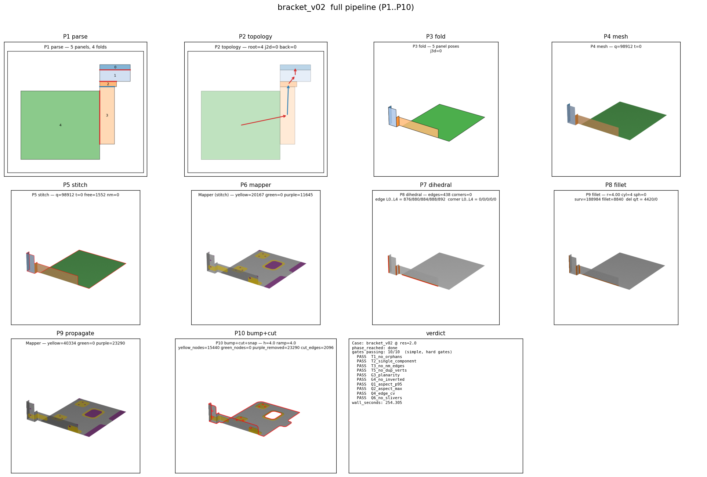

## `bracket_v03`

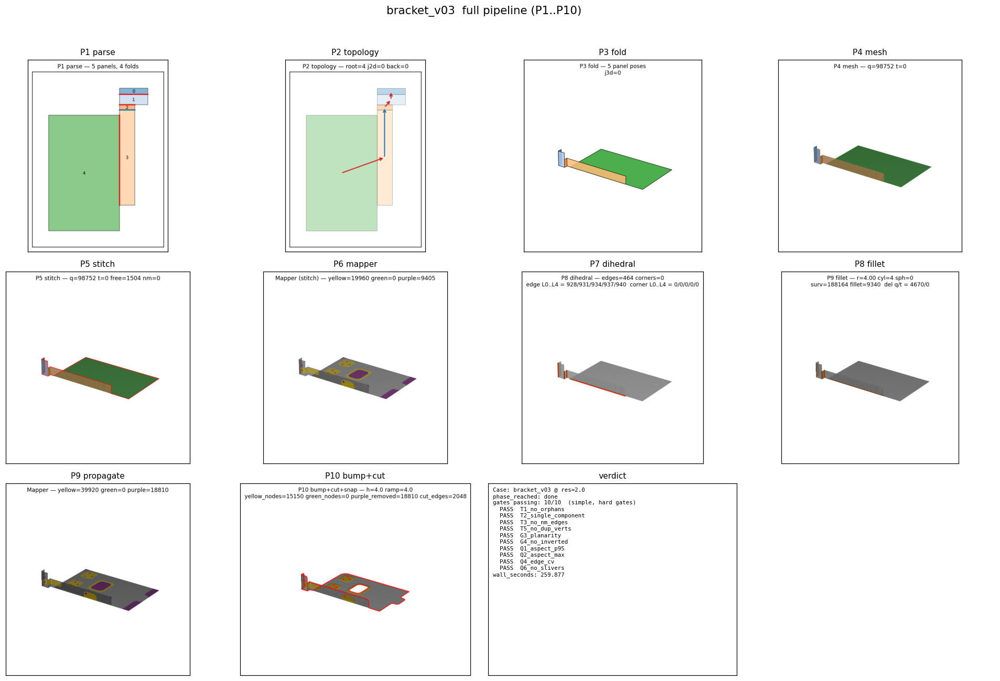

## `bracket_v04`

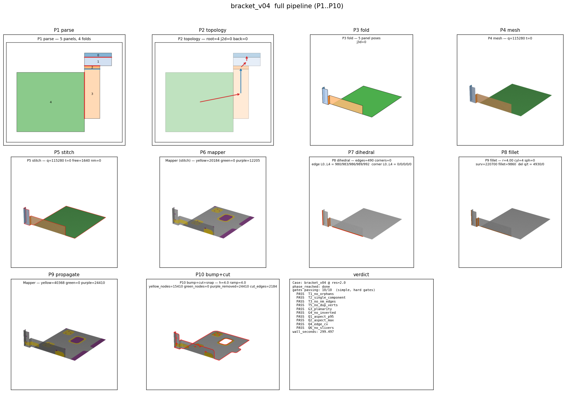

## `bracket_v05`

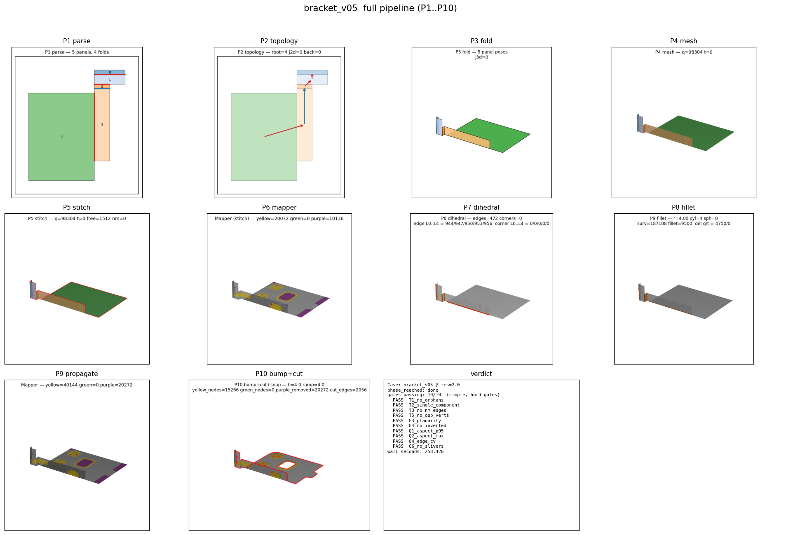

## `bracket_v06`

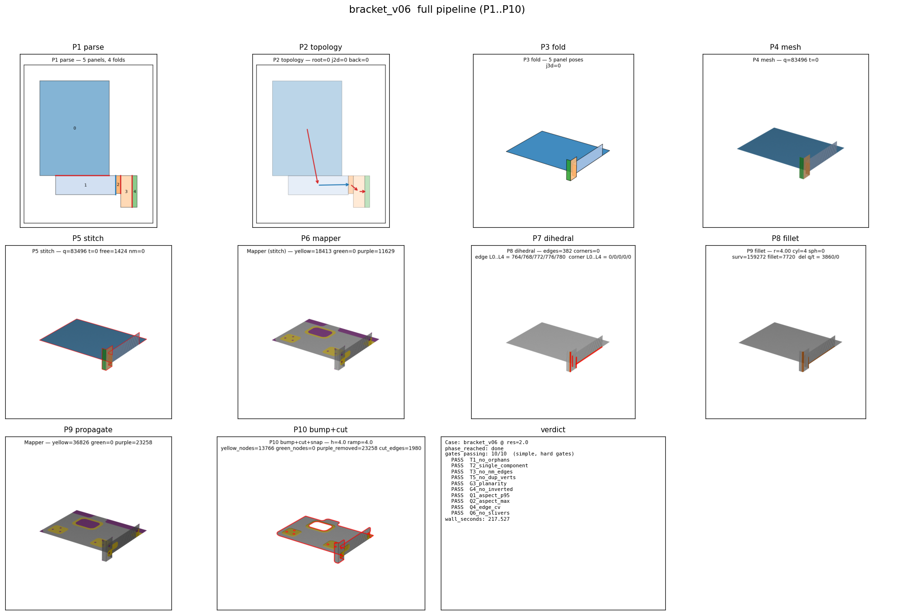

## `bracket_v07`

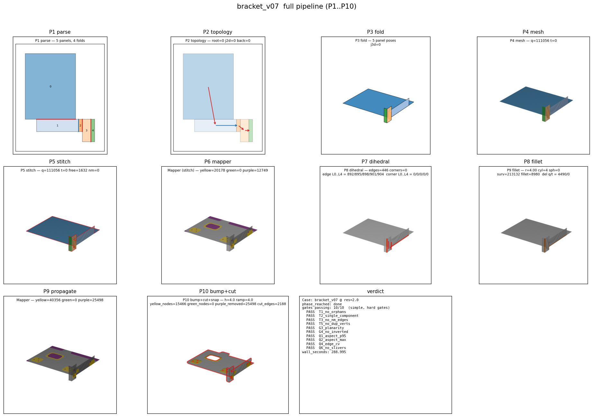

## `bracket_v08`

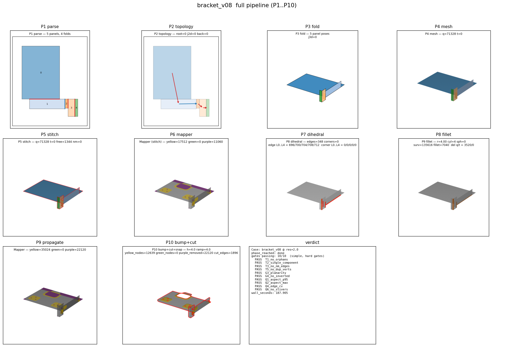

## `bracket_v09`

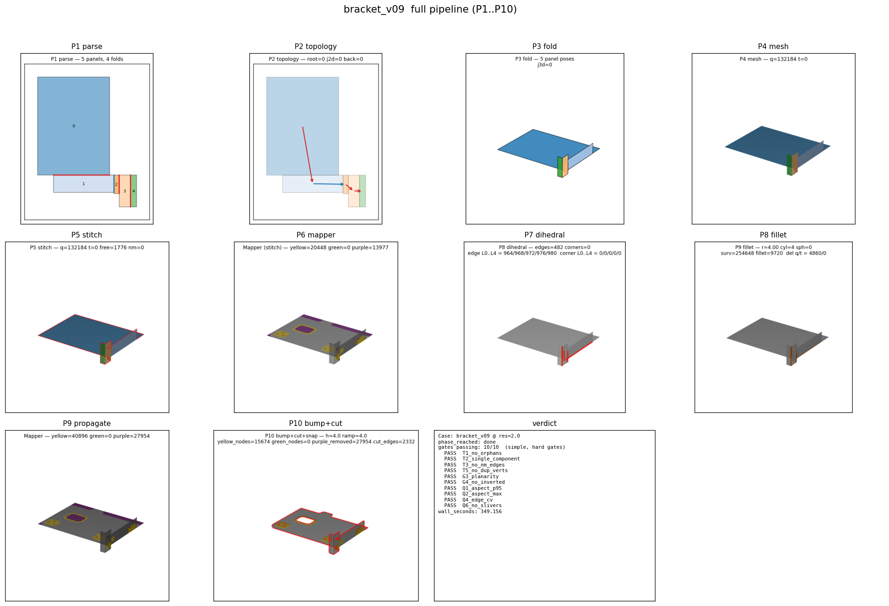

## `bracket_v10`

## `bracket_v11`

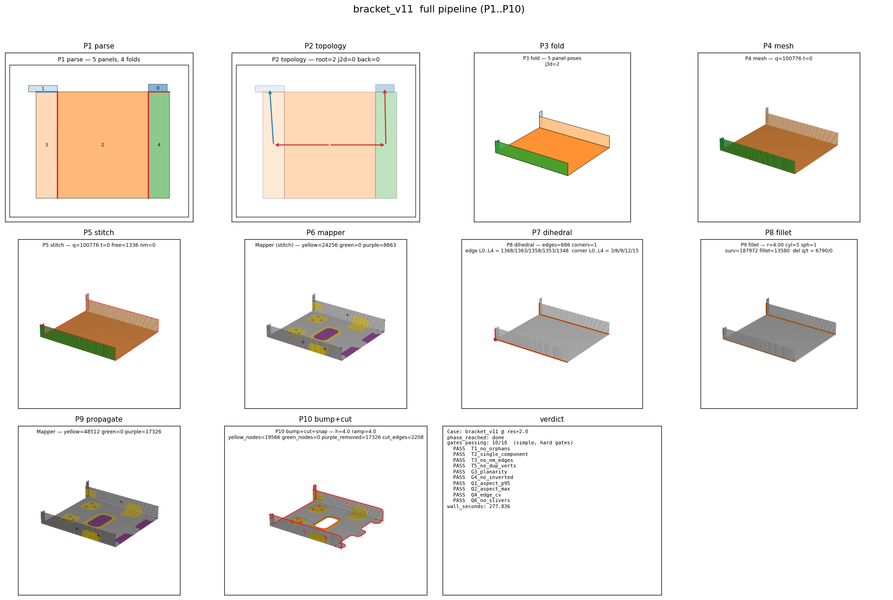

## `bracket_v12`

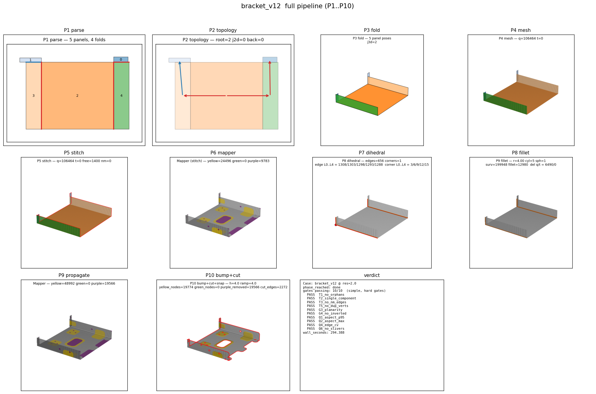

## `bracket_v13`

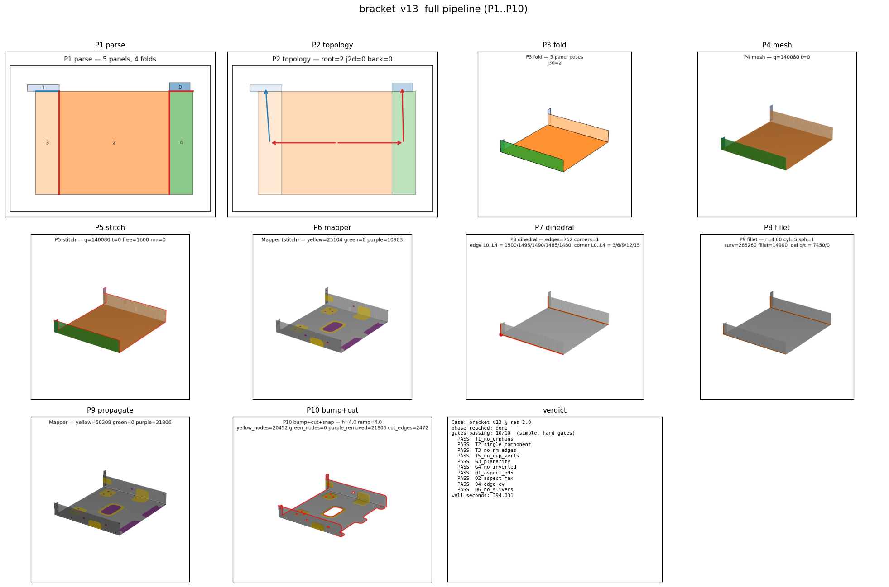

## `bracket_v14`

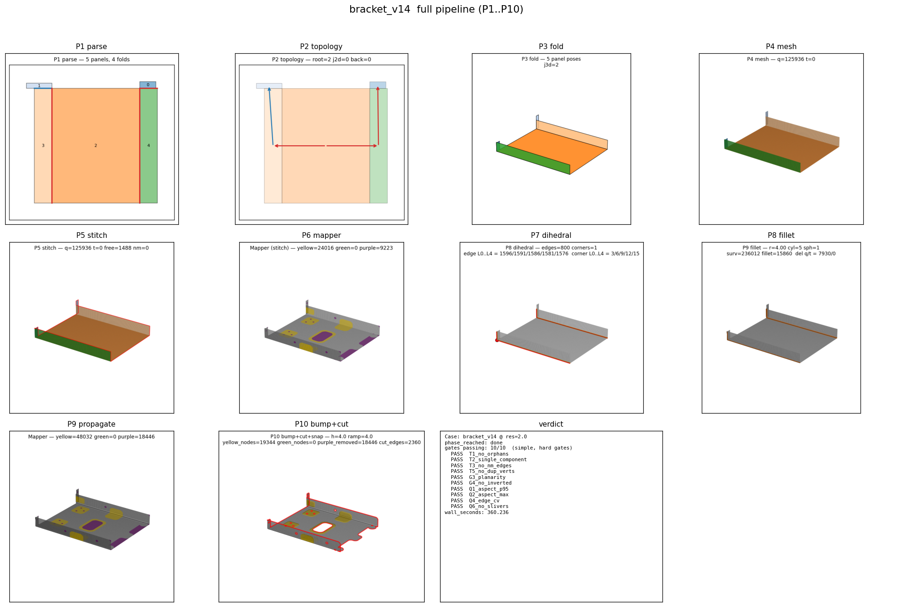

## `bracket_v15`

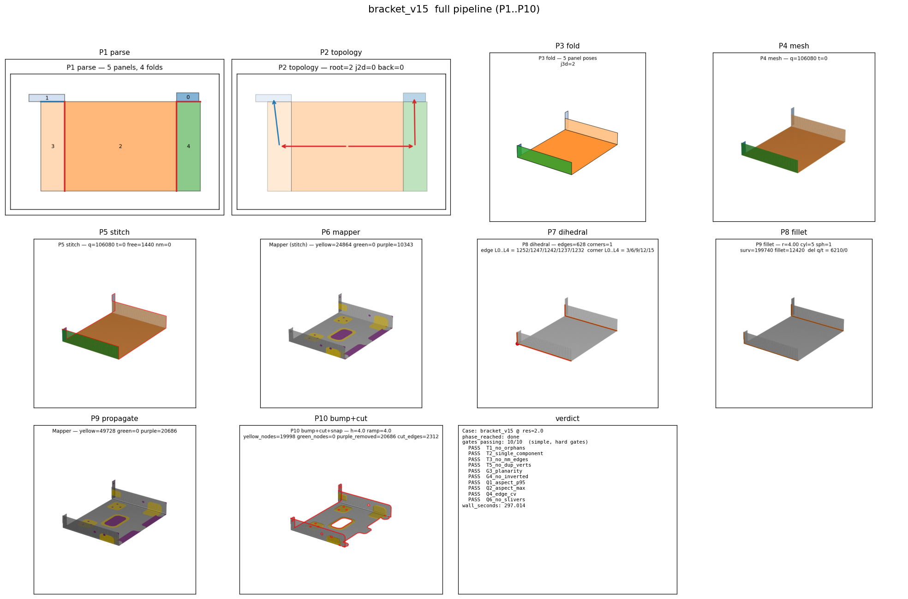

## `bracket_v16`

## `bracket_v17`

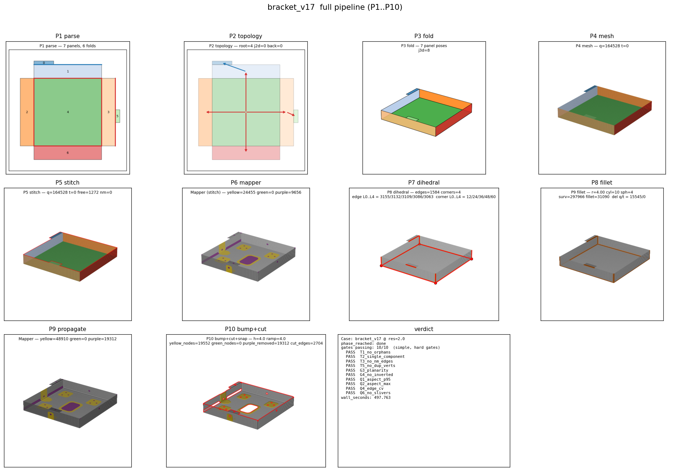

## `bracket_v18`

## `bracket_v19`

## `bracket_v20`

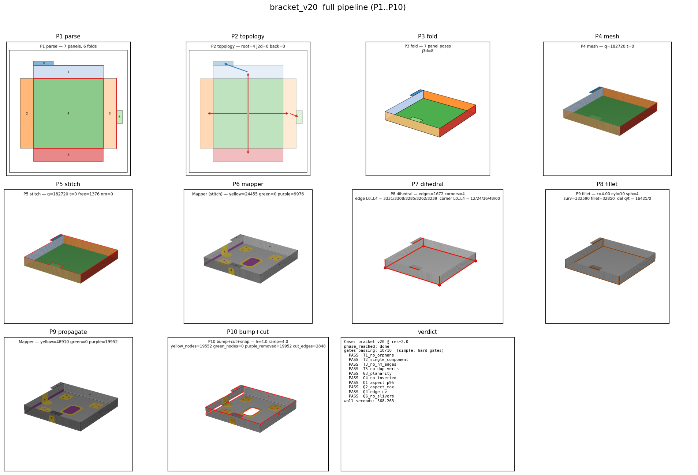
