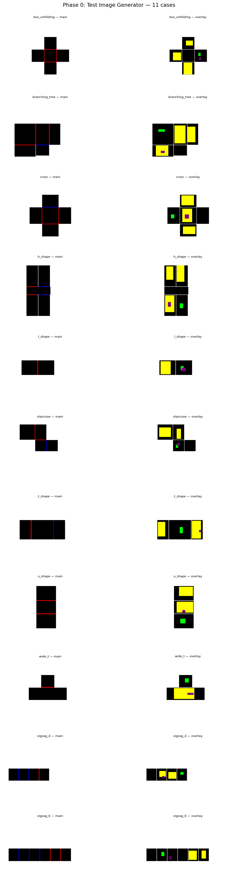
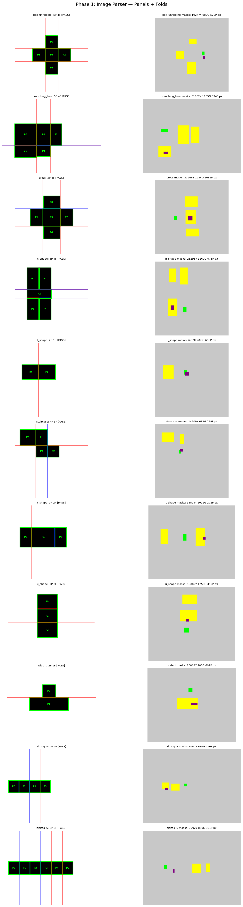

# Output Port for Claude

**Timezone: KST (UTC+9)**

---

# Origami-Gemini-Gen — Clean Pipeline Run (2026-04-23 00:51 KST)

Panel edges snapped to fold_line.position in Phase 1. Zero-gap folds. Connected mesh.

## Phase 0: Test Image Generator
11 test 전개도 cases with bump/hole overlays.

## Phase 1: Image Parser
Panels, fold lines (red=+z, blue=-z), color masks (Y/G/P).

## Phase 2: Topology Builder
BFS fold tree. Panels snapped to fold lines — no pixel gap.

## Phase 3: 3D Folder
Cascading 90° folds. Panels share edges at fold positions.

## Phase 4: Mesh Generator
Finer mesh (res=2.0). Shared vertices at fold edges. Red = boundary only.

