# Origami-Gemini-Gen — Full Pipeline Results
Updated: 2026-04-24 14:03 KST

ALL 11 CASES PASSED — Phase 0 through Phase 7, zero degenerate elements.

## Features Tested
- Non-rectangular blobs (circle, ellipse, polygon, organic)
- Clean hole boundary snapping
- Heightmap z-displacement (curved planes)
- Full pipeline regression (stitch, bump, cut, export)

## Overview — Flat vs Heightmap (all cases)
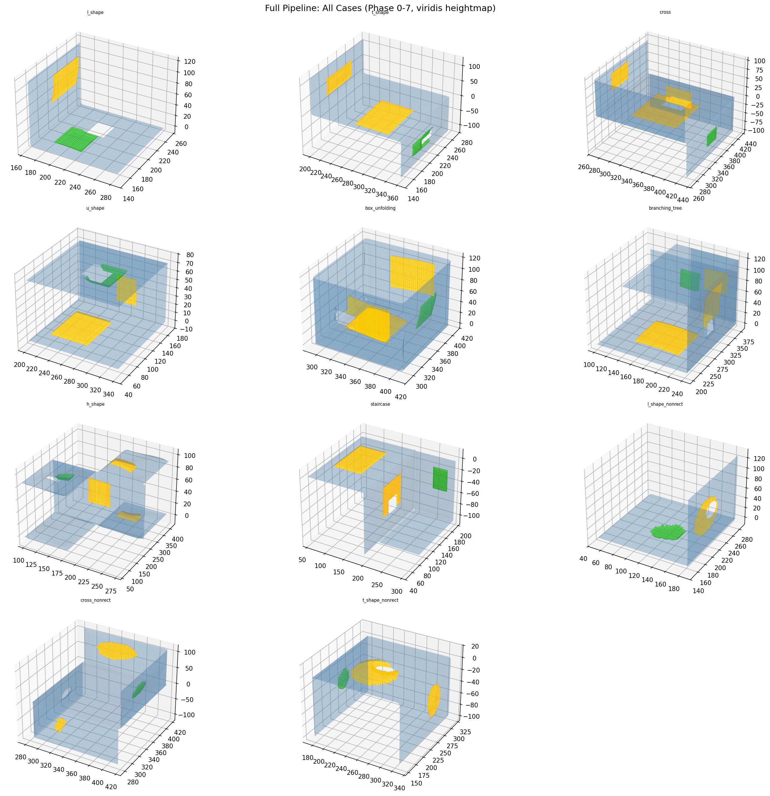

## Per-Case Detail

### l_shape
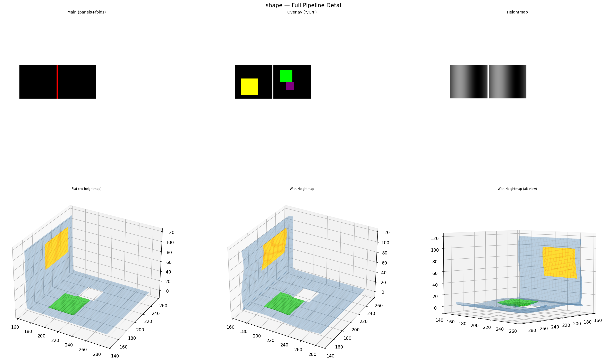

### t_shape
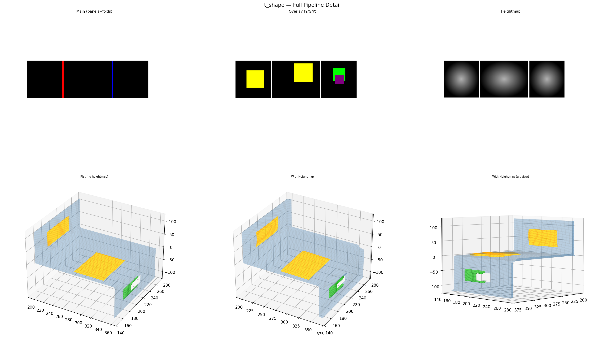

### cross
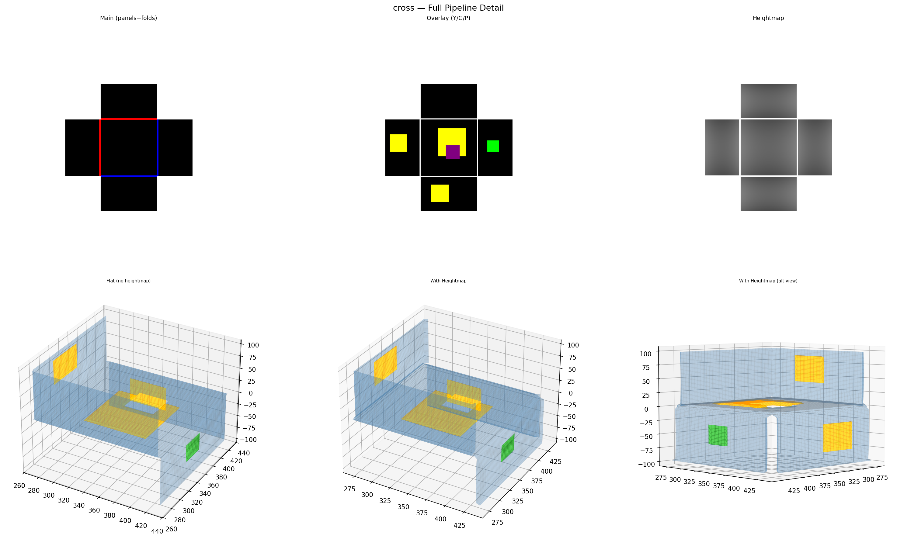

### u_shape

### box_unfolding
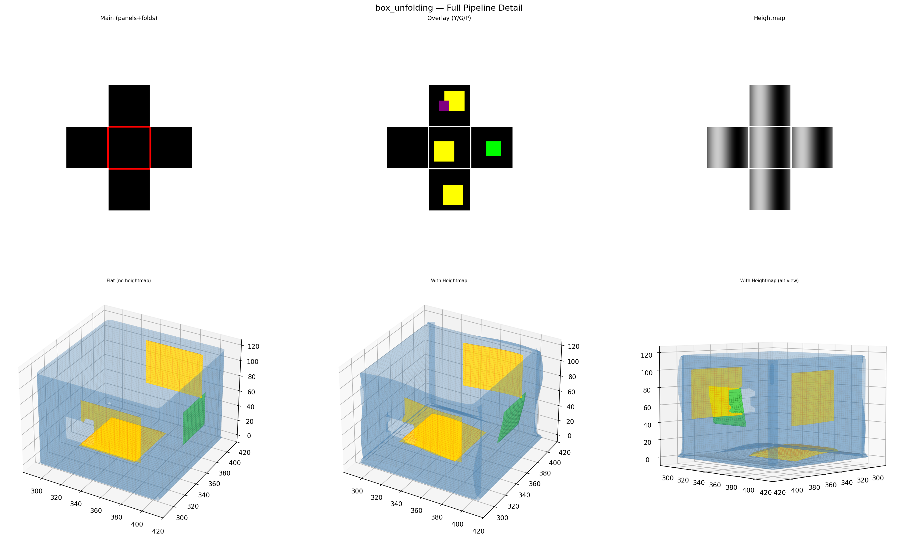

### branching_tree
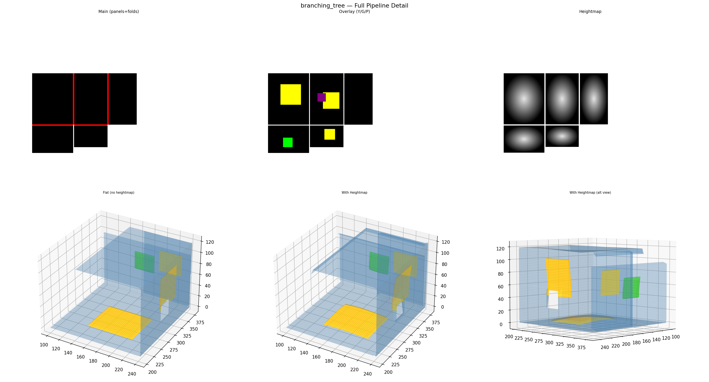

### h_shape
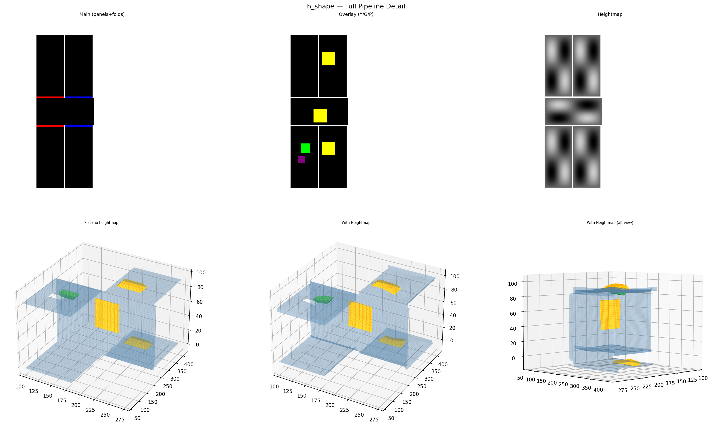

### staircase
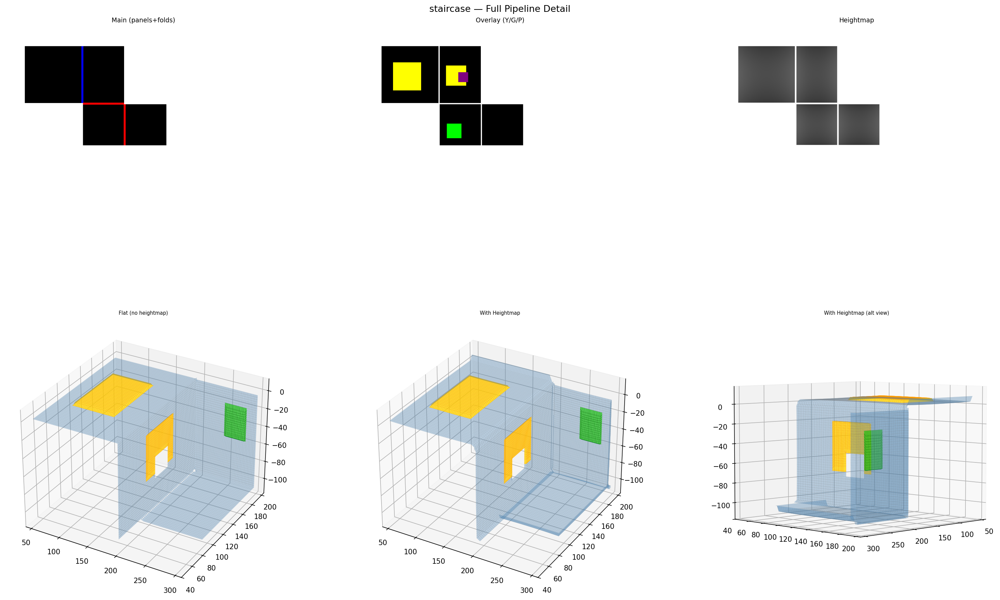

### l_shape_nonrect
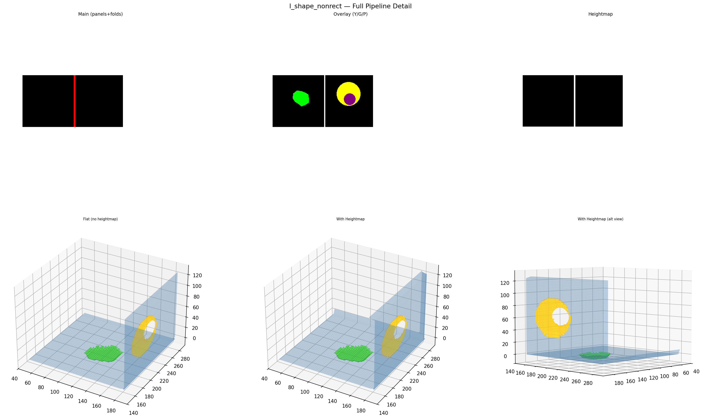

### cross_nonrect
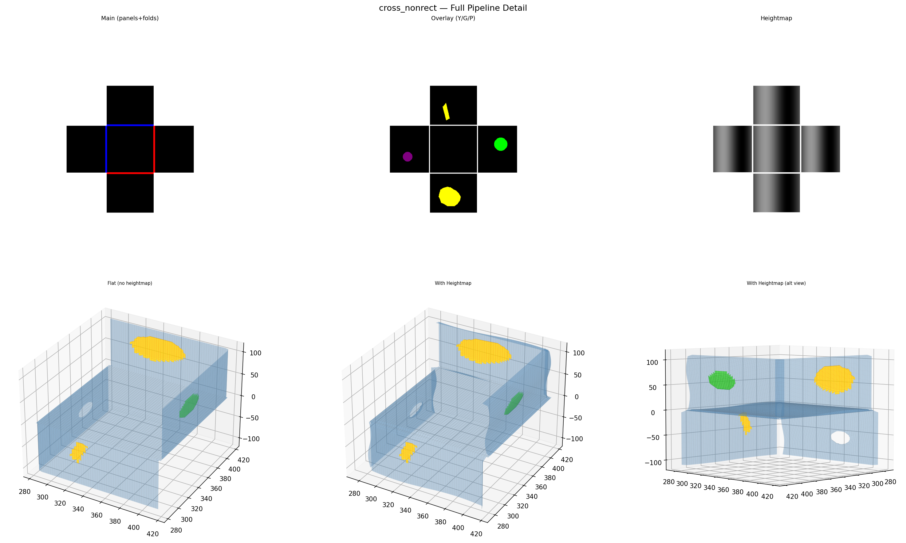

### t_shape_nonrect
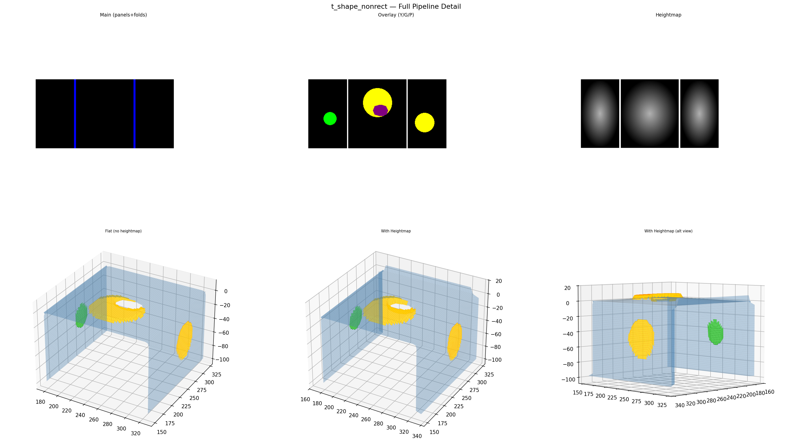

## Non-Rectangular Blobs Close-Up
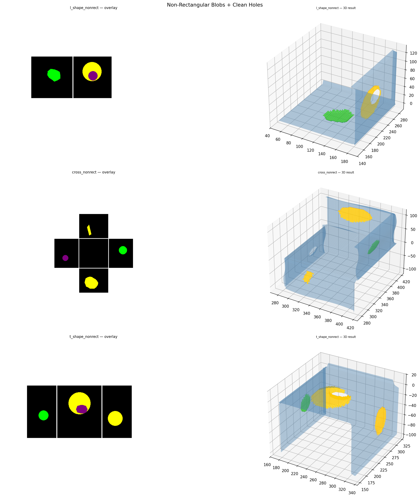

## Summary Table

| Case | Status | Degen | Elems | HM verts |
|------|--------|-------|-------|----------|
| l_shape | PASS | 0 | 3838 | 3788 |
| t_shape | PASS | 0 | 7659 | 6104 |
| cross | PASS | 0 | 26148 | 25765 |
| u_shape | PASS | 0 | 6981 | 178 |
| box_unfolding | PASS | 0 | 17352 | 15847 |
| branching_tree | PASS | 0 | 27682 | 21540 |
| h_shape | PASS | 0 | 15223 | 15203 |
| staircase | PASS | 0 | 21528 | 21507 |
| l_shape_nonrect | PASS | 0 | 5709 | 159 |
| cross_nonrect | PASS | 0 | 20295 | 18402 |
| t_shape_nonrect | PASS | 0 | 9520 | 7505 |
