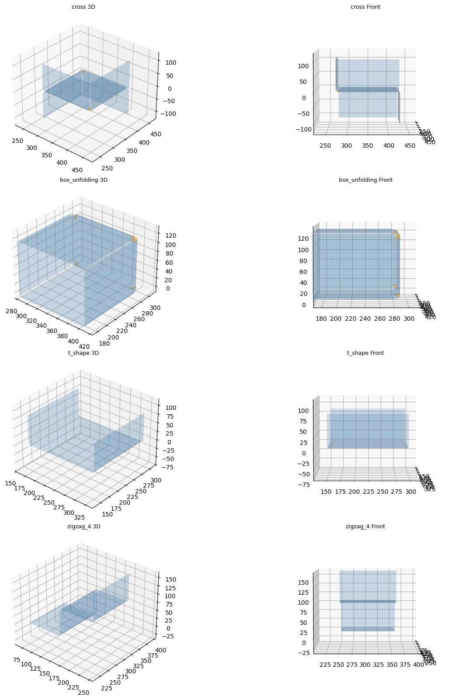
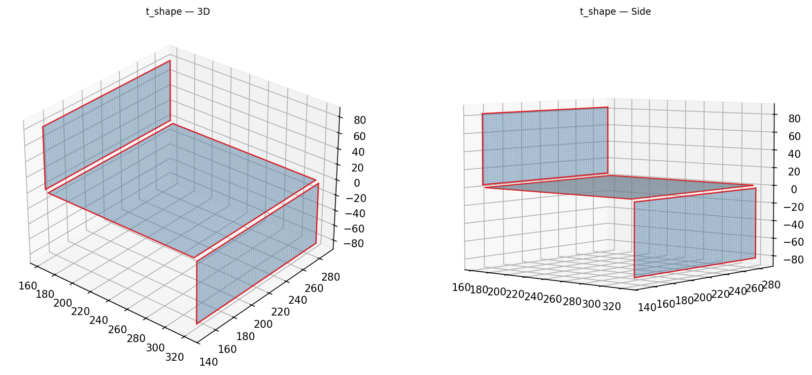
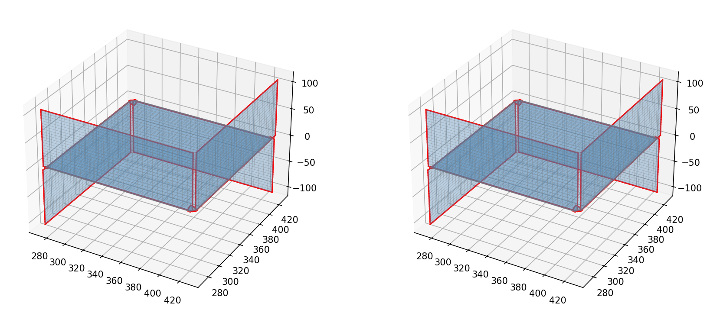
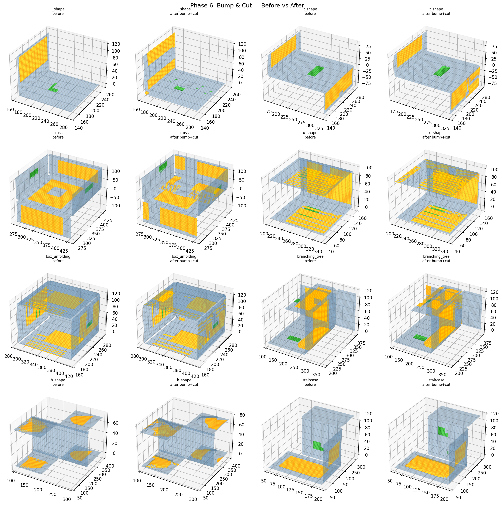
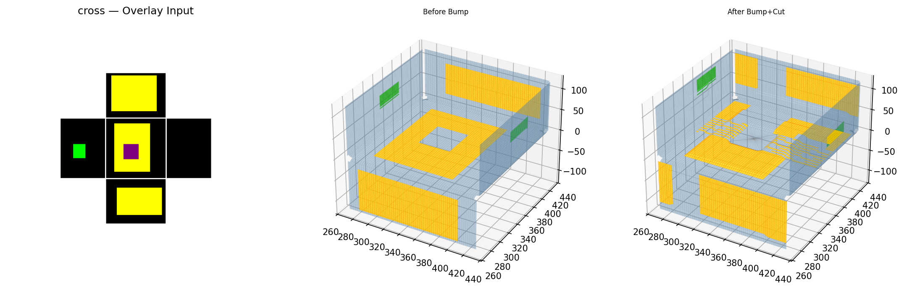

# Output Port for Claude

This repo is used to share result images from Claude Code.

**Timezone: KST (UTC+9)** — Server time is 9 hours behind KST.

---

# Origami-Gemini-Gen — Full Pipeline Results (2026-04-22 23:58 KST)

## Phase 0: Test Image Generator
11 diverse 전개도 (unfolding diagram) test cases generated programmatically.

## Phase 1: Image Parser
Panel extraction, fold line detection (red=+z, blue=-z), yellow region segmentation.

## Phase 2: Topology Builder
BFS fold tree from panel adjacency graph. Root = largest panel.

## Phase 3: 3D Folder
Cascading 90° rotations around fold axes. Panels trimmed by fillet radius.

## Phase 4: Mesh Generator
Structured quad grids + quarter-cylinder fillets + spherical corner patches. All 11 cases PASS.

### L-Shape Detail (3D + Side View)

### Multi-Case Detail

## Phase 5: Stitcher
Proximity-based free-edge welding + global vertex dedup. Red = free edges.

### L-Shape Before vs After

### T-Shape Before vs After

### Cross Before vs After

## Phase 6: Bump & Cut
Yellow = +z bump, Green = -z bump, Purple = hole cut. Smoothstep ramp.

### Overview: Before vs After (8 cases)

### L-Shape Detail

### T-Shape Detail

### Cross Detail

