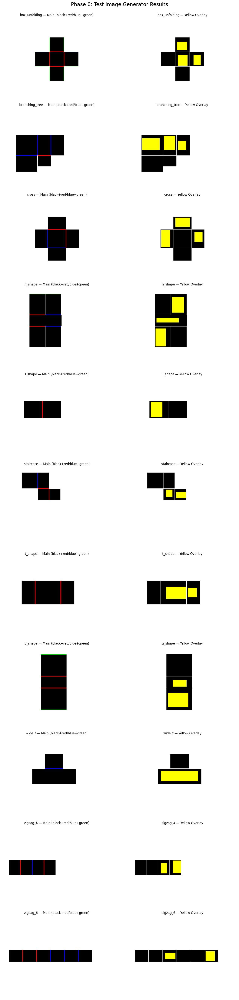
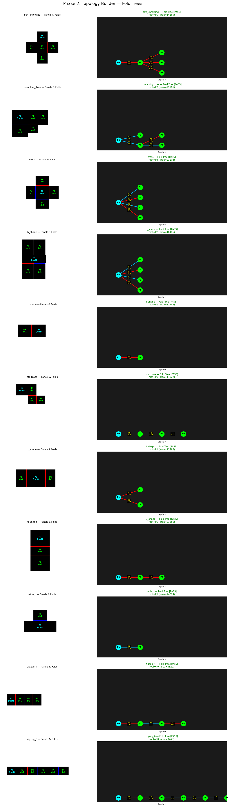
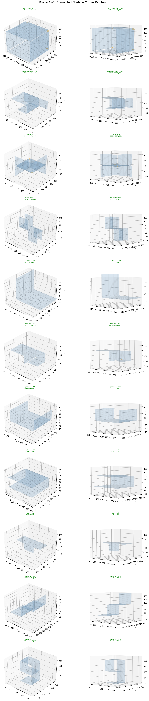
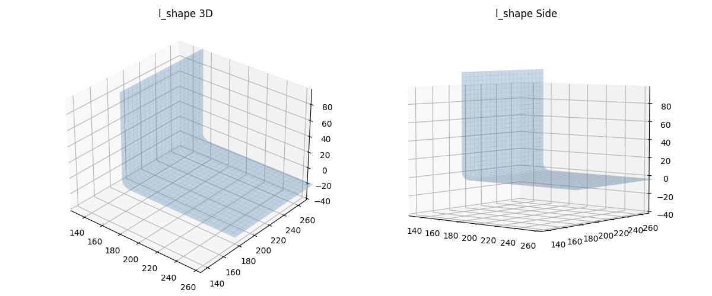
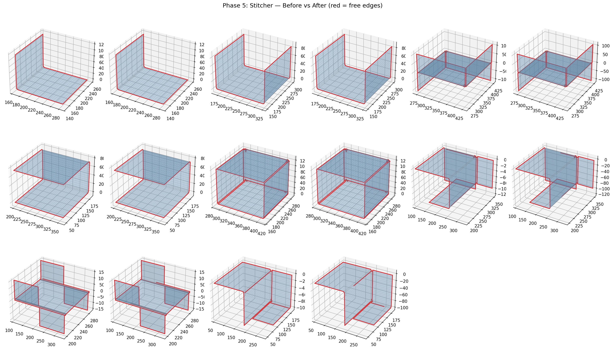
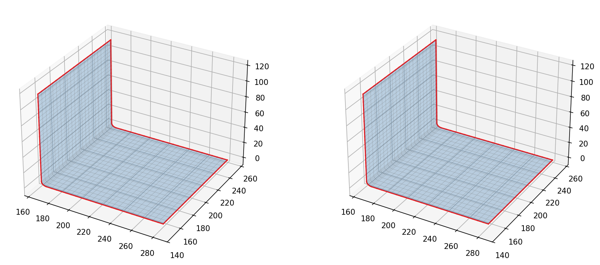
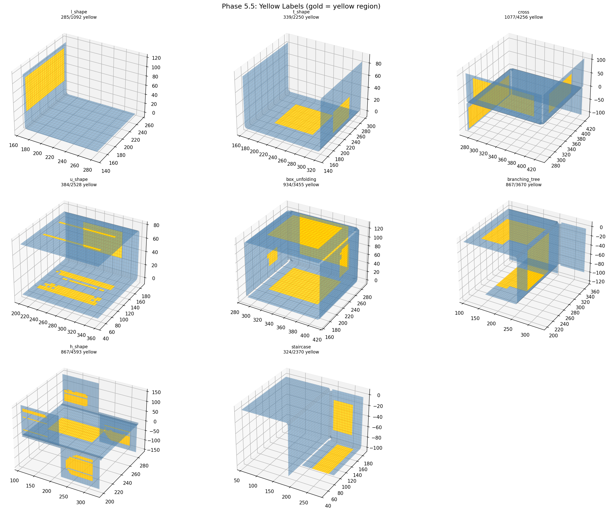
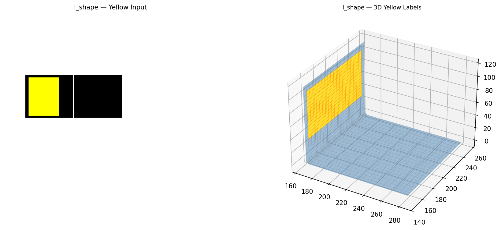
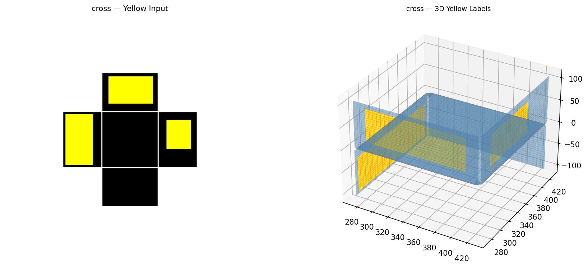

# Output Port for Claude

This repo is used to share result images from Claude Code.

**Timezone: KST (UTC+9)** — Server time is 9 hours behind KST.

---

# Origami-Gemini-Gen — Full Pipeline Results (2026-04-22 22:00 KST)

## Phase 0: Test Image Generator
11 diverse 전개도 (unfolding diagram) test cases generated programmatically.

## Phase 1: Image Parser
Panel extraction, fold line detection (red=+z, blue=-z), yellow region segmentation.

## Phase 2: Topology Builder
BFS fold tree from panel adjacency graph. Root = largest panel.

## Phase 3: 3D Folder
Cascading 90° rotations around fold axes. Panels trimmed by fillet radius.

## Phase 4: Mesh Generator
Structured quad grids + quarter-cylinder fillets + spherical corner patches.

### L-Shape Detail (3D + Side View)

## Phase 5: Stitcher
Proximity-based free-edge welding + global vertex dedup. Red = free edges.

### L-Shape Before vs After

## Phase 5.5: Yellow Labeler
Per-element binary mask via inverse 4x4 transform → 2D pixel lookup. Gold = yellow region.

### L-Shape: 2D Yellow Input → 3D Labels

### Cross: 2D Yellow Input → 3D Labels

## Phase 6: Export
Torch .pt + OBJ + VTK for all 8 test cases. Roundtrip verified.
