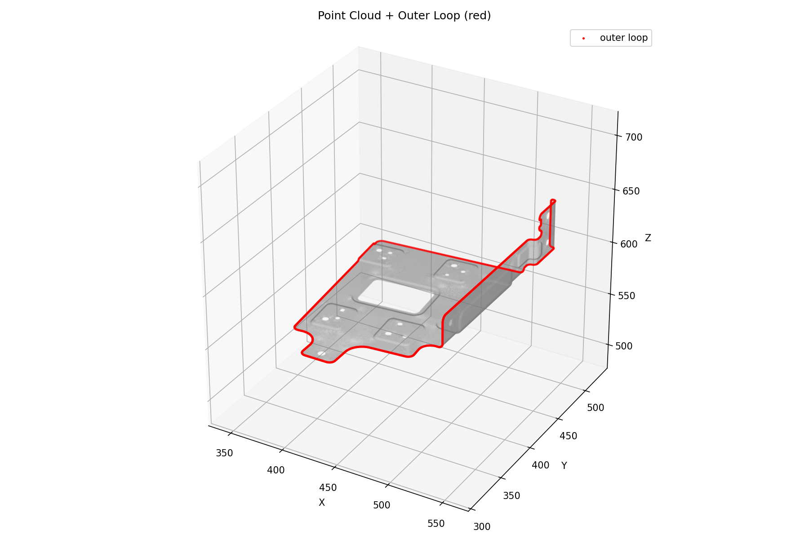
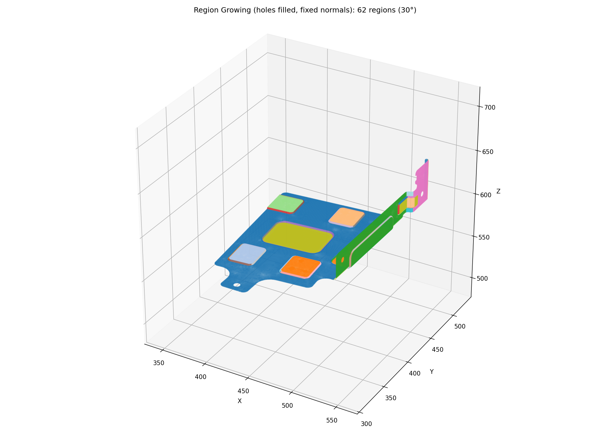
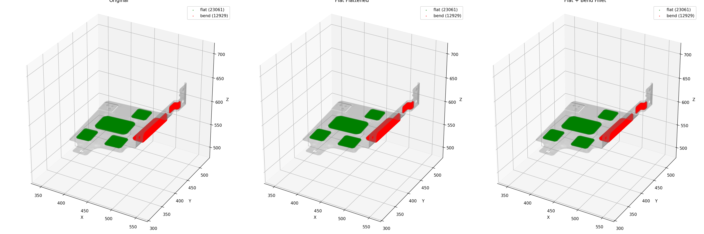
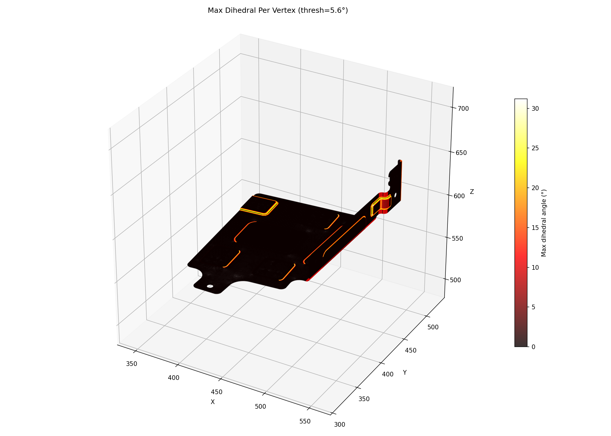
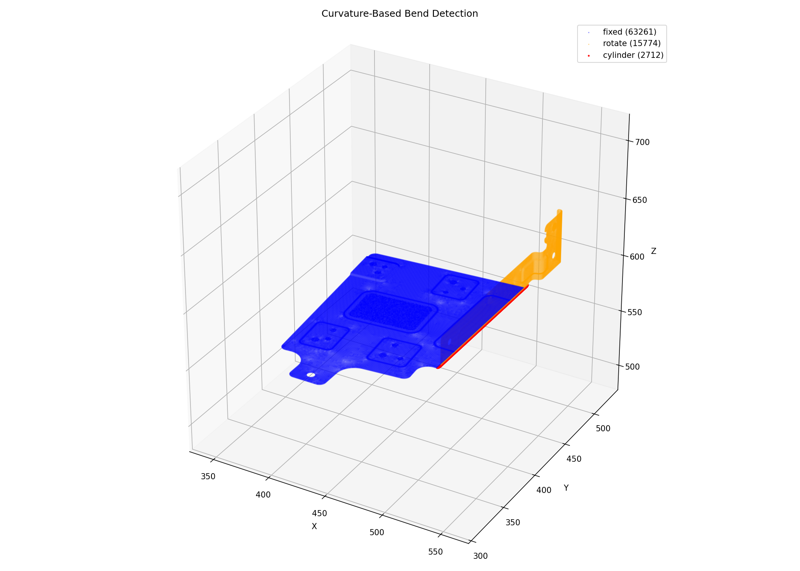
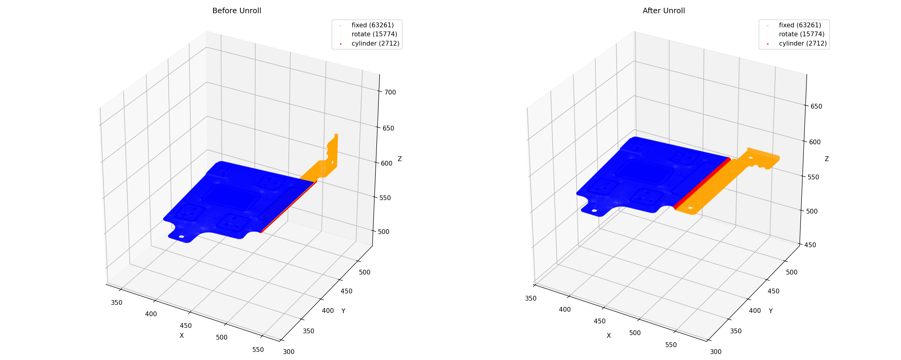
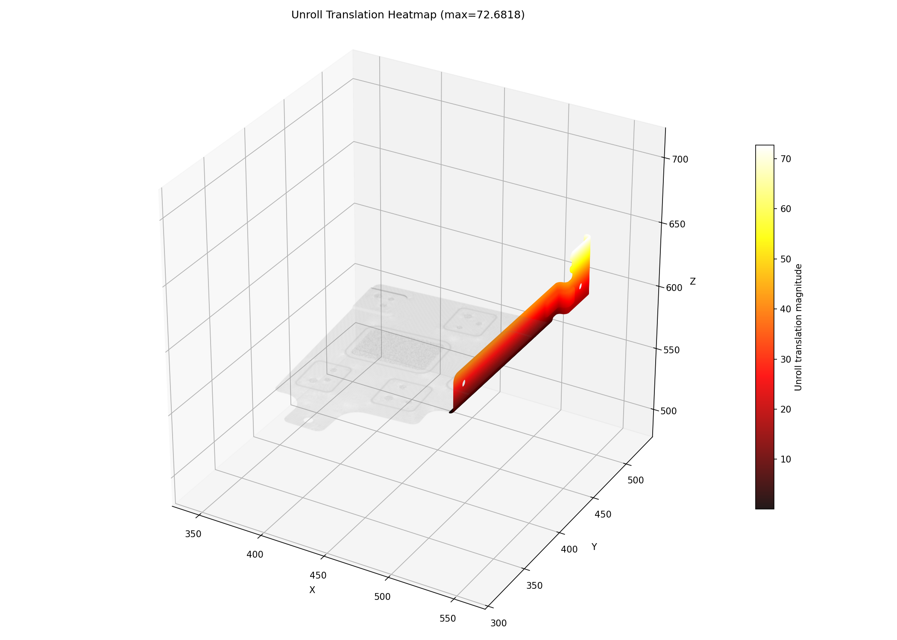

# Output Port for Claude

This repo is used to share result images from Claude Code.

**Timezone: KST (UTC+9)** — Server time is 9 hours behind KST.

## MOBIS_GEN to_2d — dihedral curvature cylinder detect (2026-04-22 06:49 KST)

### 1. Point Cloud

### 2. Outer Loop

### 3. Region Growing (holes remeshed)

### 4. Flatten Result (Original / Flat / Bend)

### 5. Dihedral Angle Heatmap

### 6. Cylinder Detected (dihedral, R=3.845, 89.9°)

### 7. Unroll Before/After

### 8. Unroll Translation Heatmap

