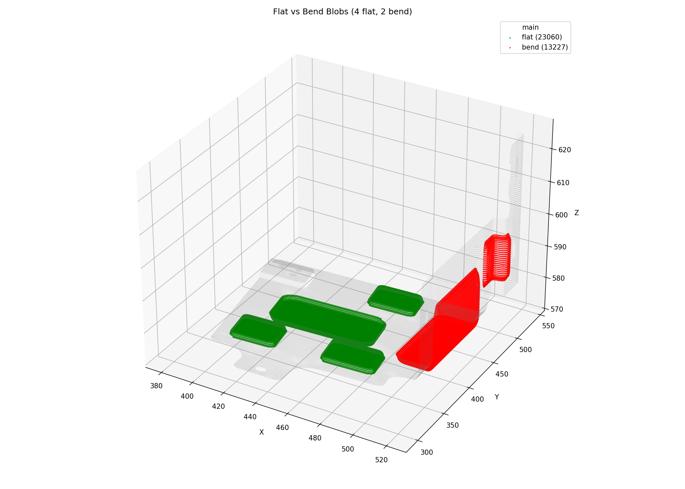
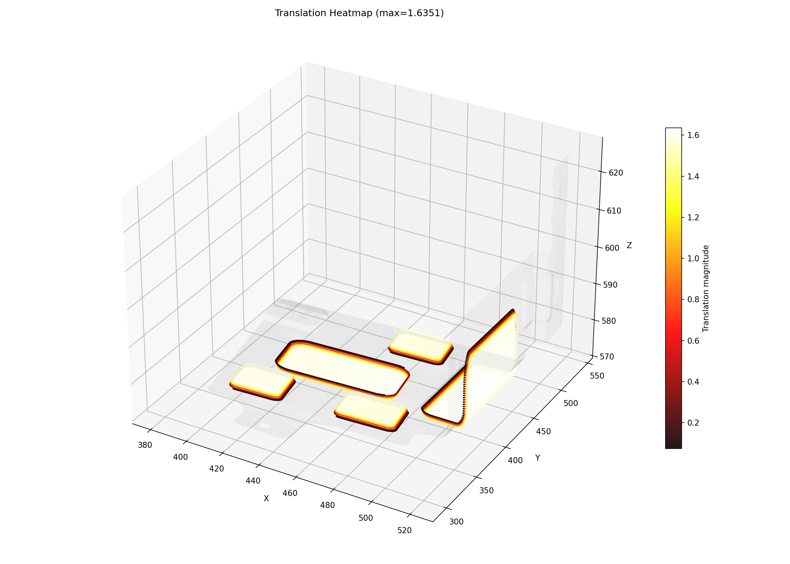

# Output Port for Claude

This repo is used to share result images from Claude Code.

**Timezone: KST (UTC+9)** — Server time is 9 hours behind KST.

## MOBIS_GEN to_baseline full pipeline (2026-04-22 01:13 KST)

### 1. Point Cloud

### 2. Outer Loop

### 3. Region Growing (holes remeshed with Delaunay)

### 4. Main vs Bump Regions

### 5. Flat vs Bend Blobs

### 6. Flatten Result (Original / Flat / Bend)

### 7. Translation Heatmap

