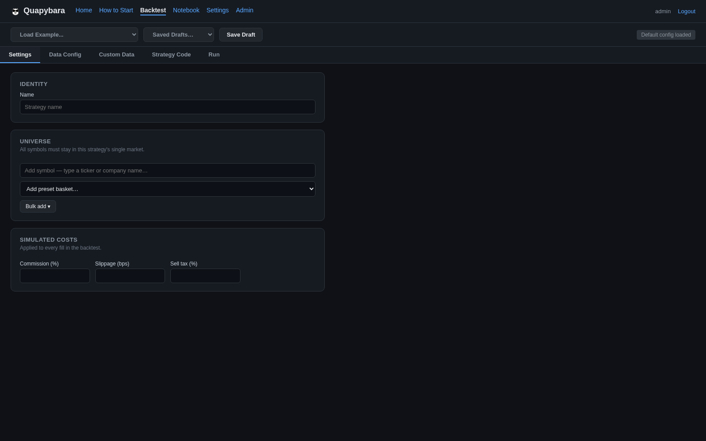
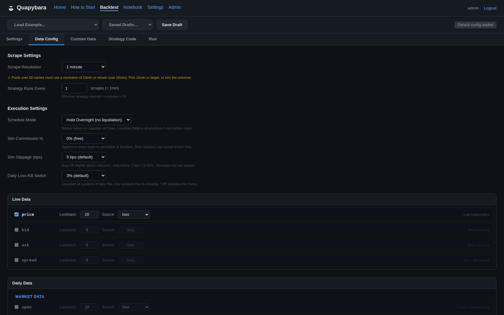
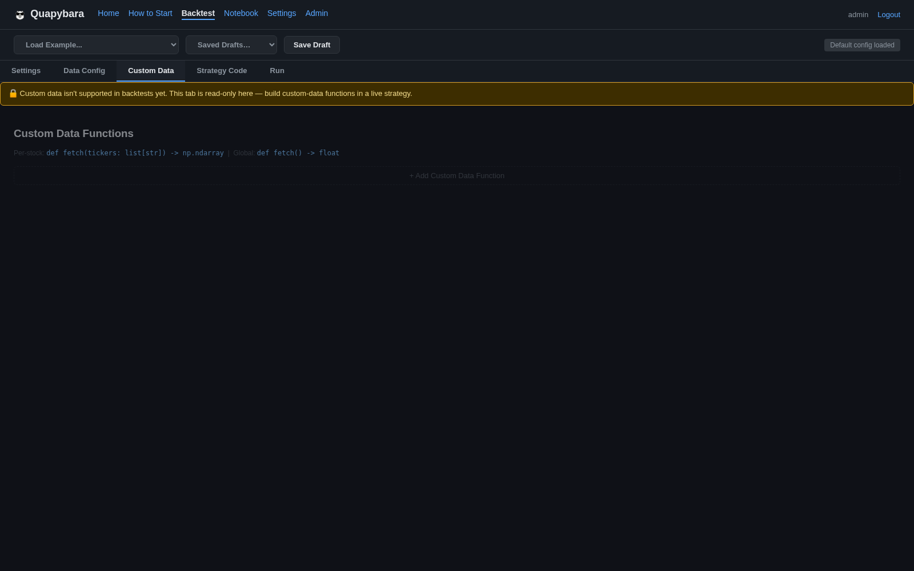
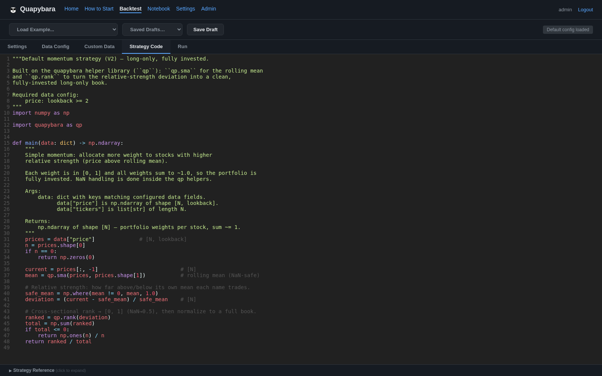
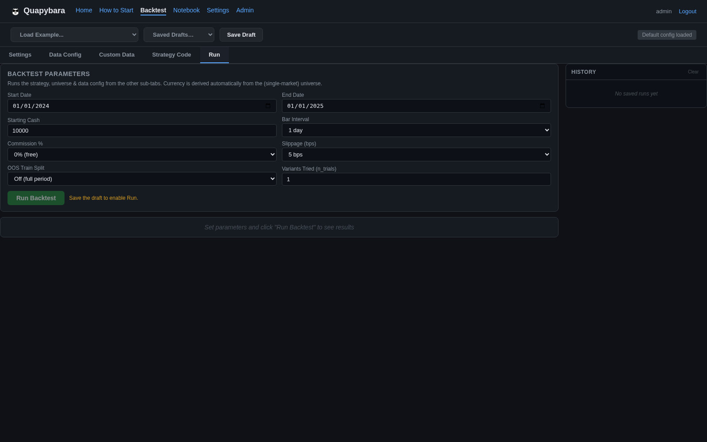

# Quapybara — `/backtest` Page (Code-Tab-Rewrite)

Screenshots of the rewritten standalone backtest page. It now reuses the whole
Code-tab editor (`backtest_mode=True`), so a backtest draft has the same degrees
of freedom as a live strategy — tab bar **Settings · Data Config · Custom Data ·
Strategy Code · Run**, plus an isolated draft store and Run gating.

## Settings (live-only blocks dropped — only Identity / Universe / Sim-Costs)

## Data Config

## Custom Data (frozen — shown but disabled, with banner)

## Strategy Code

## Run sub-tab (params + results + History; Run disabled until draft saved)

