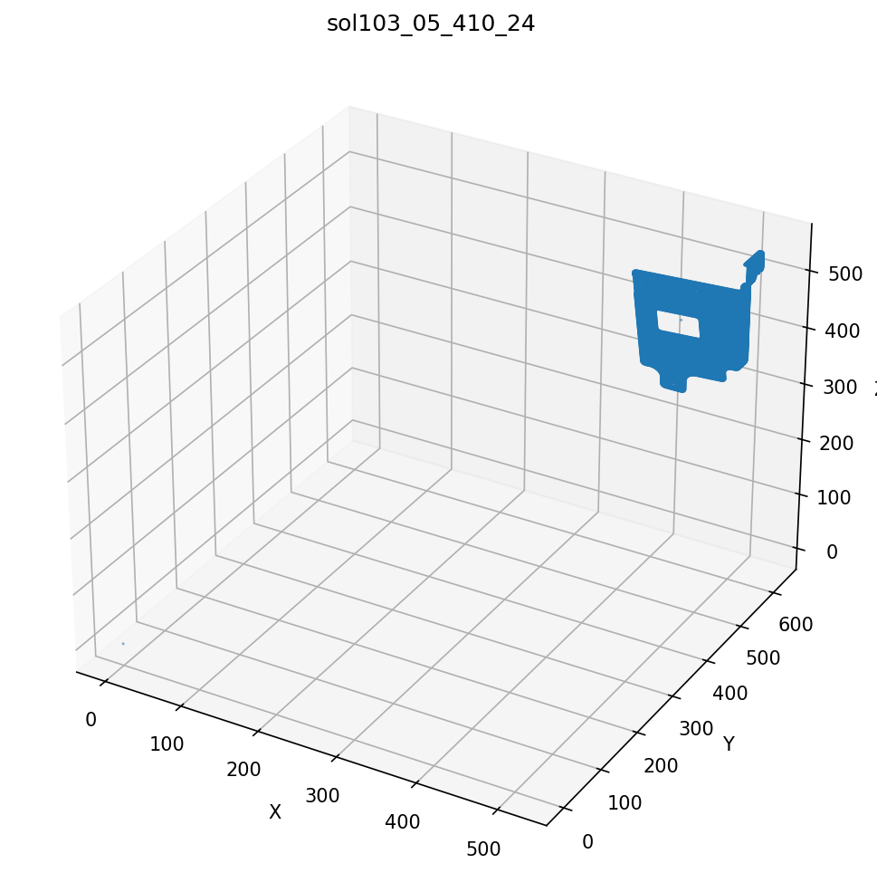
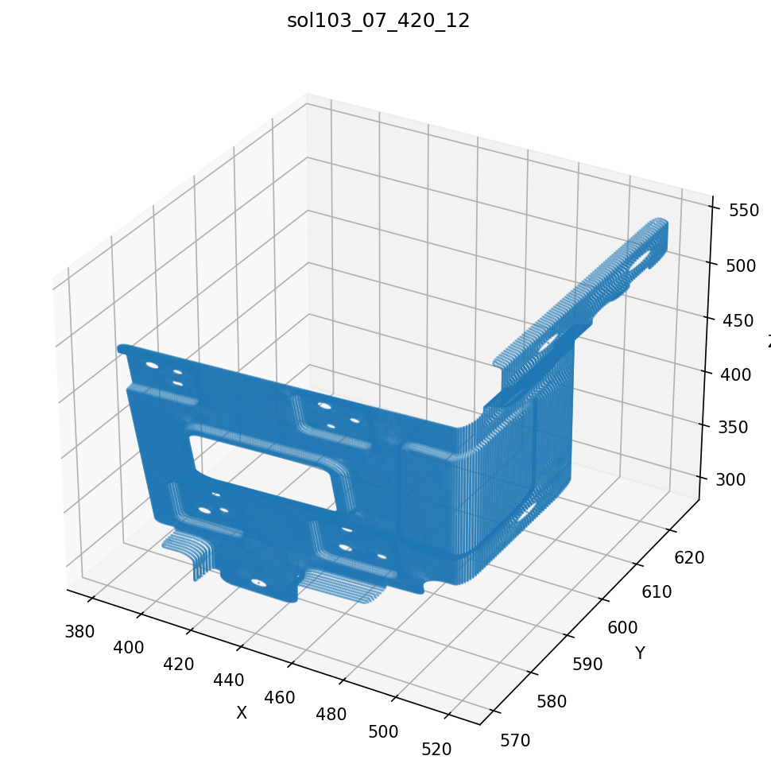
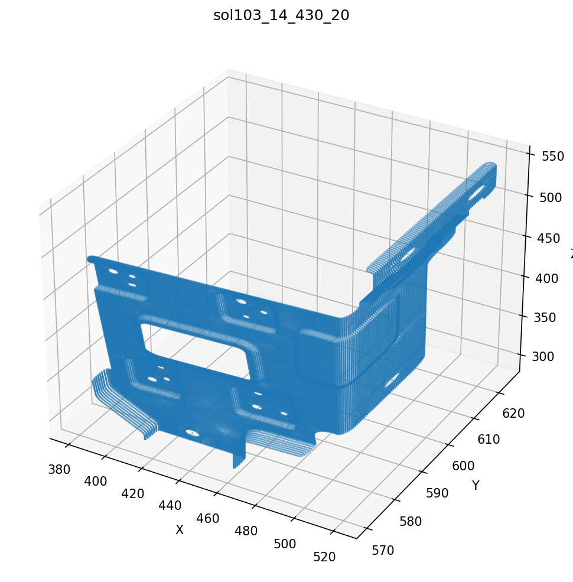
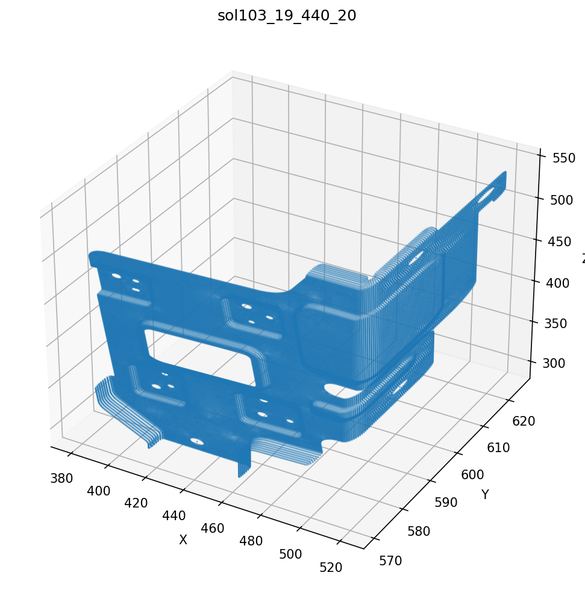
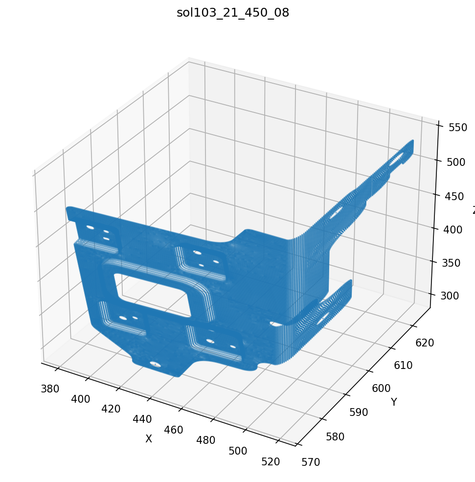
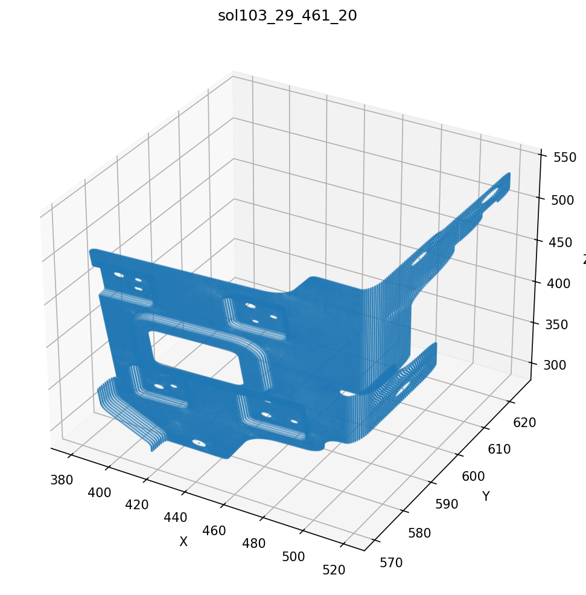
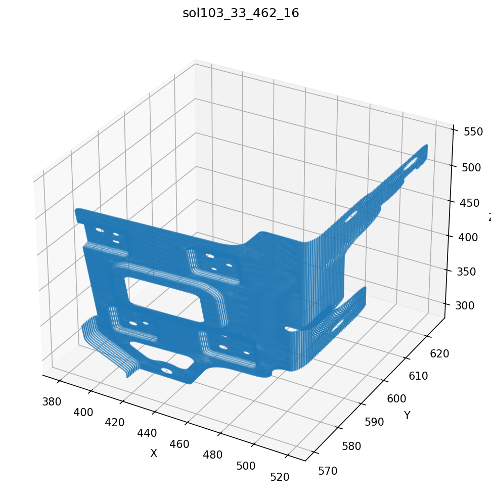
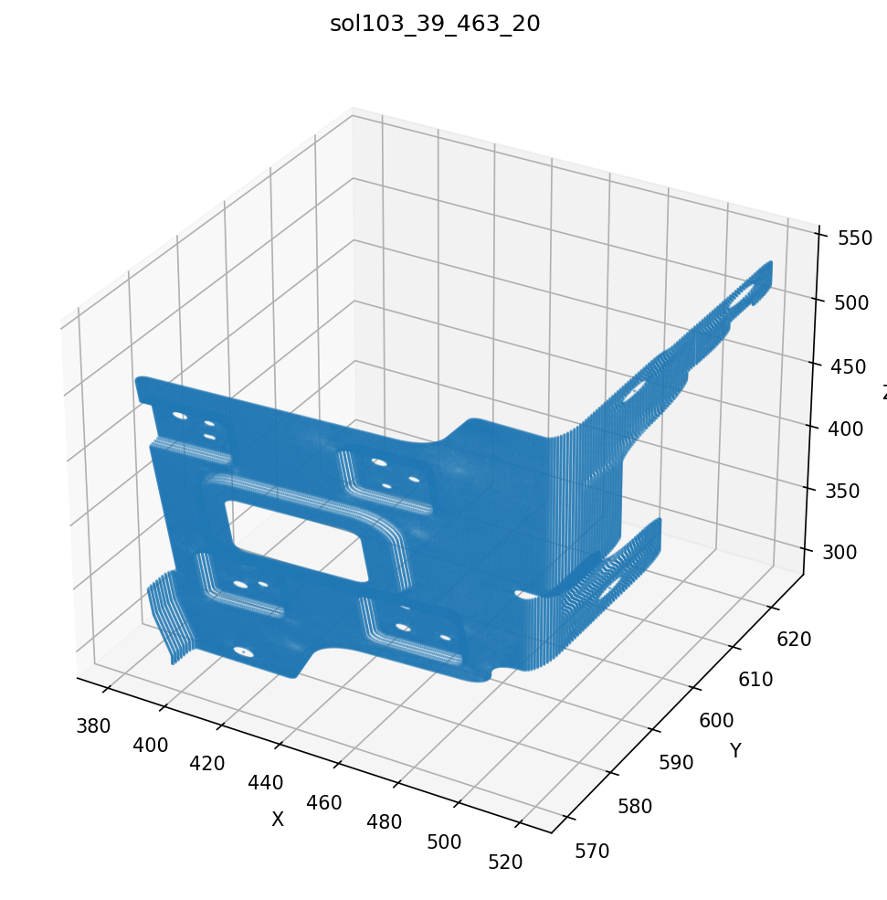

# Output Port for Claude

This repo is used to share result images from Claude Code.

**Timezone: KST (UTC+9)** — Server time is 9 hours behind KST.

## Results

### Pipeline Point Cloud (2026-04-21 15:44 KST)

### HD-MOBIS H5 3D Coord Plots (2026-04-20 23:17 KST)

