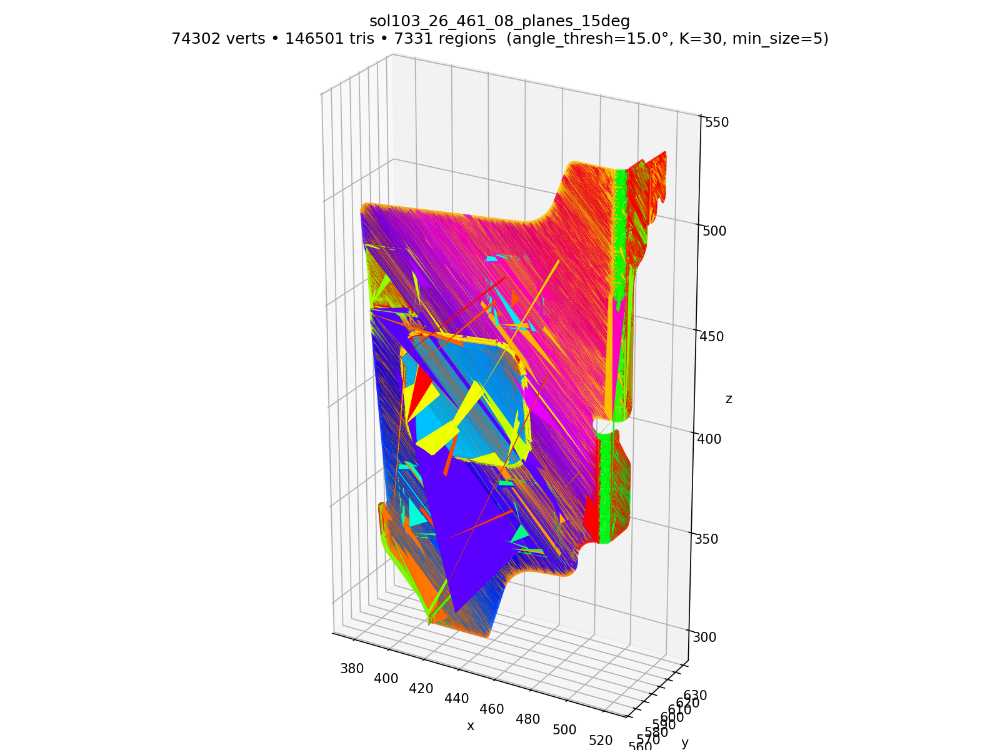
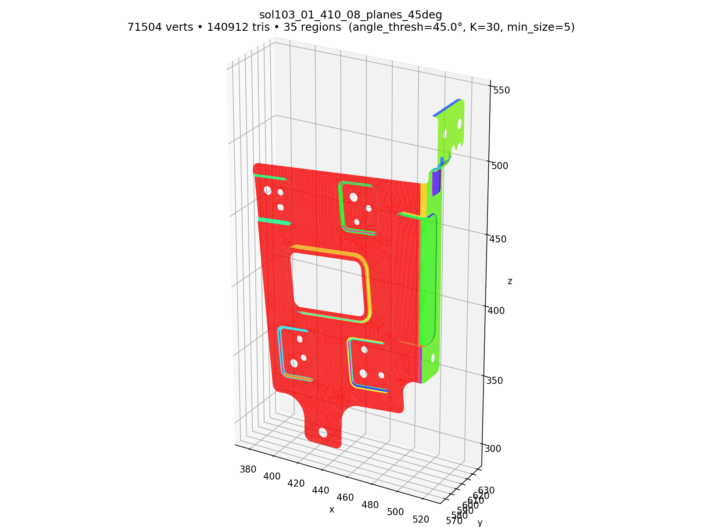
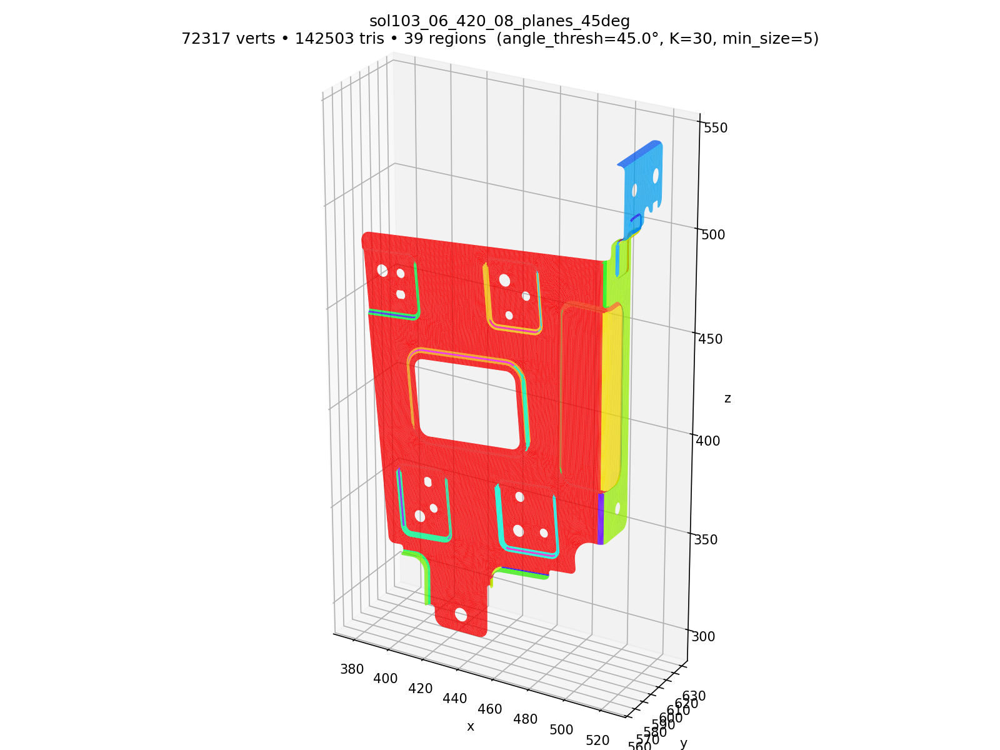
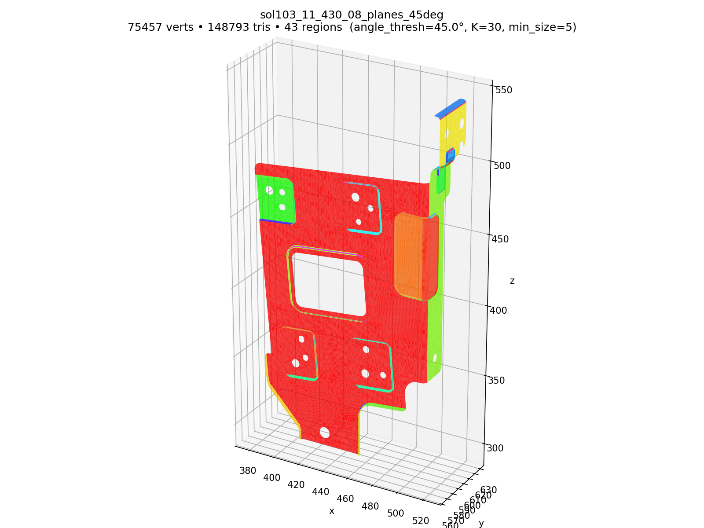
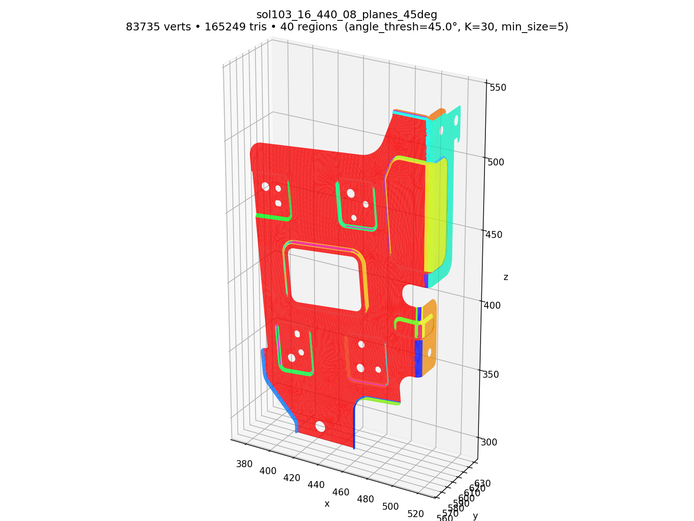
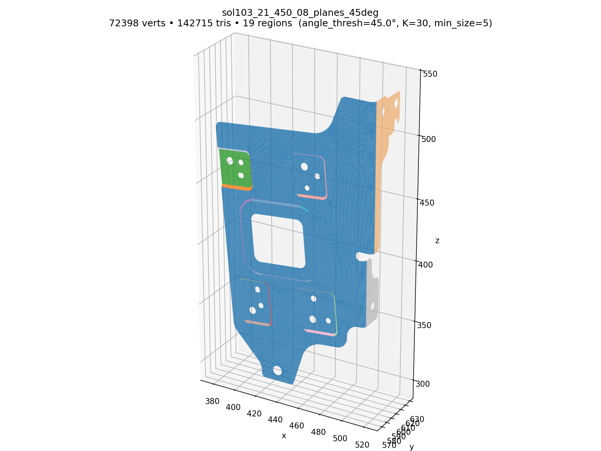
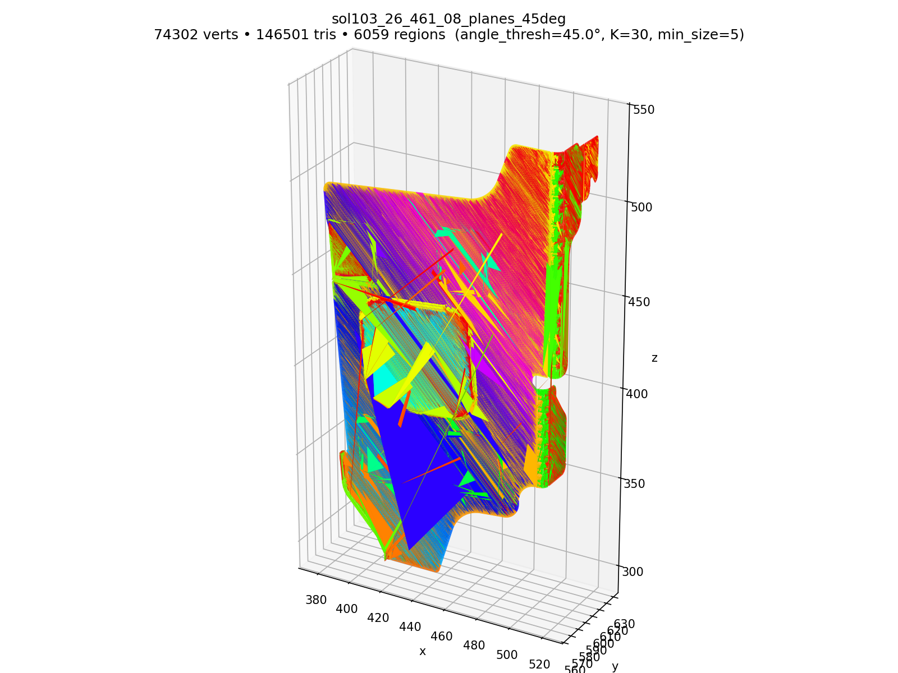

# Output Port

Files Claude moved here are visible on GitHub.

## Step 1 — Read mesh and visualize

Loaded all 40 HD Mobis H5 files via the I0 H5 ingest (solver-ID
remap), rendered each shell with matplotlib's `Poly3DCollection`
(Lambert shading from a single light, gray colormap, light edge
lines).  Per-render time ~9 s × 40 = ~6 min serial.

Geometry repeats within a family (8 geometry families × 5 load-case
variants = 40 files), so the 5 variants of each family render
identically.  The gallery below shows the canonical first variant of
each family; all 40 PNGs are in `step1_visualize/`.

### Family gallery — one canonical variant per family

| family 1 (`_410_*`) | family 2 (`_420_*`) | family 3 (`_430_*`) | family 4 (`_440_*`) |
|---|---|---|---|
|  |  |  |  |

| family 5 (`_450_*`) | family 6 (`_461_*`) | family 7 (`_462_*`) | family 8 (`_463_*`) |
|---|---|---|---|
|  |  |  |  |

### All 40 PNGs

`step1_visualize/sol103_<NN>_<YYY>_<ZZ>_mesh.png` — one per H5 file.

## Step 2 — Main-plane segmentation

Vendored the SML branch of `MOBIS_GEN`'s `region_growing_gpu`
(spherical k-means seeded BFS region growing) into the inverse
package and ran it on all 40 HD Mobis H5 files.

Algorithm: face normals → spherical K-means at fixed K=30 →
adjacency-based BFS from each cluster seed using the **fixed
cluster normal** as target (prevents drift) → fallback BFS with
running mean for any unlabeled faces → tiny-region merge → contiguous
re-index.  Identical math to the SML source — only cosmetic edits
(type hints, docstrings).  Auto-K was bypassed because every file
hit the K=30 cap anyway, wasting ~30× compute.

Two angle thresholds run per file:

- **15°** — strict; tens to hundreds of regions per file
  (over-segments curved CAD into many seeded patches).
- **45°** — loose; under 50 regions per file
  (merges curved-but-similar normals into single regions).

Output naming: `step2_mainplanes/<stem>_planes_<deg>deg.png`.

### Coverage
26 of 40 files complete (52 PNGs).  Families 410 / 420 / 430 / 440
/ 450 fully done at ~30 s per file.  Family 461 (file 26 only) took
~32 min for both angles — region-grow BFS-with-running-mean fallback
explodes on this family.  Killed at user request before 462 / 463.

### Family gallery — `_15deg` (one canonical variant per family)

| family 1 (`_410_*`) | family 2 (`_420_*`) | family 3 (`_430_*`) | family 4 (`_440_*`) |
|---|---|---|---|
|  |  |  |  |

| family 5 (`_450_*`) | family 6 (`_461_*`) | family 7 (`_462_*`) | family 8 (`_463_*`) |
|---|---|---|---|
|  |  | (462 not run) | (463 not run) |

### Family gallery — `_45deg` (one canonical variant per family)

| family 1 (`_410_*`) | family 2 (`_420_*`) | family 3 (`_430_*`) | family 4 (`_440_*`) |
|---|---|---|---|
|  |  |  |  |

| family 5 (`_450_*`) | family 6 (`_461_*`) | family 7 (`_462_*`) | family 8 (`_463_*`) |
|---|---|---|---|
|  |  | (462 not run) | (463 not run) |

### All PNGs

`step2_mainplanes/sol103_<NN>_<YYY>_<ZZ>_planes_<DEG>deg.png` — files
01–26 covered, two PNGs each (15° + 45°).

### `tmp/`
Earlier deliverables, kept for reference.
