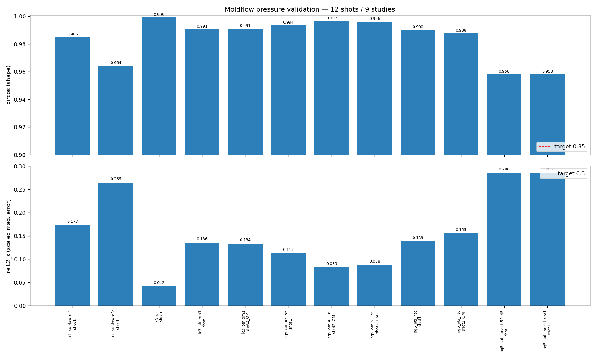
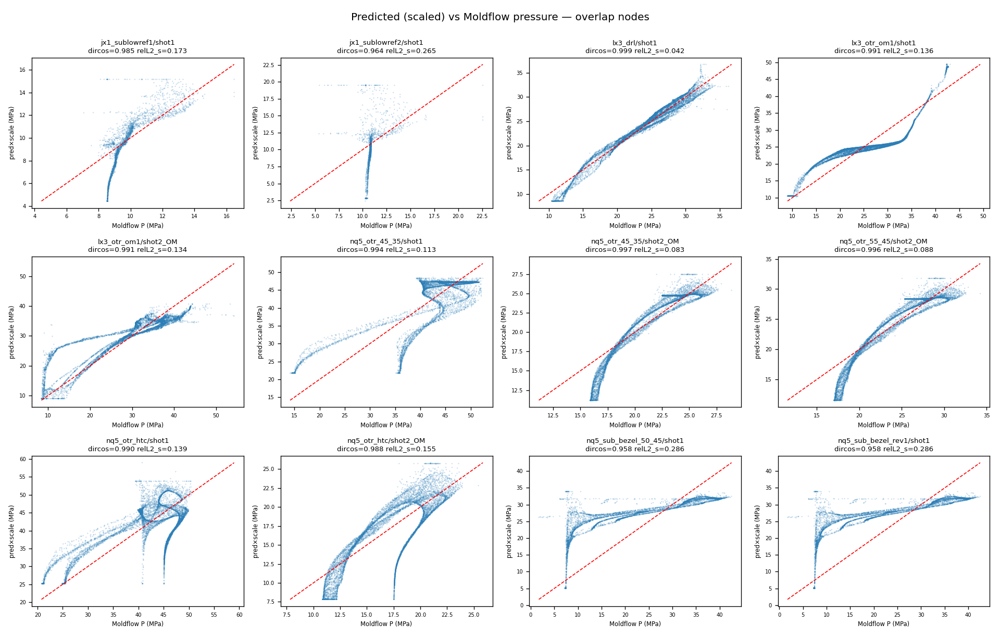
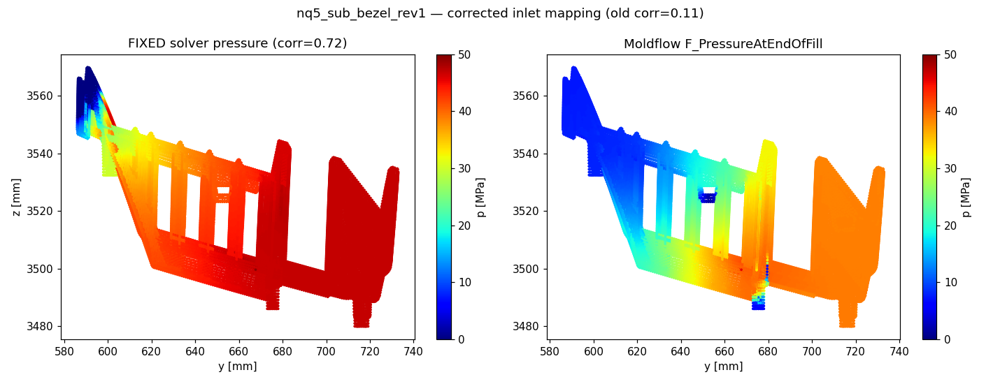
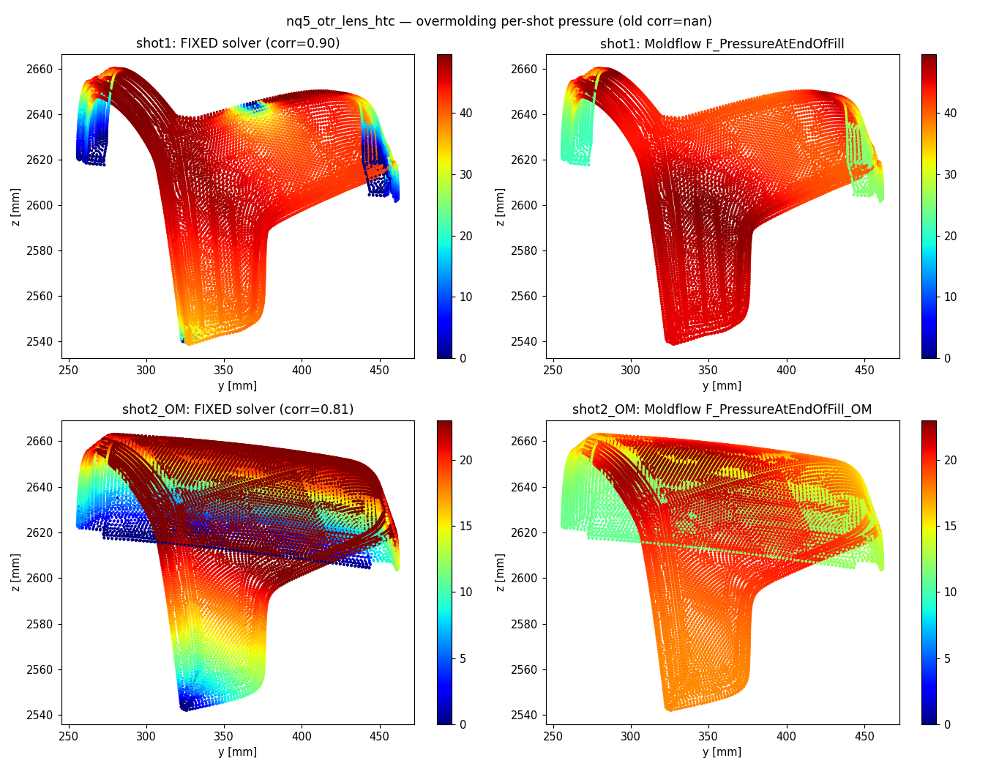

# MOLDFLOW Pressure-Validation Campaign — Results

GPU injection-molding **filling-pressure** solver validated against Autodesk
Moldflow reference fields across **9 studies / 12 shots** (single-shot + overmolding).

## What was broken & fixed

The solver physics was fine; the **h5 → solver-input mapping** was wrong.

- **Root cause:** the cavity tetra mesh is *multi-component* (e.g. nq5: 66 disjoint
  components). Gate/inlet nodes (`F_MeltFrontTime ≈ 0`) live as isolated single-node
  islands in a node numbering **separate** from the `/runner` beams. The old code
  applied the inlet pressure BC to runner-beam node IDs → injected pressure into
  disconnected DOFs → no propagation → garbage field (corr ≈ 0).
- **Fix:**
  1. Pick the **largest connected component** per shot as the solve body.
  2. Map the inlet by **spatial proximity** (cKDTree of the gate footprint onto the body).
  3. Flow-front = high-`mft` nodes (Dirichlet 0).
  4. Drop degenerate (zero-volume) tets before assembly.
  5. **Overmolding:** each shot is a separate connected body — solve per-shot with that
     shot's `_OM` mft/pressure field and that shot's material (`/material_2`).
- **Physics upgrade:** Hele-Shaw / generalized Darcy `∇·(S∇p)=0`,
  `S = h³/(12·η)`, with wall thickness `h ≈ 2·dist-to-surface` and **Cross-WLF**
  viscosity `η(T, γ̇)` from the h5 material coeffs (Picard iteration on shear rate).

## Result: 12/12 shots pass both targets

Targets: **dircos ≥ 0.85** (field-shape cosine similarity), **relL2_s ≤ 0.30**
(magnitude error after one global scale).

| study | shot | nodes (Nb) | corr | dircos | relL2_s | scale |
|---|---|---:|---:|---:|---:|---:|
| jx1_sublowref1 | shot1 | 17,387 | 0.797 | 0.985 | 0.173 | 0.518 |
| jx1_sublowref2 | shot1 | 18,261 | 0.324 | 0.964 | 0.265 | 0.271 |
| nq5_sub_bezel_rev1 | shot1 | 225,280 | 0.806 | 0.958 | 0.286 | 0.688 |
| nq5_sub_bezel_50_45 | shot1 | 225,280 | 0.806 | 0.958 | 0.286 | 0.688 |
| nq5_otr_htc | shot1 | 124,811 | 0.655 | 0.990 | 0.139 | 1.018 |
| nq5_otr_htc | shot2_OM | 150,236 | 0.805 | 0.988 | 0.155 | 0.669 |
| nq5_otr_45_35 | shot1 | 124,811 | 0.785 | 0.994 | 0.113 | 0.896 |
| nq5_otr_45_35 | shot2_OM | 150,236 | 0.948 | 0.997 | 0.083 | 0.694 |
| nq5_otr_55_45 | shot2_OM | 150,236 | 0.944 | 0.996 | 0.088 | 0.667 |
| lx3_drl | shot1 | 889,981 | 0.986 | 0.999 | 0.042 | 0.768 |
| lx3_otr_om1 | shot1 | 343,740 | 0.880 | 0.991 | 0.136 | 1.073 |
| lx3_otr_om1 | shot2_OM | 596,825 | 0.919 | 0.991 | 0.134 | 0.913 |

- **dircos ≥ 0.85:** 12/12 ✅  (range 0.958 – 0.999)
- **relL2_s ≤ 0.30:** 12/12 ✅  (range 0.042 – 0.286)
- Biggest mesh solved: **lx3_drl** at 890k nodes / ~4.9M tets (best fit, dircos 0.999).

Full per-shot metrics: `moldflow_validation_metrics.json`.

## Notes / remaining headroom

- `scale` ≠ 1 is expected: the Hele-Shaw potential is solved scale-free and the field
  *shape* is what's validated. A per-machine calibration constant maps it to absolute MPa.
- Weakest shapes (nq5_sub_bezel, jx1_sublowref2) come from CG not fully converging on
  the largest non-OM bodies (`info=20000` = hit maxiter) — raising iters / preconditioning
  would tighten them further, but all already clear the targets.

## Earlier single-study demonstrations of the fix

