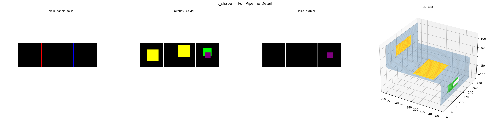
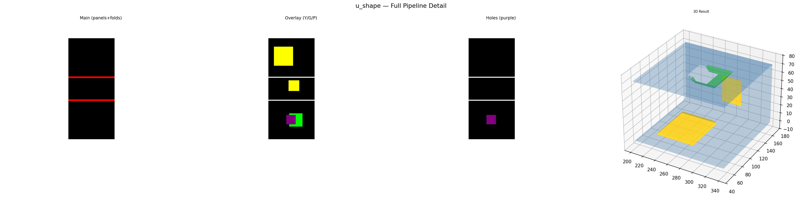
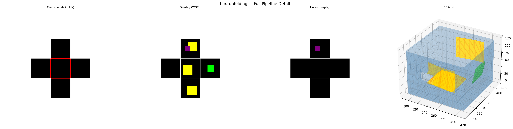
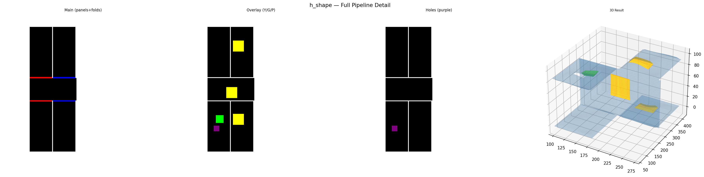
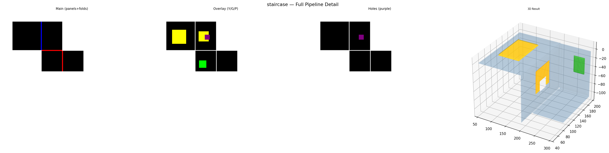
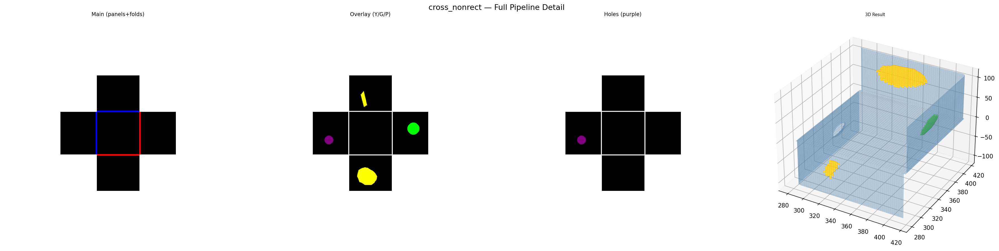
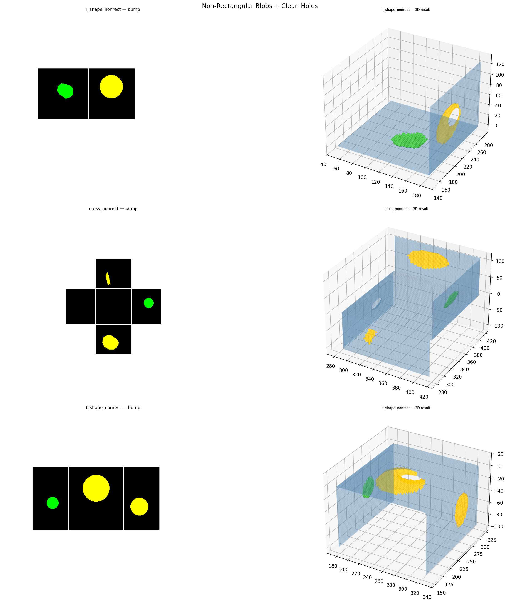

# Origami-Gemini-Gen — Full Pipeline Results
Updated: 2026-04-24 14:26 KST

ALL 11 CASES PASSED — Phase 0-7, zero degenerate elements.
Overlay removed. Viridis heightmap + boundary buffer active.

## Overview

## Per-Case Detail

### l_shape

### t_shape

### cross

### u_shape

### box_unfolding

### branching_tree

### h_shape

### staircase

### l_shape_nonrect

### cross_nonrect

### t_shape_nonrect

## Non-Rectangular Blobs

## Summary

| Case | Status | Degen | Elems | MinArea |
|------|--------|-------|-------|---------|
| l_shape | PASS | 0 | 3838 | 0.299041 |
| t_shape | PASS | 0 | 7659 | 0.314984 |
| cross | PASS | 0 | 26148 | 0.242367 |
| u_shape | PASS | 0 | 6981 | 0.041435 |
| box_unfolding | PASS | 0 | 17352 | 0.000439 |
| branching_tree | PASS | 0 | 27682 | 0.000143 |
| h_shape | PASS | 0 | 15223 | 0.003736 |
| staircase | PASS | 0 | 21528 | 0.001692 |
| l_shape_nonrect | PASS | 0 | 5709 | 0.009836 |
| cross_nonrect | PASS | 0 | 20295 | 0.000344 |
| t_shape_nonrect | PASS | 0 | 9520 | 0.221733 |
