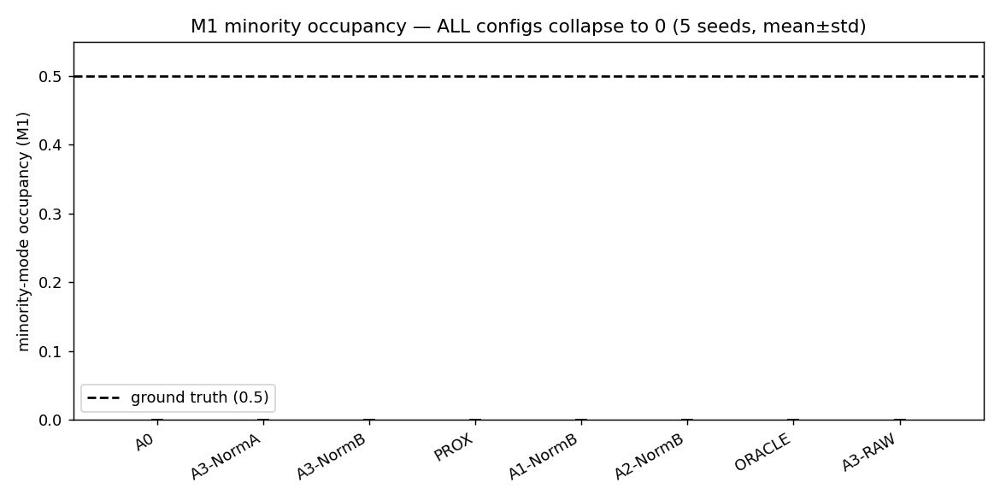
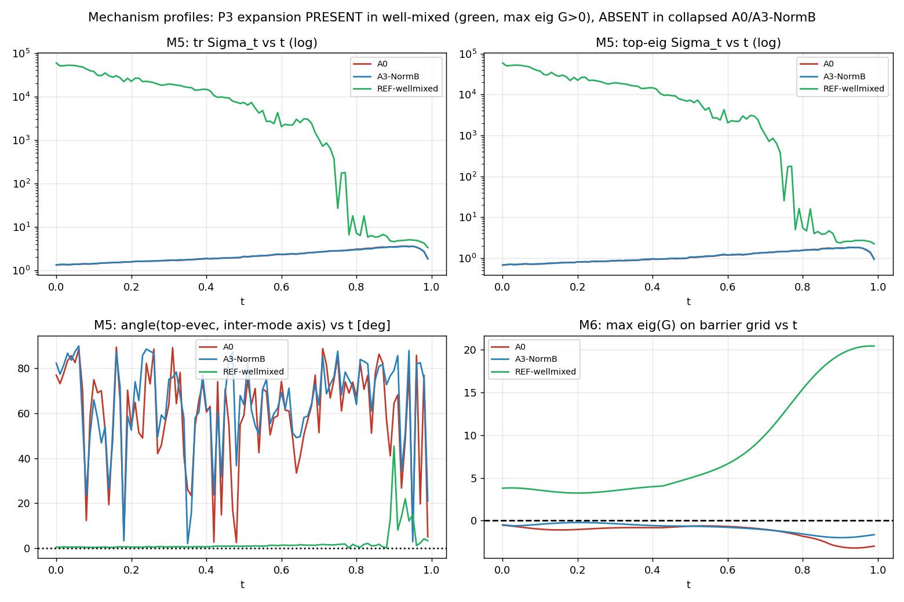
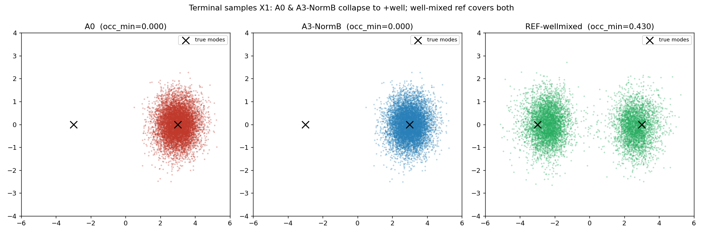

# GLS-AM Kill-Test — Results

**Verdict: H1 FALSIFIED (clean kill).** GLS-weighting the Adjoint-Matching loss is
**inert against mode collapse** on this 2D Gaussian-mixture-with-barrier target.
Every W-shape variant, the **oracle weight**, and the **proximal baseline** all
collapse identically to minority-mode occupancy **exactly 0.0** (5 seeds,
mean±std = 0.0000±0.0000), at a budget-matched 1,536,000 ∇E evals per config.

Full write-up (raw per-seed numbers, calibration ladders, mechanism profiles,
limitations): [`GLS_AM_report.md`](./GLS_AM_report.md).

## Figures

### Minority-mode occupancy — all configs collapse to 0

### Mechanism profiles (M5 variance / M6 forced-expansion eigenvalue)
Predicted expanding structure is PRESENT in the well-mixed reference
(green, max-eig G > 0) but ABSENT in the collapsed samplers.

### Terminal samples
A0 & A3-NormB collapse to the +well; well-mixed reference covers both wells.

## Notes
- Collapse was induced via a user-approved deviation: a **one-sided sampler prior**
  `N((3,0), 0.5²I)`. The **target stays a balanced 50/50 GMM** (true minority
  occupancy = 0.5). With the spec's symmetric broad prior, vanilla AM does NOT
  collapse — see report §1.
- Honest limitation: the induced failure is *total*, so no local correction
  (GLS or PROX) has leverage. The test lacks power in the partial-collapse regime
  (report §5/§9).
- Code: `gls_am.py` (single-file, phase-driven), `plots.py`. Env `SML_env`,
  PyTorch CUDA 12.6, A100 80GB.
