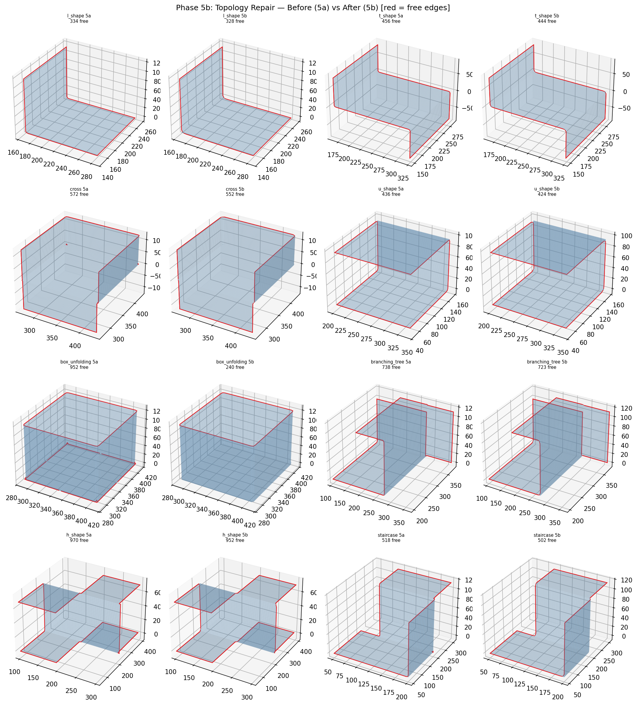
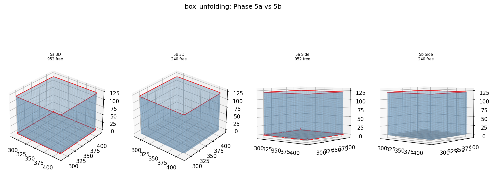
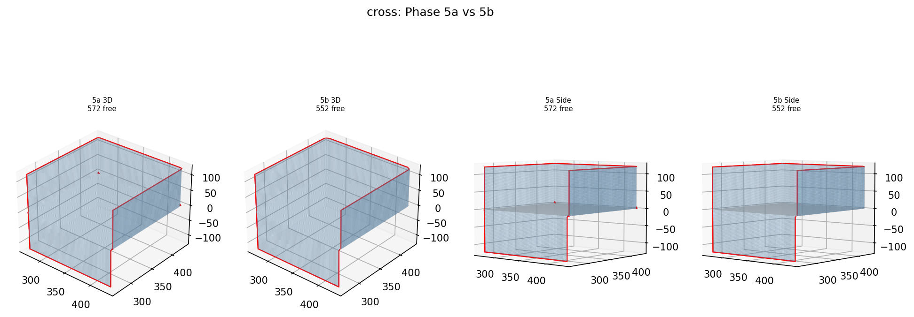
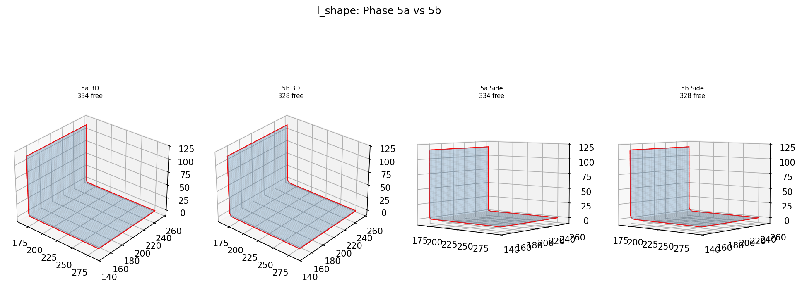

# Phase 5b: Topology Repair Results
Updated: 2026-04-23 13:49:05 KST

## Overview (5a vs 5b, red = free edges)

## box_unfolding detail (952 → 240 free edges, 712 fixed)

## cross detail (572 → 552 free edges, 20 fixed)

## l_shape detail (334 → 328 free edges, 6 fixed)

