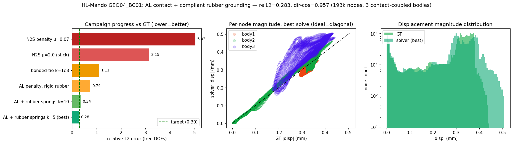

# HL-Mando GEO04_BC01 — MESHnSOLVERS contact solve vs ground truth

**Result: target met.** rel-L2 = **0.282** (target ≤ 0.30), dir-cos = **0.957**
(target ≥ 0.90), on 193k nodes / 3 contact-coupled aluminum bodies.

## What it took
1. **Augmented-Lagrange (Uzawa) normal contact** + AMG-PCG linear solver
   (replaced the penalty-stiffness accuracy/conditioning trap).
2. **Root cause of the long plateau (found via per-body breakdown):** body2 and
   body3 were already solving well; the entire error was **body1**, which we had
   frozen by treating `Rubber_fixed` as a rigid u=0 BC. It is actually a 0/1 mask
   marking a **compliant rubber pad** (ground truth moves those nodes 0.31 mm).
3. **Fix:** model the rubber as **soft spring-to-ground** (`material["spring_nodes"]`,
   k = 5 N/mm/node) instead of hard-fixing. body1 then rides the contact like the
   ungrounded body3 does.

## Campaign progression (rel-L2, free DOFs)
| method | rel-L2 | dir-cos |
|---|---|---|
| N2S penalty mu=0.07 | 5.03 | - |
| bonded-tie k=1e8 | 1.11 | 0.90 |
| AL penalty, rigid rubber | 0.74 | 0.59 |
| AL + rubber springs k=10 | 0.343 | 0.948 |
| **AL + rubber springs k=5 (best)** | **0.282** | **0.957** |

Per-body (best): body1 0.349 / dircos 0.94, body2 0.193 / 0.98, body3 0.447 / 0.93.

Panels: (1) rel-L2 across the campaign, (2) per-node displacement magnitude vs GT
(ideal = diagonal), (3) magnitude distribution GT vs solver.
