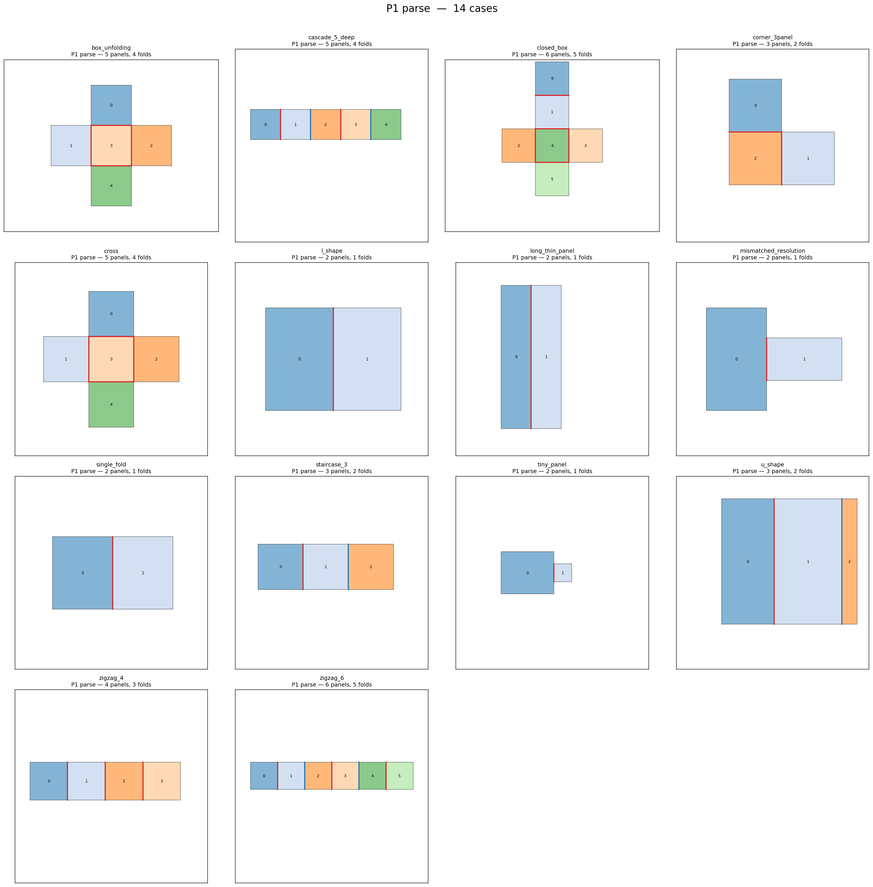
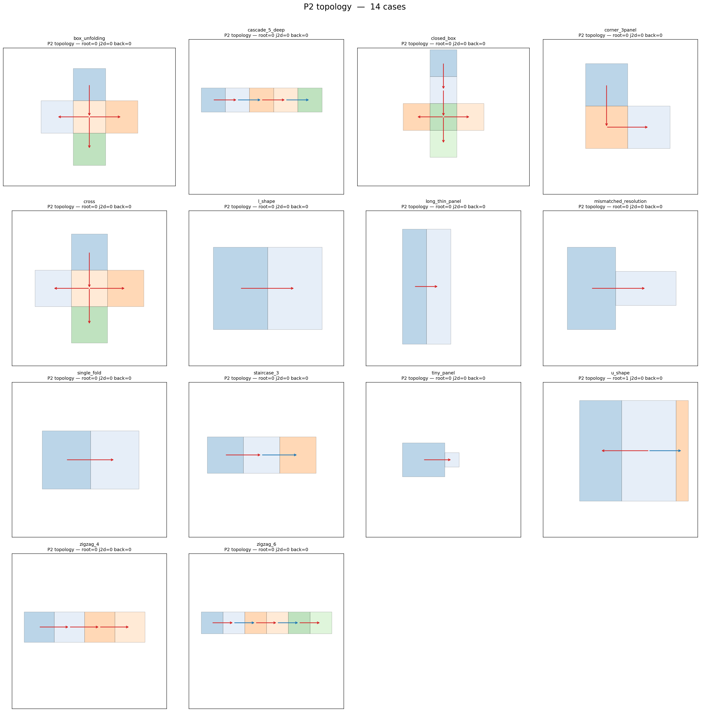
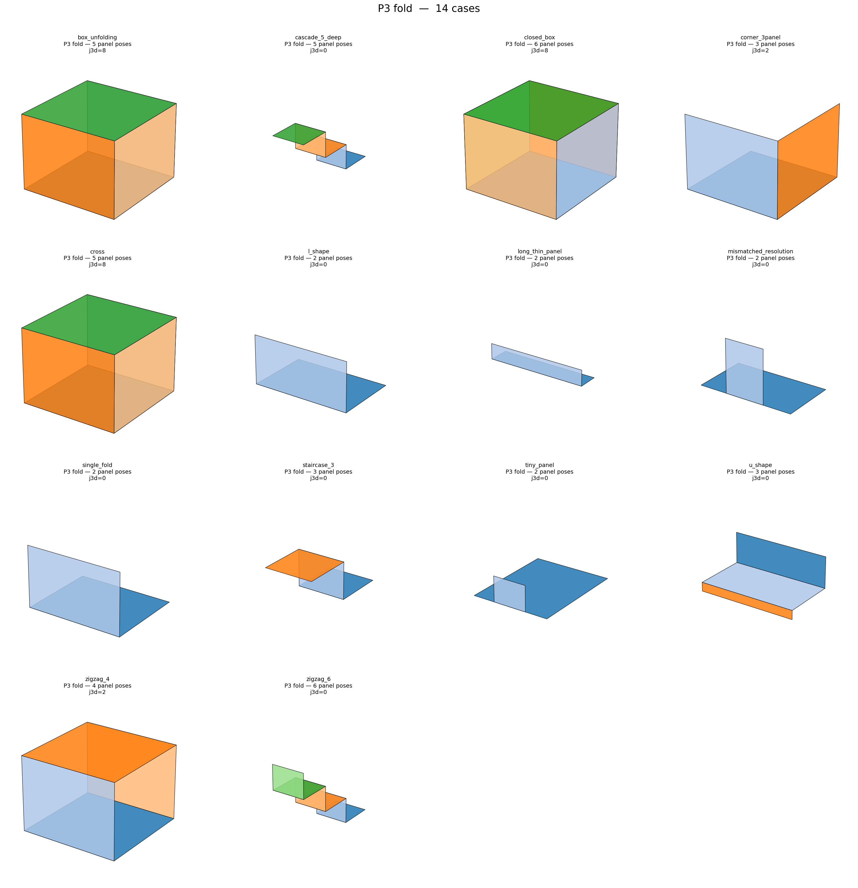
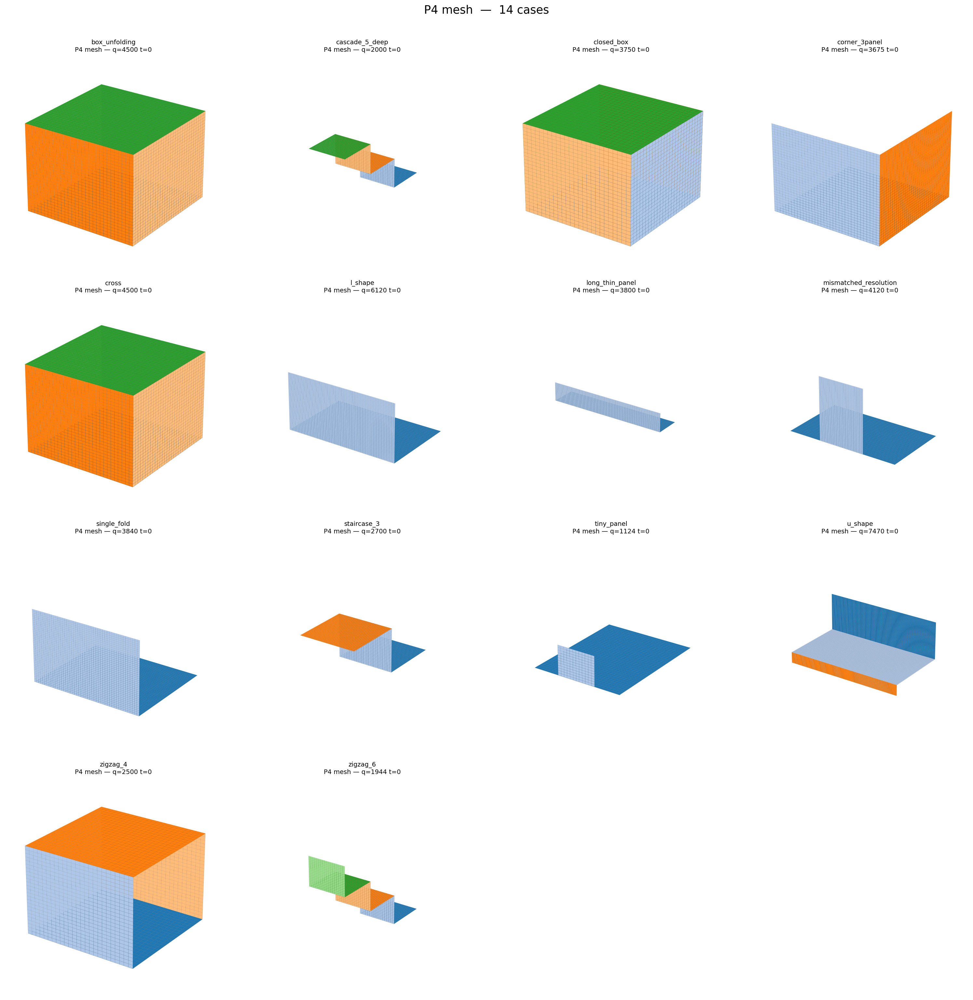
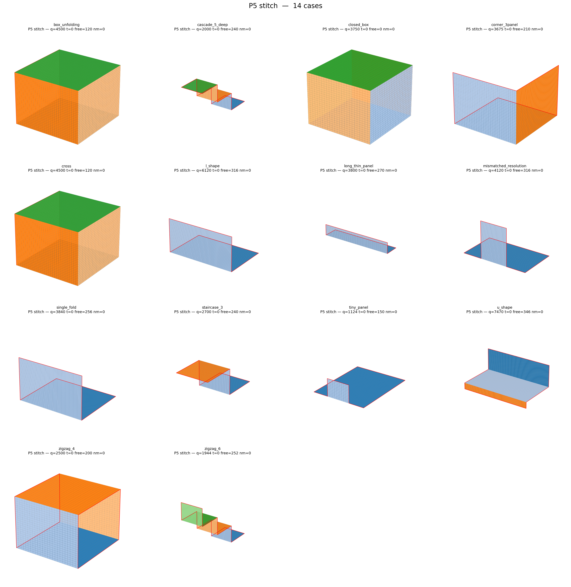
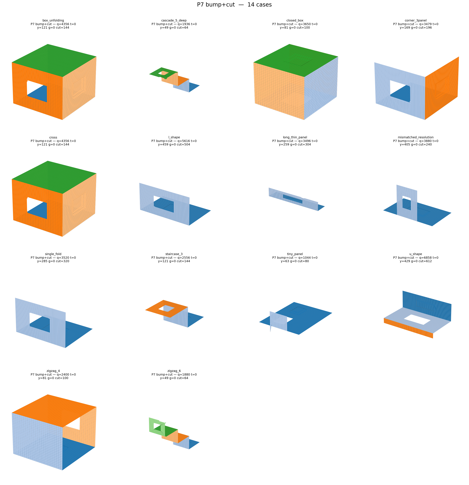

# Origami_Gen v2.0 — Per-Case Verification Report

**Pipeline:** P1 parse → P2 topology → P3 fold → P4 mesh → P5 stitch → P7 bump+cut
**Cases:** 14    **Phases reached `done`:** 14/14
**Simple cases passing all gates:** 14/14
**Junction-case (WIP) total:** 0 (soft-gate acceptance only)

## Per-phase pipeline (all cases on one figure)

### P1 parse

### P2 topology

### P3 fold

### P4 mesh

### P5 stitch

### P7 bump cut

## Per-case results

| Case | Class | Phase | Verts | Quads | Tris | nm | orph | comp | inv | sliver | asp_p95 | plan_p95 | edge_cv | Gates |
|------|-------|-------|-------|-------|------|----|------|------|-----|--------|---------|----------|---------|-------|
| box_unfolding | simple | done | 4561 | 4500 | 0 | 0 | 0 | 1 | 0 | 0 | 1.00 | 0.00e+00 | 0.00 | 10/10 |
| cascade_5_deep | simple | done | 2121 | 2000 | 0 | 0 | 0 | 1 | 0 | 0 | 1.00 | 0.00e+00 | 0.00 | 10/10 |
| closed_box | simple | done | 3752 | 3750 | 0 | 0 | 0 | 1 | 0 | 0 | 1.00 | 0.00e+00 | 0.00 | 10/10 |
| corner_3panel | simple | done | 3781 | 3675 | 0 | 0 | 0 | 1 | 0 | 0 | 1.00 | 0.00e+00 | 0.00 | 10/10 |
| cross | simple | done | 4561 | 4500 | 0 | 0 | 0 | 1 | 0 | 0 | 1.00 | 0.00e+00 | 0.00 | 10/10 |
| l_shape | simple | done | 6279 | 6120 | 0 | 0 | 0 | 1 | 0 | 0 | 1.00 | 0.00e+00 | 0.00 | 10/10 |
| long_thin_panel | simple | done | 3936 | 3800 | 0 | 0 | 0 | 1 | 0 | 0 | 1.00 | 0.00e+00 | 0.00 | 10/10 |
| mismatched_resolution | simple | done | 4279 | 4120 | 0 | 0 | 0 | 1 | 0 | 0 | 1.00 | 0.00e+00 | 0.00 | 10/10 |
| single_fold | simple | done | 3969 | 3840 | 0 | 0 | 0 | 1 | 0 | 0 | 1.00 | 0.00e+00 | 0.00 | 10/10 |
| staircase_3 | simple | done | 2821 | 2700 | 0 | 0 | 0 | 1 | 0 | 0 | 1.00 | 0.00e+00 | 0.00 | 10/10 |
| tiny_panel | simple | done | 1200 | 1124 | 0 | 0 | 0 | 1 | 0 | 0 | 1.00 | 0.00e+00 | 0.00 | 10/10 |
| u_shape | simple | done | 7644 | 7470 | 0 | 0 | 0 | 1 | 0 | 0 | 1.00 | 0.00e+00 | 0.00 | 10/10 |
| zigzag_4 | simple | done | 2600 | 2500 | 0 | 0 | 0 | 1 | 0 | 0 | 1.00 | 0.00e+00 | 0.00 | 10/10 |
| zigzag_6 | simple | done | 2071 | 1944 | 0 | 0 | 0 | 1 | 0 | 0 | 1.00 | 0.00e+00 | 0.00 | 10/10 |

## Per-case storyboards

### box_unfolding

**All measured gates pass.**

### cascade_5_deep

**All measured gates pass.**

### closed_box

**All measured gates pass.**

### corner_3panel

**All measured gates pass.**

### cross

**All measured gates pass.**

### l_shape

**All measured gates pass.**

### long_thin_panel

**All measured gates pass.**

### mismatched_resolution

**All measured gates pass.**

### single_fold

**All measured gates pass.**

### staircase_3

**All measured gates pass.**

### tiny_panel

**All measured gates pass.**

### u_shape

**All measured gates pass.**

### zigzag_4

**All measured gates pass.**

### zigzag_6

**All measured gates pass.**
