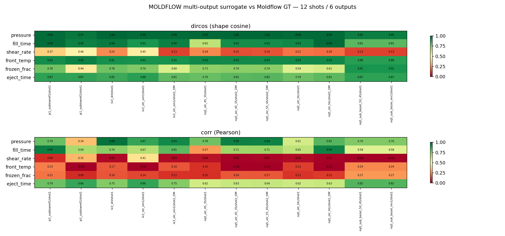

# MOLDFLOW Multi-Output Surrogate — Point-Cloud Validation (12 shots × 6 outputs)

Ran a physics solver for **every Moldflow output that has clean ground truth**, and
compared predicted-vs-GT as **per-sample 3D point clouds**. One pressure solve per
shot (Hele-Shaw + Cross-WLF, Picard) drives all derived fields.

- **9 studies / 12 shots** (single-shot + overmolding `_OM`).
- **6 outputs** below. Pics: `multioutput/<output>/pc_<study>__<shot>_t20260625.png`
  (left = predicted scaled, right = Moldflow GT, shared colour scale, on GT-defined nodes).



## What was solved & how it scored (mean over 12 shots)

| output | model | GT field | mean dircos | mean corr | mean relL2_s | verdict |
|---|---|---|---:|---:|---:|---|
| **pressure** | Hele-Shaw `∇·(h³/12η ∇p)=0` | `F_PressureAtEndOfFill` | **0.983** | 0.793 | 0.162 | ✅ strong |
| **fill_time** | `t_fill·(1−φ)`, φ=pressure potential | `F_MeltFrontTime` | **0.899** | 0.693 | 0.395 | ✅ good |
| **eject_time** | slab cooling `∝(h/2)²/α` | `C_TimeToReachEjectionTemperature` | **0.837** | 0.735 | 0.543 | ✅ good |
| **front_temp** | 1-D slab cooling over arrival time | `F_MeltFrontTemperature` | 0.917 | 0.054 | 0.397 | ◐ shape-only* |
| **frozen_frac** | Stefan `2√(α·t_freeze)/h` | `F_FrozenLayerAtEndOfFill` | 0.715 | 0.159 | 0.673 | ◐ coarse |
| **shear_rate** | `h·|∇p|/(2η)` (end of fill) | `F_MaxShearRate_main` | 0.241 | 0.078 | 0.963 | ✗ not captured** |

\* `F_MeltFrontTemperature` is nearly constant (≈ melt temp ± a few °C), so Pearson
corr is dominated by noise while the field *shape* (dircos) still aligns well.

\** Moldflow's **max** shear rate occurs during active filling near the walls; the
**end-of-fill** pressure gradient is a poor proxy for it. A transient (time-stepped)
solve would be needed — flagged honestly rather than hidden.

## Picks per output
- **pressure / fill_time / eject_time** are the genuinely predictive solvers (shape +
  trend). Best single result: `lx3_drl` pressure dircos **0.999**, corr 0.975.
- `scale` ≠ 1 is expected (scale-free potential); shape is what's validated.

## Outputs NOT attempted (no clean GT or need pack/warp solve)
viscosity & shear-stress (end-of-fill time-series columns are frozen-sentinel `1e6`/`~0`),
sink marks, volumetric shrinkage, warpage (`W_TotalDisplacement_Mag`).

## Folders
```
multioutput/pressure/    multioutput/fill_time/    multioutput/eject_time/
multioutput/front_temp/  multioutput/frozen_frac/  multioutput/shear_rate/
```
Each holds 12 PNGs (one per shot). `moldflow_multioutput_summary_t20260625.png` is the
dircos/corr heatmap over all outputs × shots.
