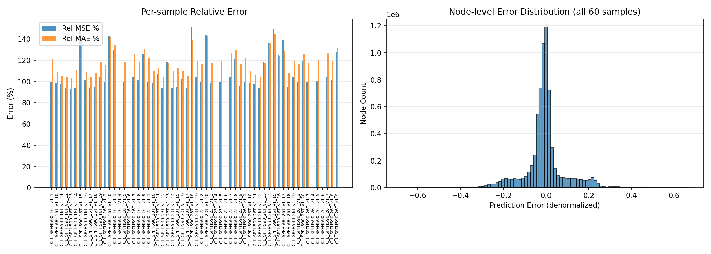
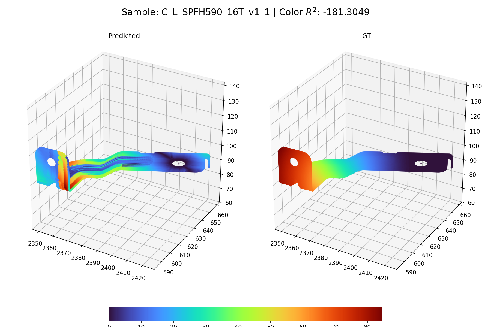
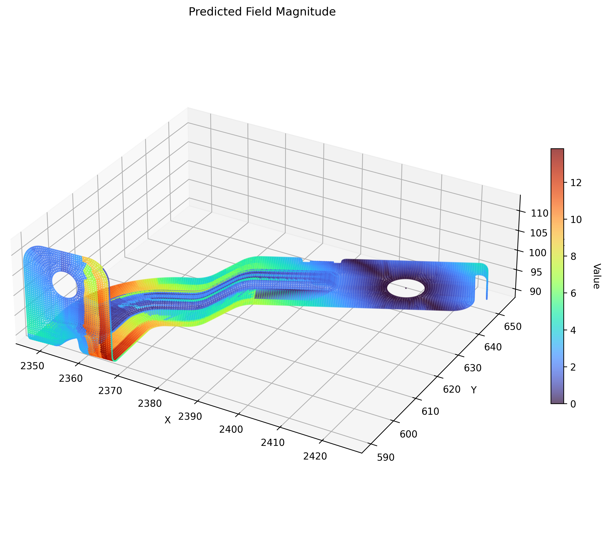
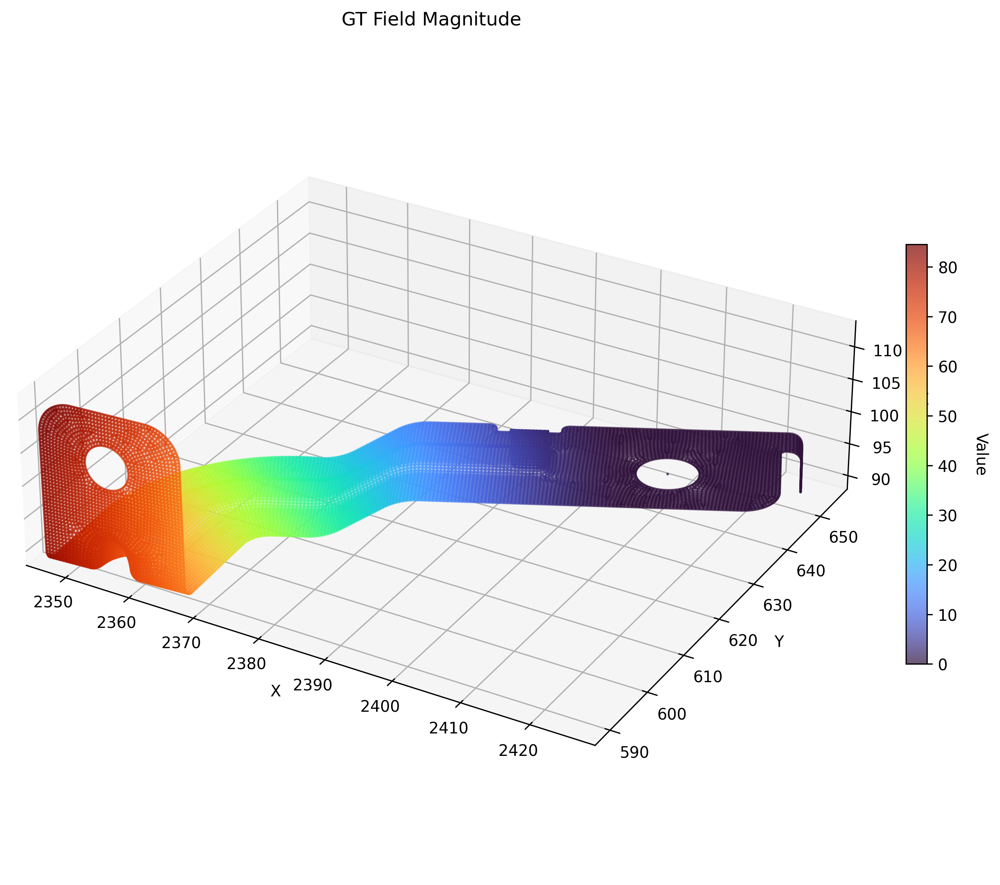
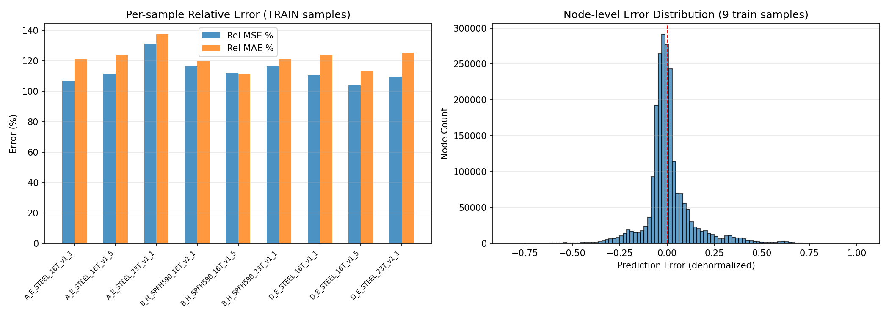
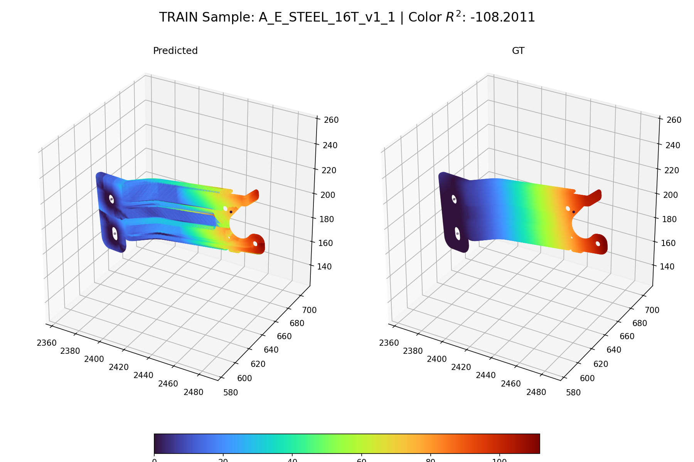
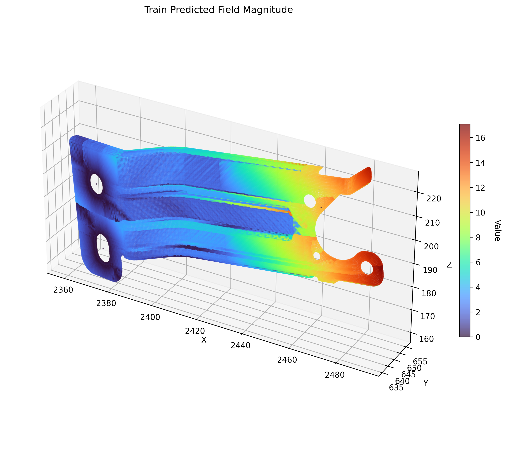
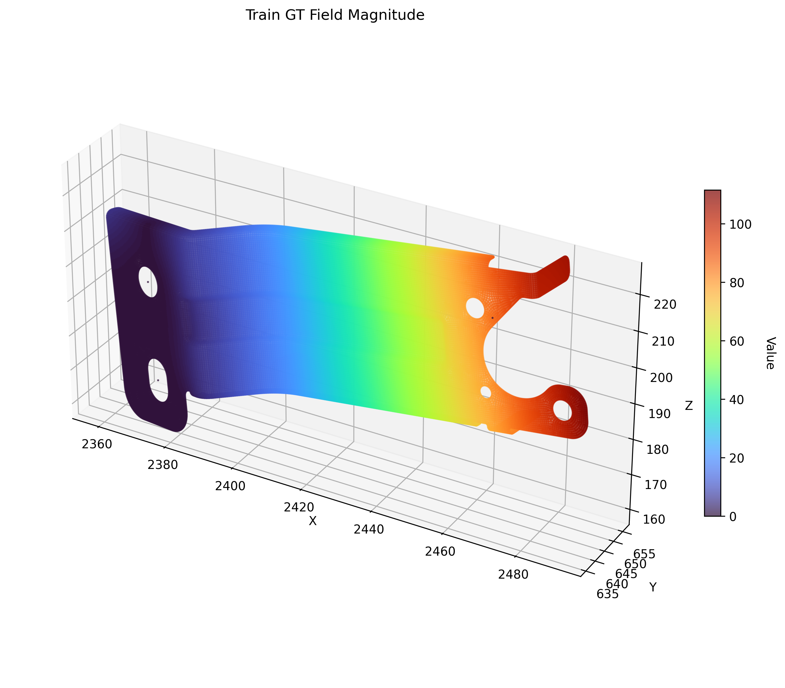

# Output Port for Claude

This repo is used to share result images from Claude Code.

**Timezone: KST (UTC+9)** — Server time is 9 hours behind KST.

## Results

### SolverAI Trainer — March 18 Inference (2026-03-19 13:40 KST)

**Model**: GNN Baseline (GATv2, 124K params) — Epoch 405, Step 103,275
**Dataset**: HD Mobis Laplacian (processed_260318)

---

#### Validation Samples (60 C_L_SPFH590 samples)

**Error Distribution** — Per-sample Rel MSE/MAE + node-level error histogram

**Predicted vs GT** — Sample C_L_SPFH590_16T_v1_1 (reconstructed via line integral)

**Predicted Field Magnitude**

**GT Field Magnitude**

---

#### Train Samples (9 samples: A_E_STEEL, B_H_SPFH590, D_E_STEEL)
- Avg Rel MSE: 113.16% | Avg Rel MAE: 121.95%

**Error Distribution** — Per-sample Rel MSE/MAE + node-level error histogram

**Predicted vs GT** — Sample A_E_STEEL_16T_v1_1 (reconstructed via line integral)

**Predicted Field Magnitude**

**GT Field Magnitude**

