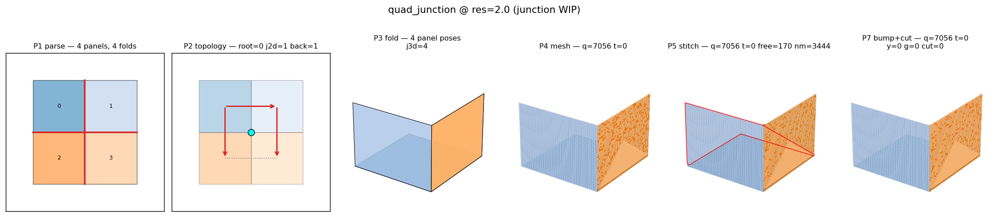
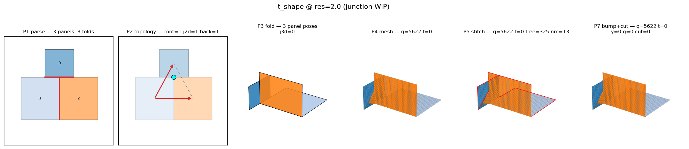
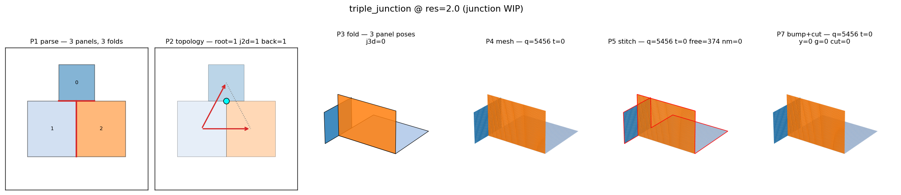

# Origami_Gen v2.0 — Per-Case Verification Report

**Pipeline:** P1 parse → P2 topology → P3 fold → P4 mesh → P5 stitch → P7 bump+cut
**Cases:** 14    **Phases reached `done`:** 14/14
**Simple cases passing all gates:** 8/8
**Junction-case (WIP) total:** 6 (soft-gate acceptance only)

## Per-case results

| Case | Class | Phase | Verts | Quads | Tris | nm | orph | comp | inv | sliver | asp_p95 | plan_p95 | edge_cv | Gates |
|------|-------|-------|-------|-------|------|----|------|------|-----|--------|---------|----------|---------|-------|
| box_unfolding | junction | done | 4681 | 4740 | 0 | 236 | 0 | 1 | 0 | 240 | 87.73 | 0.00e+00 | 0.12 | 6/10 |
| cascade_5_deep | simple | done | 2113 | 2000 | 0 | 0 | 0 | 1 | 0 | 0 | 1.00 | 0.00e+00 | 0.04 | 10/10 |
| closed_box | junction | done | 3858 | 3950 | 0 | 196 | 0 | 1 | 0 | 200 | 73.60 | 0.00e+00 | 0.12 | 6/10 |
| cross | junction | done | 4681 | 4740 | 0 | 236 | 0 | 1 | 0 | 240 | 87.73 | 0.00e+00 | 0.12 | 6/10 |
| l_shape | simple | done | 6277 | 6120 | 0 | 0 | 0 | 1 | 0 | 0 | 1.00 | 0.00e+00 | 0.01 | 10/10 |
| long_thin_panel | simple | done | 3934 | 3800 | 0 | 0 | 0 | 1 | 0 | 0 | 1.00 | 0.00e+00 | 0.01 | 10/10 |
| mismatched_resolution | simple | done | 4277 | 4120 | 0 | 0 | 0 | 1 | 0 | 0 | 1.00 | 0.00e+00 | 0.02 | 10/10 |
| quad_junction | junction | done | 5418 | 7056 | 0 | 3444 | 0 | 1 | 2 | 38 | 1.00 | 0.00e+00 | 1.88 | 5/10 |
| t_shape | junction | done | 5777 | 5622 | 0 | 13 | 0 | 1 | 0 | 15 | 1.00 | 0.00e+00 | 0.56 | 6/10 |
| tiny_panel | simple | done | 1198 | 1124 | 0 | 0 | 0 | 1 | 0 | 0 | 1.00 | 0.00e+00 | 0.03 | 10/10 |
| triple_junction | junction | done | 5608 | 5456 | 0 | 14 | 0 | 1 | 1 | 14 | 1.00 | 0.00e+00 | 0.52 | 5/10 |
| u_shape | simple | done | 7640 | 7470 | 0 | 0 | 0 | 1 | 0 | 0 | 1.00 | 0.00e+00 | 0.02 | 10/10 |
| zigzag_4 | simple | done | 2592 | 2500 | 0 | 0 | 0 | 1 | 0 | 0 | 1.00 | 0.00e+00 | 0.04 | 10/10 |
| zigzag_6 | simple | done | 2061 | 1944 | 0 | 0 | 0 | 1 | 0 | 0 | 1.00 | 0.00e+00 | 0.05 | 10/10 |

## Per-case storyboards

### box_unfolding

**Failed gates:** T3_no_nm_edges, Q1_aspect_p95, Q2_aspect_max, Q6_no_slivers

### cascade_5_deep

**All measured gates pass.**

### closed_box

**Failed gates:** T3_no_nm_edges, Q1_aspect_p95, Q2_aspect_max, Q6_no_slivers

### cross

**Failed gates:** T3_no_nm_edges, Q1_aspect_p95, Q2_aspect_max, Q6_no_slivers

### l_shape

**All measured gates pass.**

### long_thin_panel

**All measured gates pass.**

### mismatched_resolution

**All measured gates pass.**

### quad_junction

**Failed gates:** T3_no_nm_edges, G4_no_inverted, Q2_aspect_max, Q4_edge_cv, Q6_no_slivers

### t_shape

**Failed gates:** T3_no_nm_edges, Q2_aspect_max, Q4_edge_cv, Q6_no_slivers

### tiny_panel

**All measured gates pass.**

### triple_junction

**Failed gates:** T3_no_nm_edges, G4_no_inverted, Q2_aspect_max, Q4_edge_cv, Q6_no_slivers

### u_shape

**All measured gates pass.**

### zigzag_4

**All measured gates pass.**

### zigzag_6

**All measured gates pass.**
