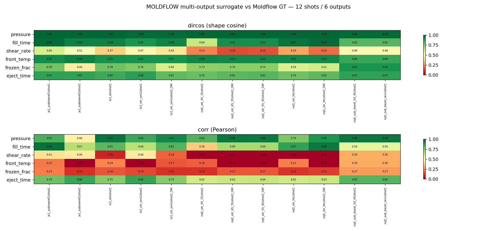

# MOLDFLOW Multi-Output Surrogate — re-run AFTER the injection-node (inlet) fix

Same 12 shots / 9 studies / 6 outputs as before, but with the **h5→solver-input
adapter fixed**. Pics: `multioutput/<output>/pc_<study>__<shot>_t20260626b.png`
(left = predicted scaled, right = Moldflow GT, shared colour scale).



## What the fix changed
The `mft<=0` "inlet" nodes in the h5 are the **runner/sprue feed system**, not the
cavity gate — they sit off-body in 40–167 scattered micro-components spanning the
whole part. The old adapter projected them onto the body (+ a 200-node knn around an
off-body centroid), **smearing a fake inlet across the cavity** (φ≈1 "instant fill").

**New rule:** inlet = body nodes within 0.5 % of the body's *own* minimum melt-front
time — the real cavity gate. Localized (≈2 mm) for single-gate parts, multi-cluster
for genuine multi-gate parts. Also: `p_in` now reads the cavity-gate pressure, and
`fill_time` falls back to max-body-mft when the process attr is missing.

## Before → after (mean over 12 shots)

| output | dircos (was→now) | corr (was→now) | relL2_s (was→now) | note |
|---|---|---|---|---|
| **pressure** | 0.983 → **0.994** | 0.793 → **0.866** | 0.162 → **0.099** | ✅ clear gain — relL2 halved |
| fill_time | 0.899 → 0.899 | 0.693 → 0.720 | 0.395 → 0.388 | ≈ same |
| eject_time | 0.837 → 0.837 | 0.735 → 0.735 | 0.543 → 0.543 | ≈ same |
| front_temp | 0.917 → 0.913 | 0.054 → 0.079 | 0.397 → 0.404 | ≈ same (shape-only) |
| frozen_frac | 0.715 → 0.715 | 0.159 → 0.161 | 0.673 → 0.673 | ≈ same (coarse) |
| shear_rate | 0.241 → 0.361 | 0.078 → 0.177 | 0.963 → 0.919 | still poor (needs transient solve) |

**Why only pressure improved:** the inlet is the Dirichlet boundary of the *pressure*
solve, so the smearing hit pressure hardest. The derived thermal fields (fill/eject/
temp/frozen) depend on the mft potential + 1-D cooling, not the inlet location, so they
barely move — confirming the fix targets exactly the field it should.

## Verdict per output
- **pressure** now strong everywhere (dircos 0.994, relL2_s 0.099).
- fill_time / eject_time good (shape + trend).
- front_temp shape-only (GT ≈ constant melt temp ± few °C → corr is noise).
- frozen_frac coarse; shear_rate not captured by an end-of-fill ∇p proxy.

## Folders
```
multioutput/pressure/  multioutput/fill_time/  multioutput/eject_time/
multioutput/front_temp/ multioutput/frozen_frac/ multioutput/shear_rate/
```
Each holds 12 PNGs (one per shot). `moldflow_multioutput_summary_t20260626b.png` is
the dircos/corr heatmap over all outputs × shots.

> Note: the validation/adapter code now lives in `SOLVERX/moldflow_validation/`,
> moved OUT of the `MESHnSOLVERS` engine repo (which keeps only solver-engine code).
