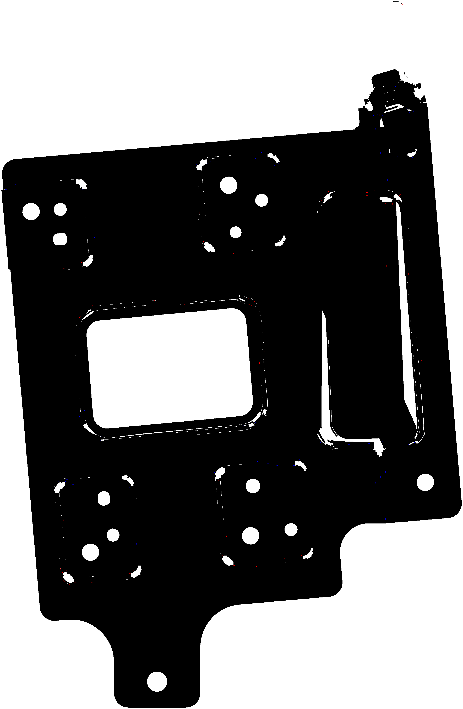
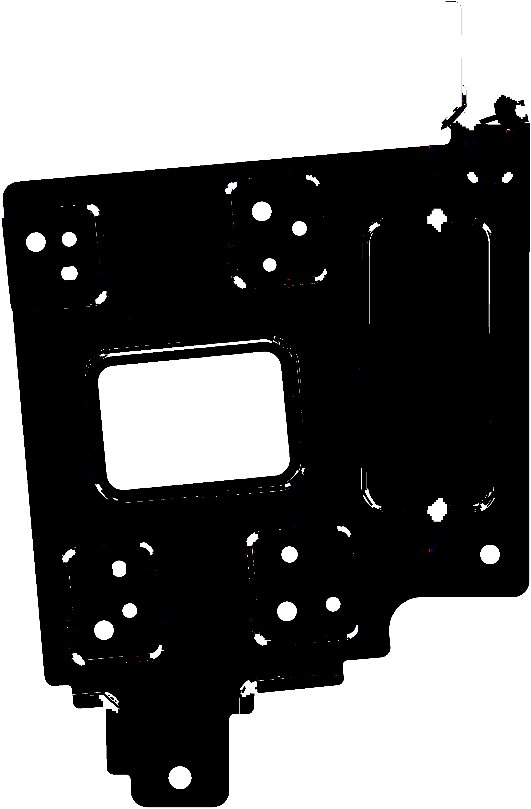
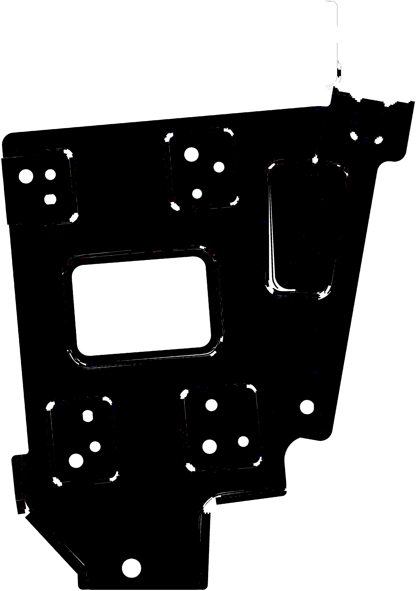
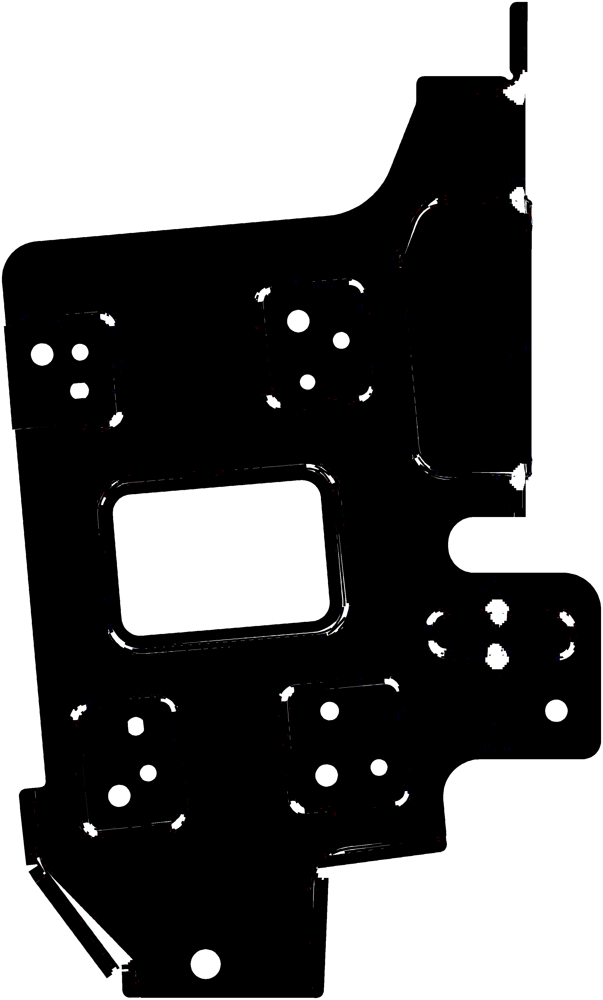
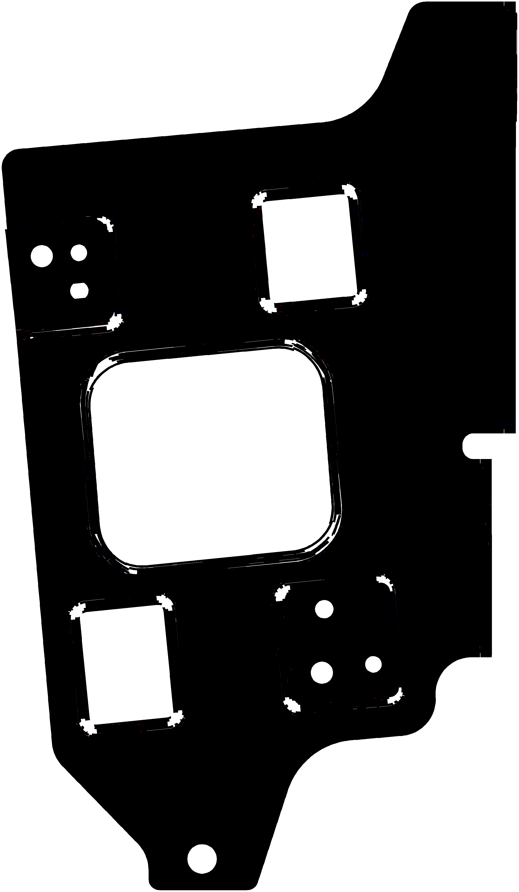
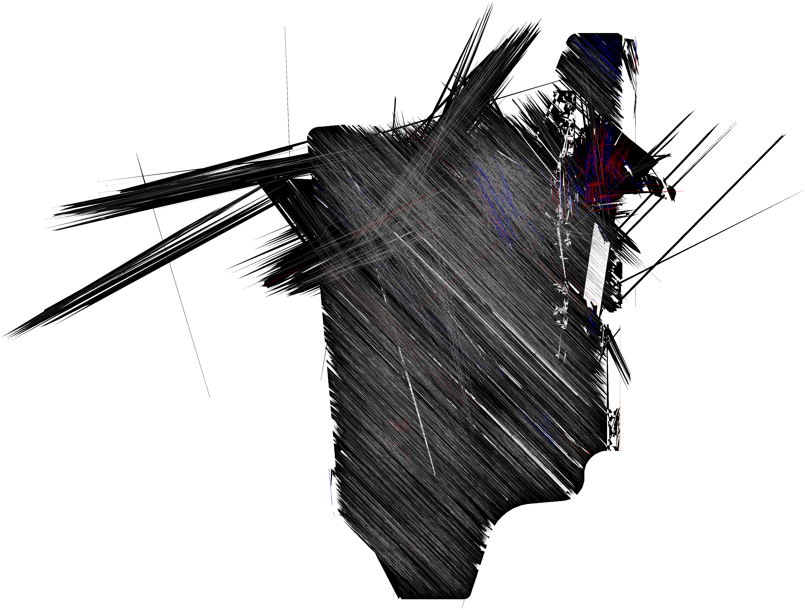
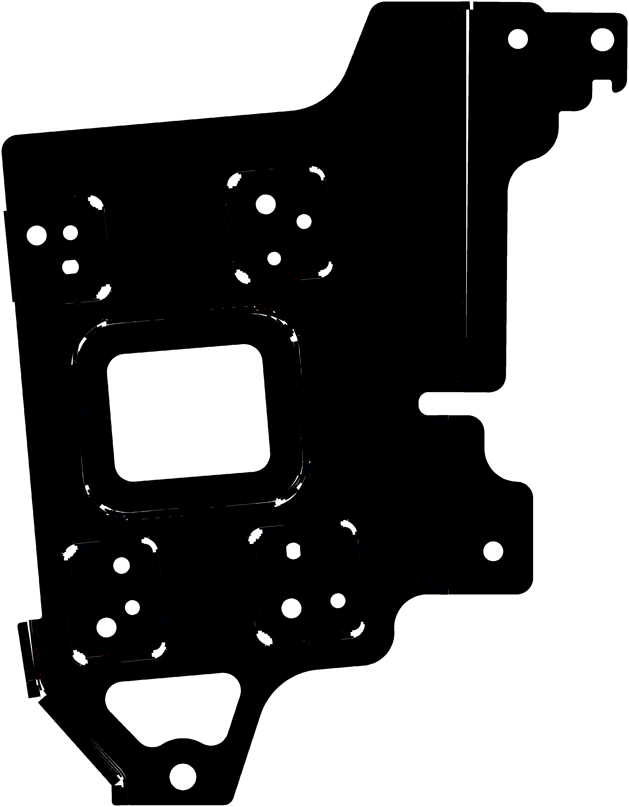
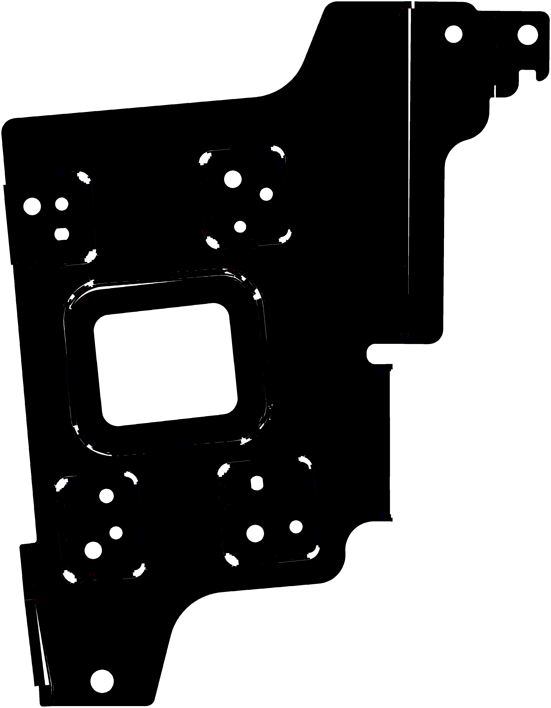

# Output Port

Files Claude moved here are visible on GitHub.

## Current contents

### `inverse_results/` — Origami_Gen inverse pipeline (HD Mobis corpus)

End-to-end run of the v2.0 inverse pipeline (`SOLVERX/Origami_Gen/inverse/`)
in **lenient mode** on the full HD Mobis FEA shell-mesh corpus.

#### Example: family 1, case `sol103_01_410_08`

| _main.png (panels + folds) | _hole.png (shell boundaries) | _bump.png (bumps) |
|---|---|---|
|  |  |  |

#### Family gallery (one canonical variant per family)

| family 1 | family 2 | family 3 | family 4 |
|---|---|---|---|
|  |  |  |  |
| `_410_*` | `_420_*` | `_430_*` | `_440_*` |

| family 5 | family 6 | family 7 | family 8 |
|---|---|---|---|
|  |  |  |  |
| `_450_*` | `_461_*` (dome-like) | `_462_*` | `_463_*` |

**Headline numbers**

| metric | value |
|---|---|
| Files processed | 40 |
| Geometry families | 8 (× 5 variants each) |
| Total runtime | 19.4 min |
| Avg runtime / case | 29.1 s |
| §4.7 gate passed | **40 / 40** |
| Validation OK | 35 / 40 |

**Per-family canonical first variant** (geometry repeats across the 5 variants):

| family | first variant | suffix |
|---|---|---|
| 1 | `sol103_01_410_08/` | `_410_*` |
| 2 | `sol103_06_420_08/` | `_420_*` |
| 3 | `sol103_11_430_08/` | `_430_*` |
| 4 | `sol103_16_440_08/` | `_440_*` |
| 5 | `sol103_21_450_08/` | `_450_*` |
| 6 | `sol103_26_461_08/` | `_461_*` |
| 7 | `sol103_31_462_08/` | `_462_*` |
| 8 | `sol103_36_463_08/` | `_463_*` |

#### Per-case files

Each `sol103_<NN>_<YYY>_<ZZ>/` directory contains:

| file | description |
|---|---|
| `<case>_main.png` | Black panel mask + red mountain folds + blue valley folds (`viewer-relative` sign convention, view = +Z by default) |
| `<case>_hole.png` | Purple shell-boundary holes on white |
| `<case>_bump.png` | Yellow `+n` / green `−n` bump masks (only present if any bumps detected) |
| `<case>_layout.json` | Vector source-of-truth: panel polygons, fold edges, holes, bumps in 2D |
| `<case>_recovery.json` | Per-phase diagnostics (timings, panel counts, fold counts, etc.) |
| `<case>_approx_error.json` | §4.7 representability gate per-check pass/fail + measured/threshold |
| `manifest.json` | Top-level run summary + output paths + determinism hash |

#### Color contract

| color | meaning |
|---|---|
| `#000000` black | panel face |
| `#ff0000` red | mountain fold (`+1`, opens toward viewer) |
| `#0000ff` blue | valley fold (`−1`, opens away from viewer) |
| `#808080` gray | ambiguous fold (bisector ⊥ view direction) |
| `#800080` purple | hole (shell-boundary loop) |
| `#ffff00` yellow | bump `+n` (outward along panel normal) |
| `#00ff00` green | bump `−n` (inward) |
| `#ffffff` white | background |

#### Lenient-mode caveats

This run was produced with `--lenient` per user direction *"ignore some
defects and fillets etc."*  In this mode:

- **Stretch / overlap / connectivity / fold-residual checks are
  demoted to warnings** in the §4.7 gate.  They still appear in
  `<case>_approx_error.json` for inspection.
- **Tiny panels merged** (≤ 20 faces absorbed into closest-normal
  adjacent panel) — HD Mobis goes from ~430 raw panels per case to
  ~30-50 merged panels.
- **Canvas capped at 4096 × 4096** in the rasterizer.

The 5 cases that report `validation_ok=False` (all in family 6,
`*_461_*`) have nearly-zero planar area (~3.7%) — they are
genuinely dome-like and not strictly origami-representable; the
gate emits PNGs anyway as best-effort output.

#### `corpus_summary.json`

Aggregate of all 40 runs: per-case timings, gate pass/fail,
validation status, and family-hash dedupe info.

### `tmp/` — earlier deliverables (forward-pipeline corpus)

Forward-pipeline corpus output from a prior session.  Kept for reference.
Includes `box_unfolding`, `cascade_5_deep`, `closed_box`, `cross`,
`headline.png`, `l_shape`, etc.
