# Origami_Gen bracket variants v01..v20

Twenty parametric L-with-cap-stack bracket cases authored against `BRACKET_RECIPE.md` §0a (Complexity Floor C1..C11). All share the `hd_mobis_bracket` / `accessory_l_bracket` archetype:

* **5 panels** — A main plate + B flange + C/D/E cap stack.
* **C2 valley fold** at B↔C (blue), rest mountain (red).
* **C3 wider-child** at C→D (D extends past C as a free edge).
* **C4 irregular outline** — main plate has a TL chamfer and a bottom narrow-tab carve with two `_concave_fillet` inside corners (C8).
* **C5/C10 bosses** — 2 boss-stiffener groups × 3 bolts each on the main plate; bolts sit ≥ 6 mm inside their boss.
* **C6 pocket-with-bump** — central rrect cutout wrapped by a matching rrect bump 5 mm larger on every side.
* **C7 fold-spanning beads** — one across A↔B plus one double-fold-cross across B↔C↔D.
* **C9 corner fillets** on every non-fold corner.
* **C11 sub-panel bolts** on B + D.

Variants sweep across main-plate aspect, flange depth, cap proportions, boss placement, and pocket dimensions. Generator: `origami_gen.corpus.mobis_bracket.bracket_variants`.

Each preview shows the three input PNGs side by side:
`_main.png` (panels + folds), `_hole.png` (purple cuts), `_bump.png` (yellow / green displacement).

## Summary

| # | Variant | Canvas |
|---:|---|---:|
| 1 | `bracket_v01` | 920 × 968 |
| 2 | `bracket_v02` | 1032 × 920 |
| 3 | `bracket_v03` | 816 × 1088 |
| 4 | `bracket_v04` | 1096 × 944 |
| 5 | `bracket_v05` | 904 × 1008 |
| 6 | `bracket_v06` | 816 × 1000 |
| 7 | `bracket_v07` | 920 × 1112 |
| 8 | `bracket_v08` | 792 × 944 |
| 9 | `bracket_v09` | 968 × 1208 |
| 10 | `bracket_v10` | 880 × 1048 |
| 11 | `bracket_v11` | 944 × 800 |
| 12 | `bracket_v12` | 1048 × 760 |
| 13 | `bracket_v13` | 1160 × 848 |
| 14 | `bracket_v14` | 976 × 920 |
| 15 | `bracket_v15` | 1120 × 728 |
| 16 | `bracket_v16` | 944 × 976 |
| 17 | `bracket_v17` | 1040 × 1072 |
| 18 | `bracket_v18` | 1096 × 1136 |
| 19 | `bracket_v19` | 1152 × 1192 |
| 20 | `bracket_v20` | 1080 × 1120 |

## All variants

### `bracket_v01`

920 × 968 px

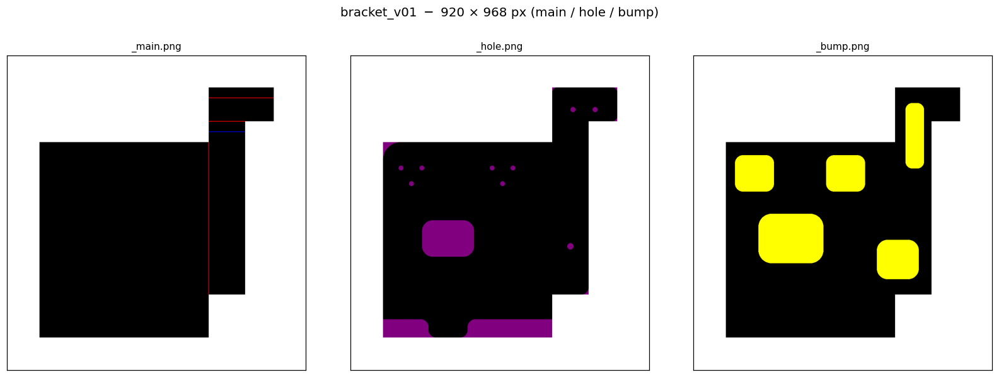

### `bracket_v02`

1032 × 920 px

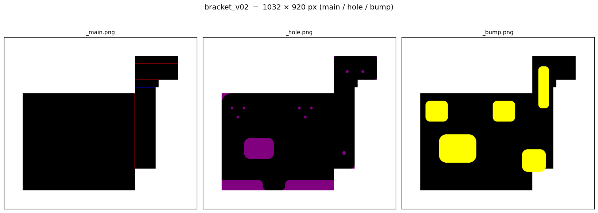

### `bracket_v03`

816 × 1088 px

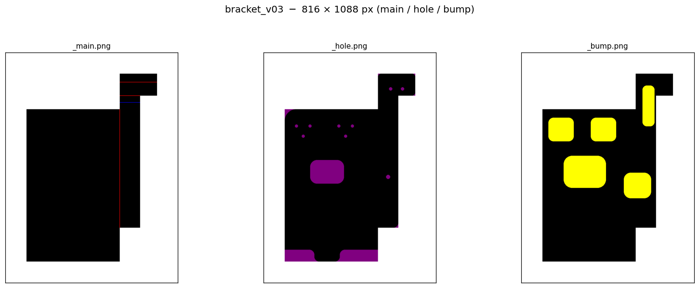

### `bracket_v04`

1096 × 944 px

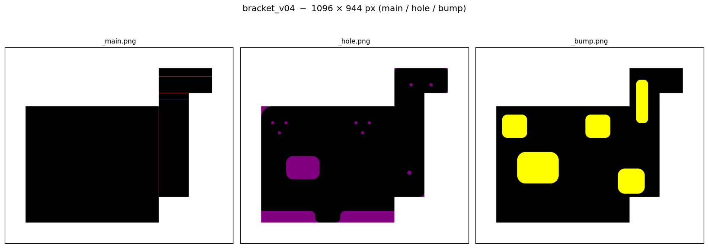

### `bracket_v05`

904 × 1008 px

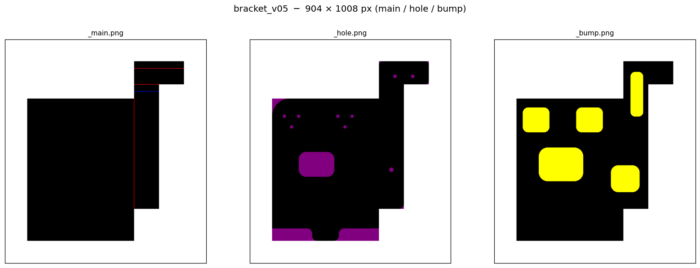

### `bracket_v06`

816 × 1000 px

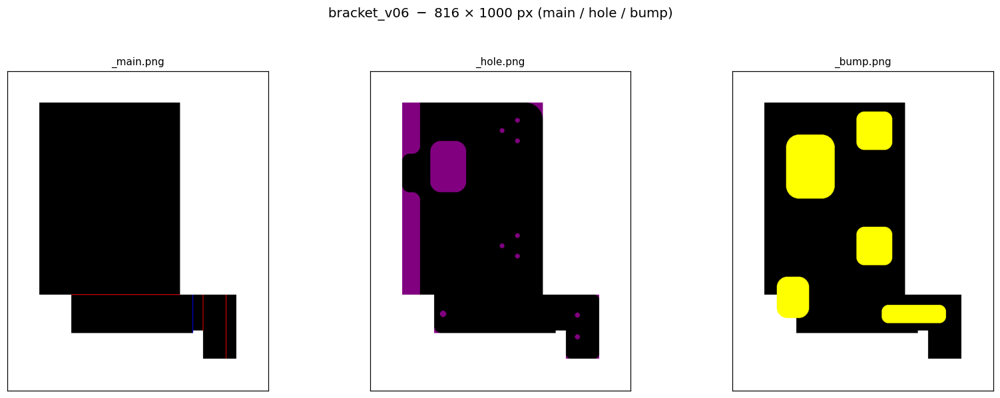

### `bracket_v07`

920 × 1112 px

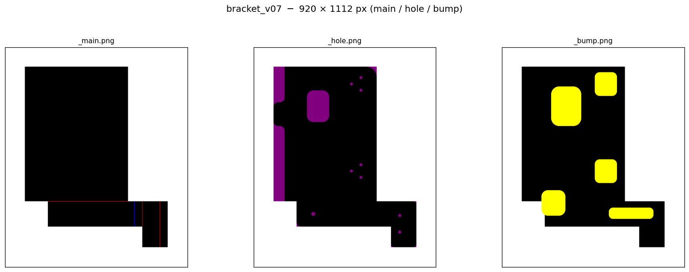

### `bracket_v08`

792 × 944 px

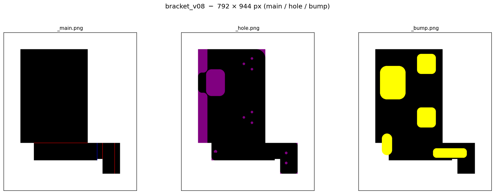

### `bracket_v09`

968 × 1208 px

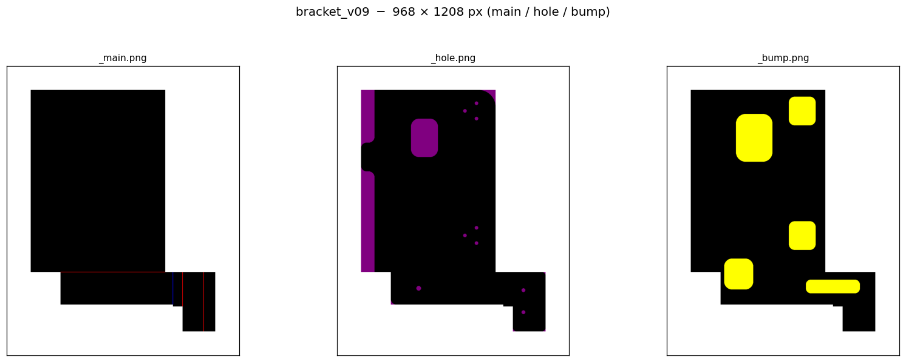

### `bracket_v10`

880 × 1048 px

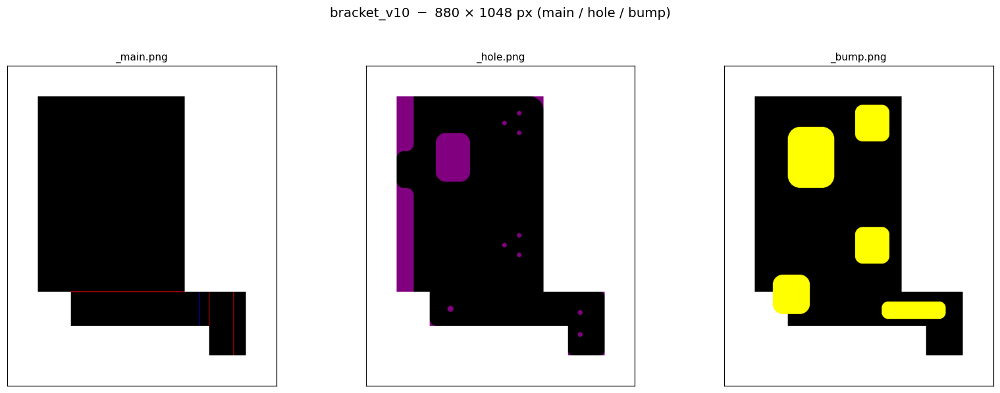

### `bracket_v11`

944 × 800 px

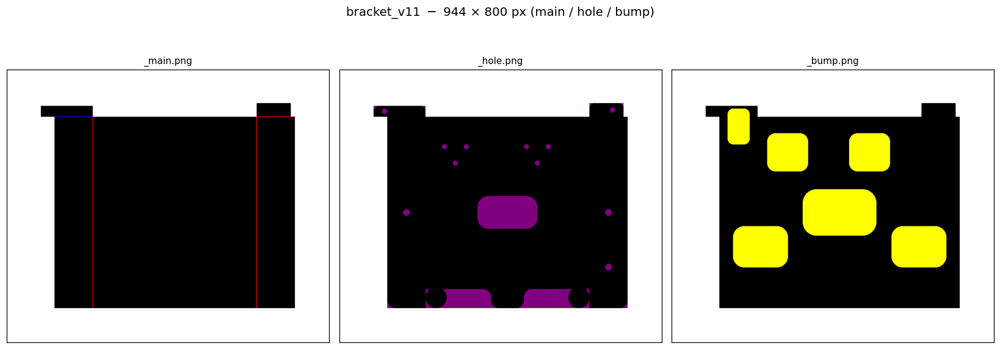

### `bracket_v12`

1048 × 760 px

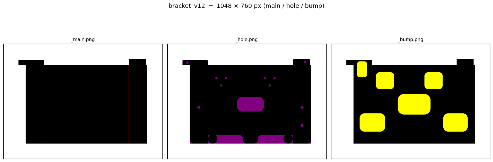

### `bracket_v13`

1160 × 848 px

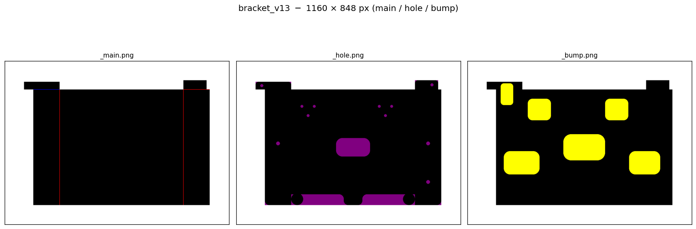

### `bracket_v14`

976 × 920 px

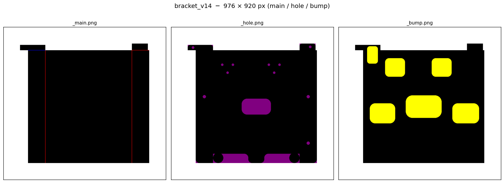

### `bracket_v15`

1120 × 728 px

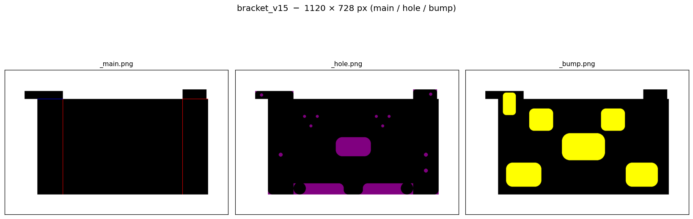

### `bracket_v16`

944 × 976 px

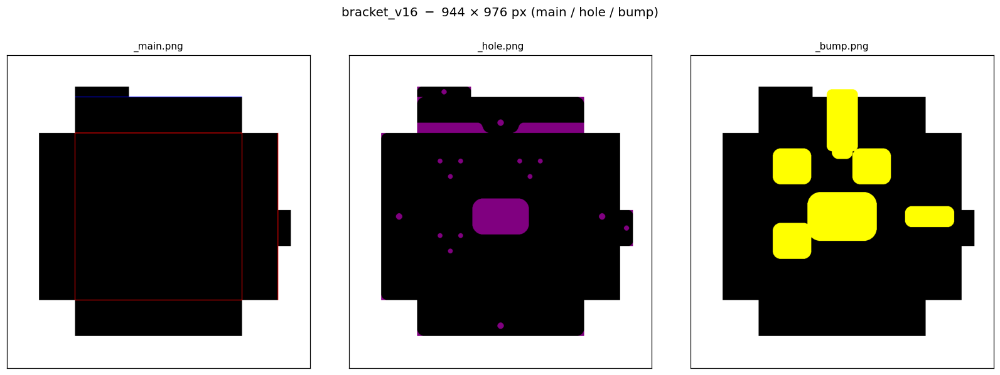

### `bracket_v17`

1040 × 1072 px

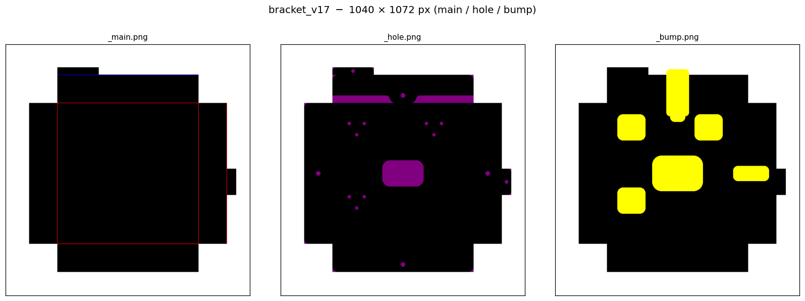

### `bracket_v18`

1096 × 1136 px

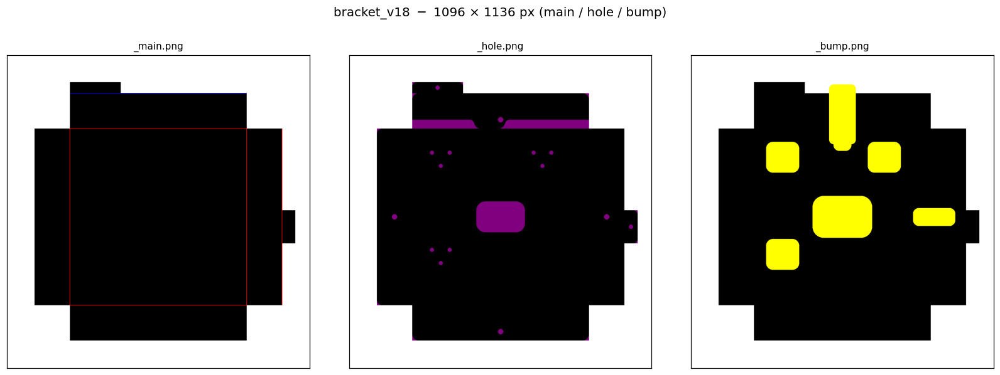

### `bracket_v19`

1152 × 1192 px

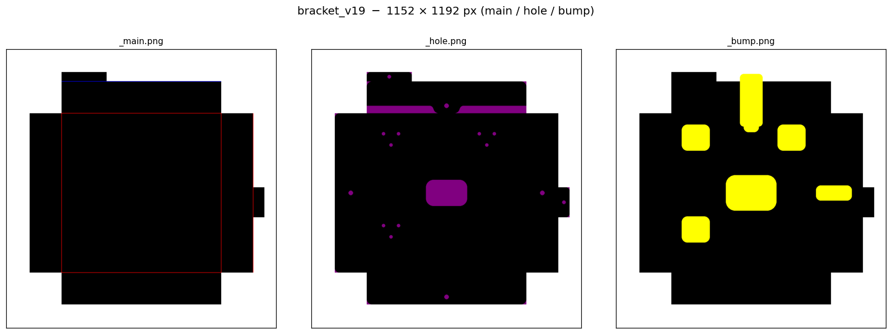

### `bracket_v20`

1080 × 1120 px

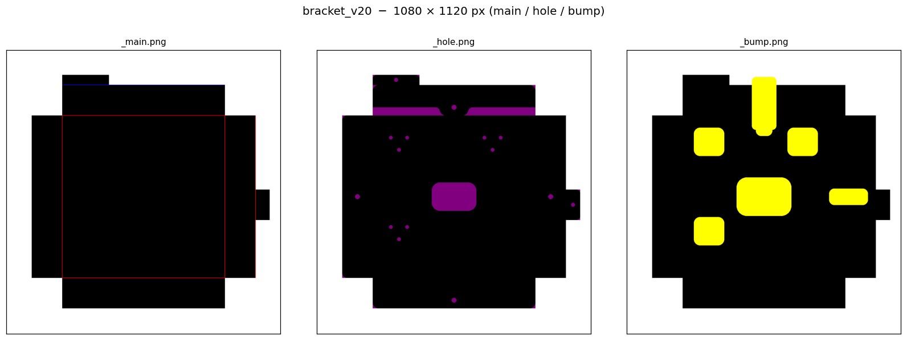
