# Origami_Gen bracket variants v01..v20

Twenty parametric L-with-cap-stack bracket cases authored against `BRACKET_RECIPE.md` §0a (Complexity Floor C1..C11). All share the `hd_mobis_bracket` / `accessory_l_bracket` archetype:

* **5 panels** — A main plate + B flange + C/D/E cap stack.
* **C2 valley fold** at B↔C (blue), rest mountain (red).
* **C3 wider-child** at C→D (D extends past C as a free edge).
* **C4 irregular outline** — main plate has a TL chamfer and a bottom narrow-tab carve with two `_concave_fillet` inside corners (C8).
* **C5/C10 bosses** — 2 boss-stiffener groups × 3 bolts each on the main plate; bolts sit ≥ 6 mm inside their boss.
* **C6 pocket-with-bump** — central rrect cutout wrapped by a matching rrect bump 5 mm larger on every side.
* **C7 fold-spanning beads** — one across A↔B plus one double-fold-cross across B↔C↔D.
* **C9 corner fillets** on every non-fold corner.
* **C11 sub-panel bolts** on B + D.

Variants sweep across main-plate aspect, flange depth, cap proportions, boss placement, and pocket dimensions. Generator: `origami_gen.corpus.mobis_bracket.bracket_variants`.

Each preview shows the three input PNGs side by side:
`_main.png` (panels + folds), `_hole.png` (purple cuts), `_bump.png` (yellow / green displacement).

## Summary

| # | Variant | Canvas |
|---:|---|---:|
| 1 | `bracket_v01` | 800 × 888 |
| 2 | `bracket_v02` | 920 × 808 |
| 3 | `bracket_v03` | 760 × 1008 |
| 4 | `bracket_v04` | 912 × 928 |
| 5 | `bracket_v05` | 784 × 888 |
| 6 | `bracket_v06` | 872 × 888 |
| 7 | `bracket_v07` | 800 × 920 |
| 8 | `bracket_v08` | 800 × 888 |
| 9 | `bracket_v09` | 800 × 888 |
| 10 | `bracket_v10` | 800 × 888 |
| 11 | `bracket_v11` | 800 × 888 |
| 12 | `bracket_v12` | 800 × 888 |
| 13 | `bracket_v13` | 800 × 888 |
| 14 | `bracket_v14` | 800 × 888 |
| 15 | `bracket_v15` | 800 × 888 |
| 16 | `bracket_v16` | 800 × 888 |
| 17 | `bracket_v17` | 840 × 904 |
| 18 | `bracket_v18` | 776 × 872 |
| 19 | `bracket_v19` | 832 × 904 |
| 20 | `bracket_v20` | 856 × 920 |

## All variants

### `bracket_v01`

800 × 888 px

### `bracket_v02`

920 × 808 px

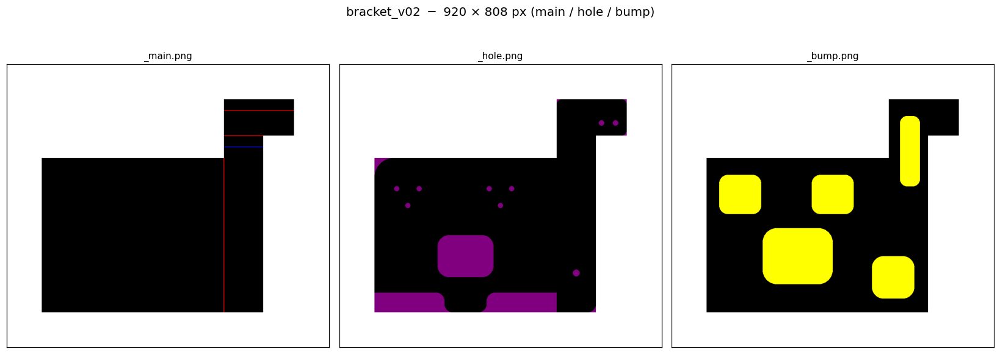

### `bracket_v03`

760 × 1008 px

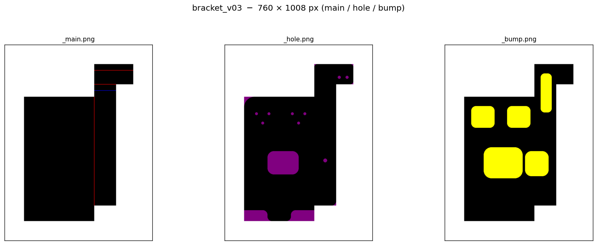

### `bracket_v04`

912 × 928 px

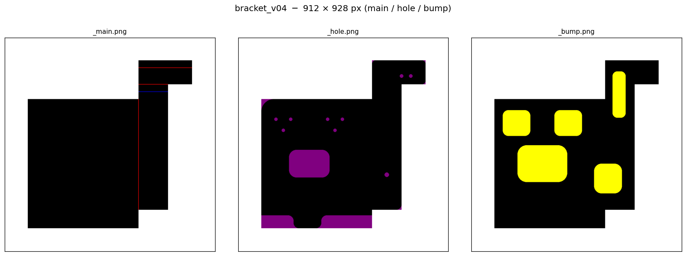

### `bracket_v05`

784 × 888 px

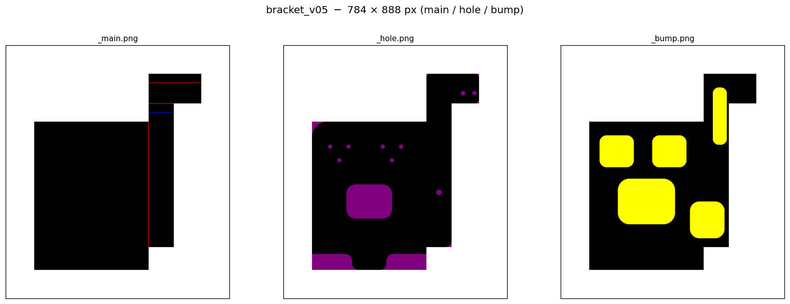

### `bracket_v06`

872 × 888 px

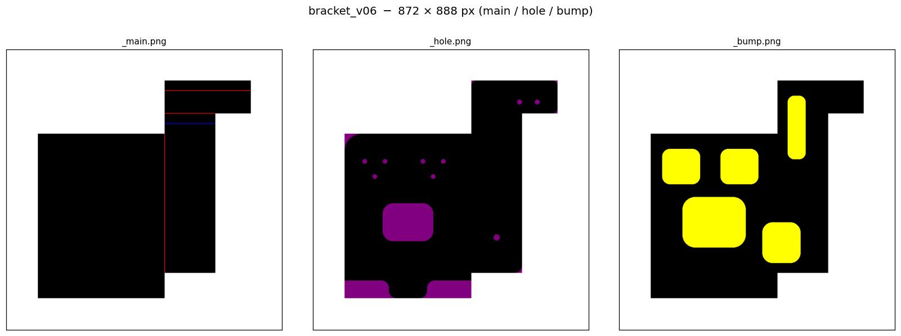

### `bracket_v07`

800 × 920 px

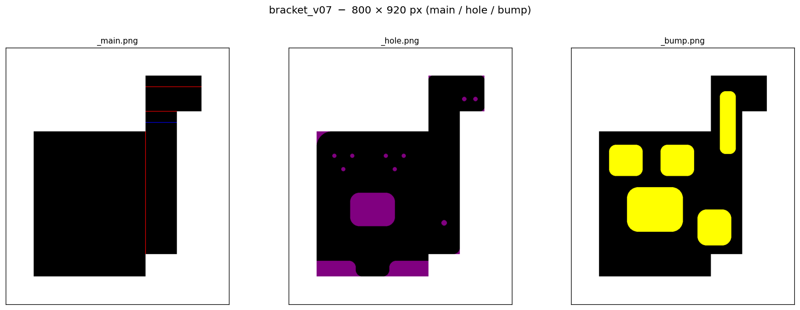

### `bracket_v08`

800 × 888 px

### `bracket_v09`

800 × 888 px

### `bracket_v10`

800 × 888 px

### `bracket_v11`

800 × 888 px

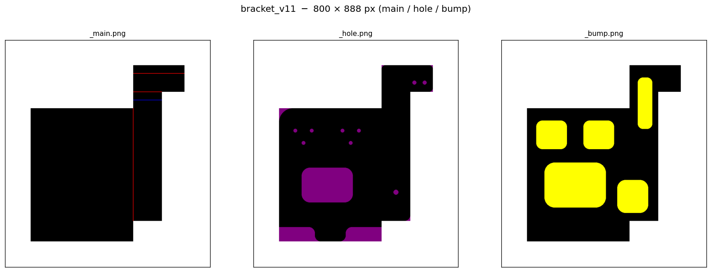

### `bracket_v12`

800 × 888 px

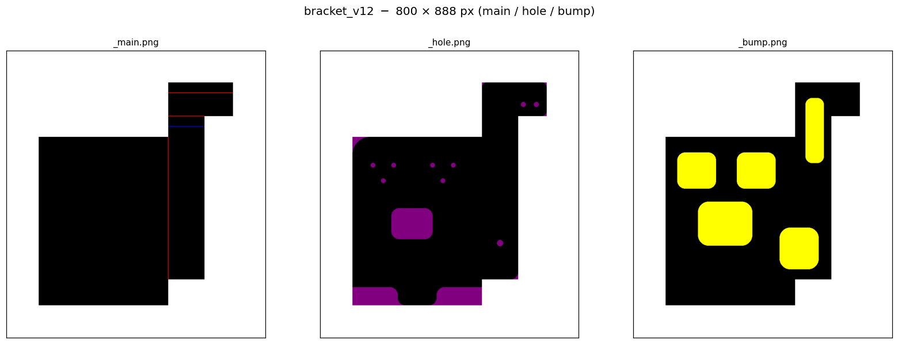

### `bracket_v13`

800 × 888 px

### `bracket_v14`

800 × 888 px

### `bracket_v15`

800 × 888 px

### `bracket_v16`

800 × 888 px

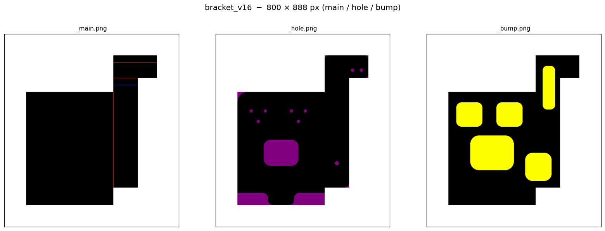

### `bracket_v17`

840 × 904 px

### `bracket_v18`

776 × 872 px

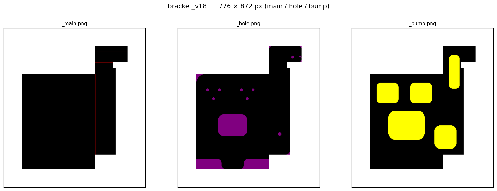

### `bracket_v19`

832 × 904 px

### `bracket_v20`

856 × 920 px

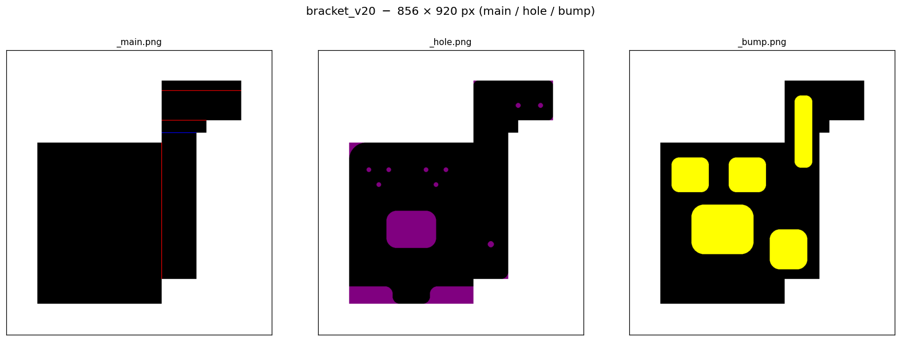
