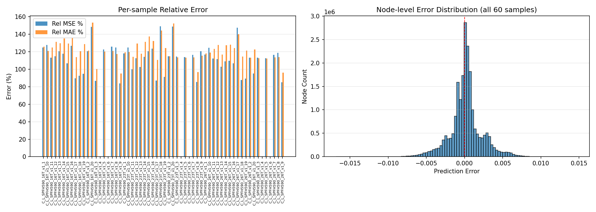

# Output Port for Claude

This repo is used to share result images from Claude Code.

**Timezone: KST (UTC+9)** — Server time is 9 hours behind KST.

## Results

### PyG Trainer — March 19 Inference (2026-03-19 18:46 KST)

**Model**: GNN Baseline (GATv2, 122K params) — Epoch 89, Step 22,695
**Dataset**: HD Mobis Laplacian (processed_260318) — Auto-normalized x & bc, raw y
**Loss**: MSE only | **Checkpoint**: best_valid_loss.pt

---

#### Validation Samples (60 C_L_SPFH590 samples)

**Error Distribution** — Per-sample Rel MSE/MAE + node-level error histogram

**Predicted vs GT** — Sample C_L_SPFH590_16T_v1_1 (reconstructed via line integral)

