# Origami-Gemini-Gen — Per-Phase Pipeline Results
Updated: 2026-04-24 14:31 KST

ALL 11 CASES PASSED. Each image shows: Main | Bump(Y/G) | Hole(P) | Heightmap(Viridis) | Mesh+Stitch | Bump+Cut

## l_shape
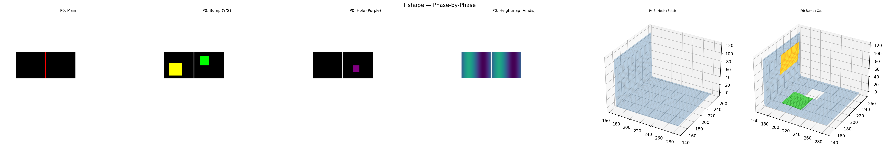

## t_shape
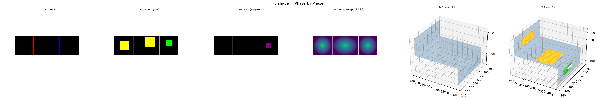

## cross
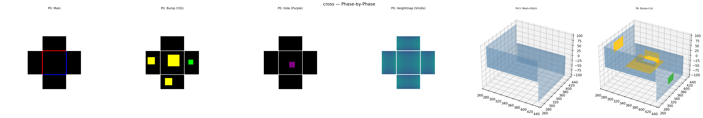

## u_shape
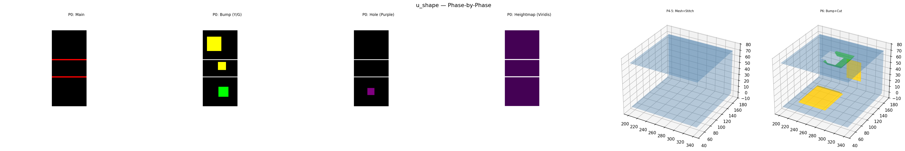

## box_unfolding
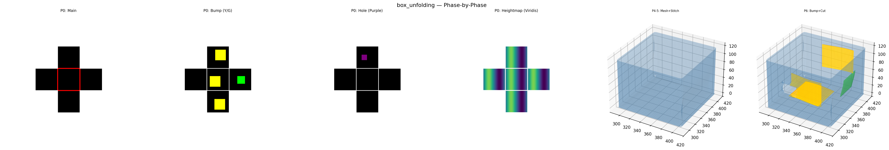

## branching_tree
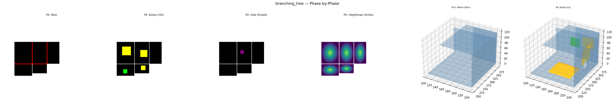

## h_shape
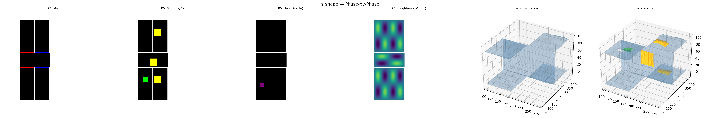

## staircase
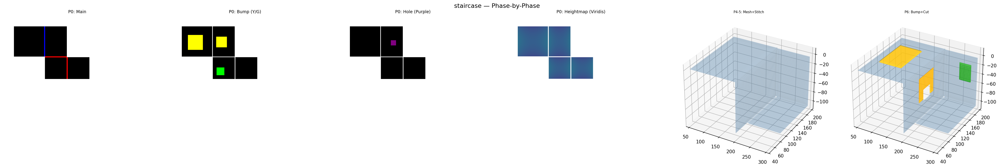

## l_shape_nonrect
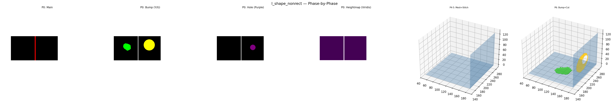

## cross_nonrect
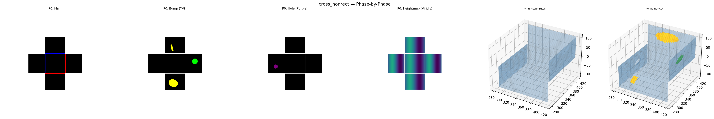

## t_shape_nonrect
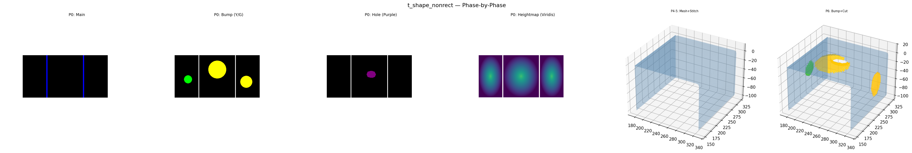

## Summary

| Case | Status | Degen | Elems | MinArea |
|------|--------|-------|-------|---------|
| l_shape | PASS | 0 | 3838 | 0.299041 |
| t_shape | PASS | 0 | 7659 | 0.314984 |
| cross | PASS | 0 | 26148 | 0.242367 |
| u_shape | PASS | 0 | 6981 | 0.041435 |
| box_unfolding | PASS | 0 | 17352 | 0.000439 |
| branching_tree | PASS | 0 | 27682 | 0.000143 |
| h_shape | PASS | 0 | 15223 | 0.003736 |
| staircase | PASS | 0 | 21528 | 0.001692 |
| l_shape_nonrect | PASS | 0 | 5709 | 0.009836 |
| cross_nonrect | PASS | 0 | 20295 | 0.000344 |
| t_shape_nonrect | PASS | 0 | 9520 | 0.221733 |
