# Output Port for Claude

This repo is used to share result images from Claude Code.

**Timezone: KST (UTC+9)** — Server time is 9 hours behind KST.

## Results

### Fillet Bend — fillet region R fit (2026-04-21 23:08 KST)

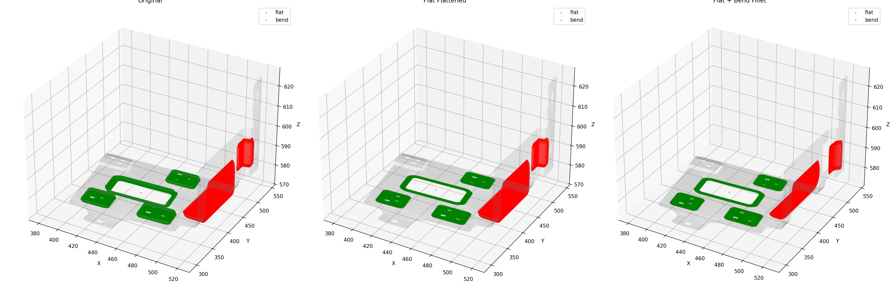

### Bend Blob Boundaries Debug (2026-04-21 22:45 KST)

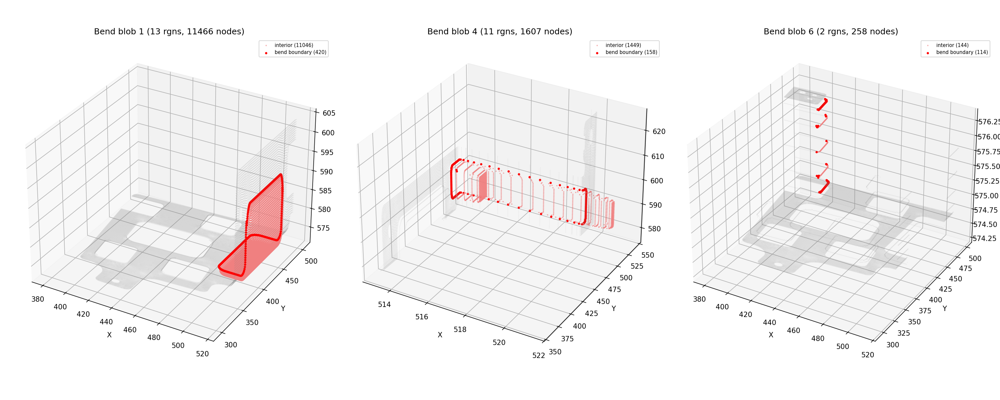

### Fillet Bend Projection (2026-04-21 22:02 KST)

### Laplacian Bend Smoothing (2026-04-21 20:45 KST)

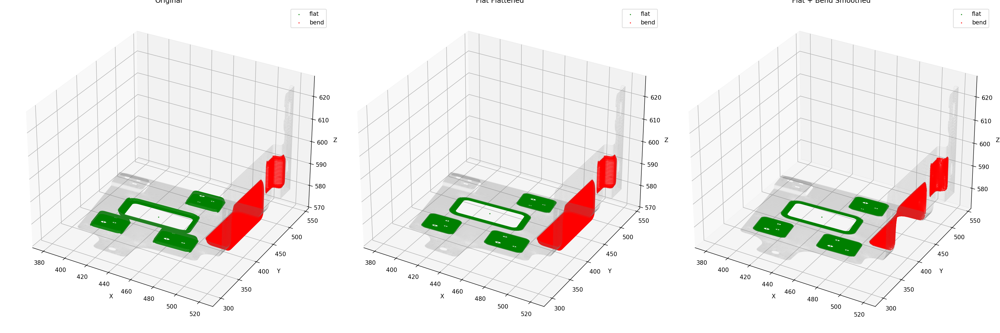

### Blob Flatten adj-only (2026-04-21 20:37 KST)

### Flat vs Bend Bumps L2 (2026-04-21 20:30 KST)

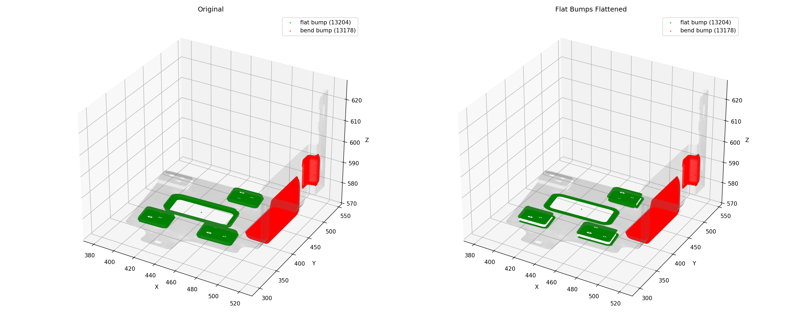

### Peel Flatten (2026-04-21 20:17 KST)

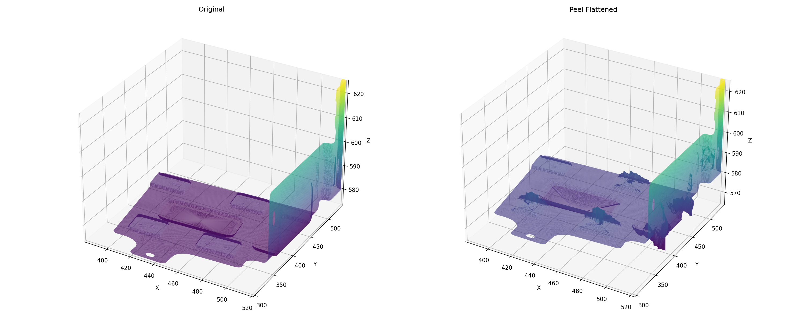

### Bump Blobs (2026-04-21 20:04 KST)

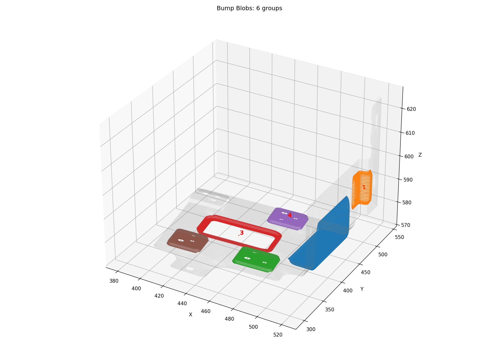

### Main vs Bump Regions (2026-04-21 19:57 KST)

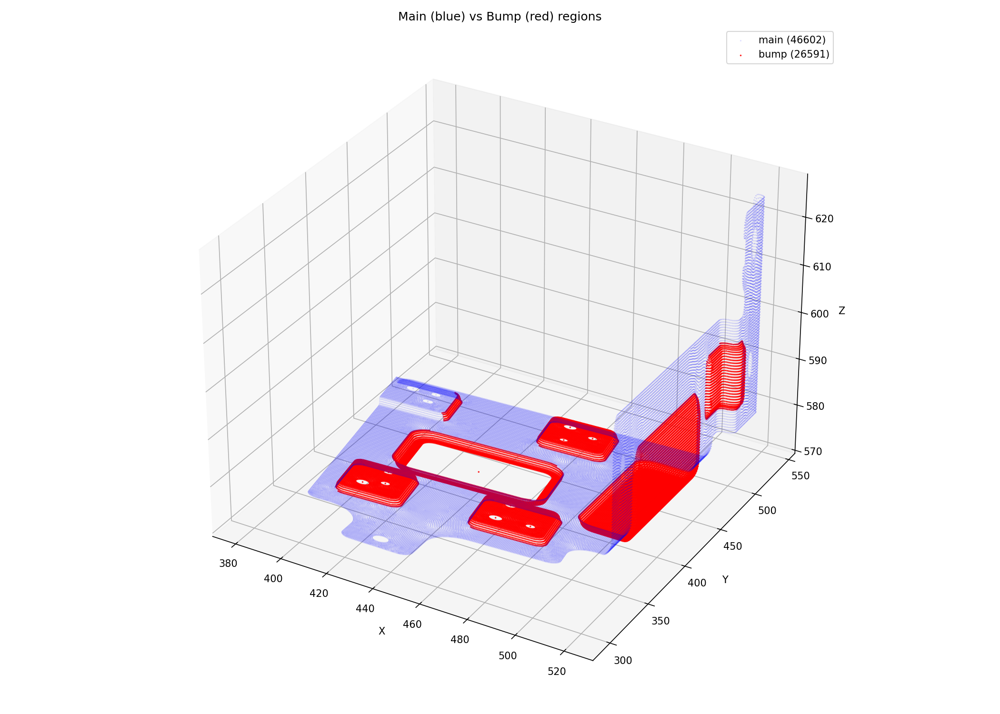

### Bump Flattening Mesh (2026-04-21 19:43 KST)

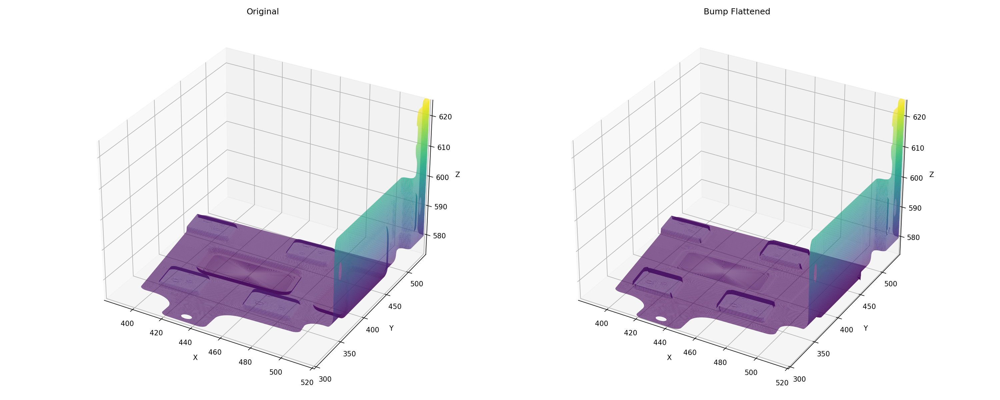

### Bump Flattening (2026-04-21 19:38 KST)

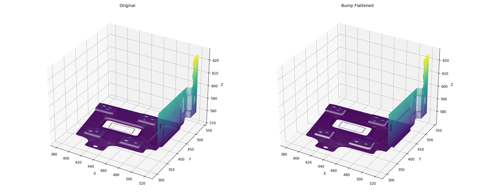

### Region Growing fixed normals (2026-04-21 17:20 KST)

### Region Growing holes filled 86 regions 30° (2026-04-21 17:06 KST)

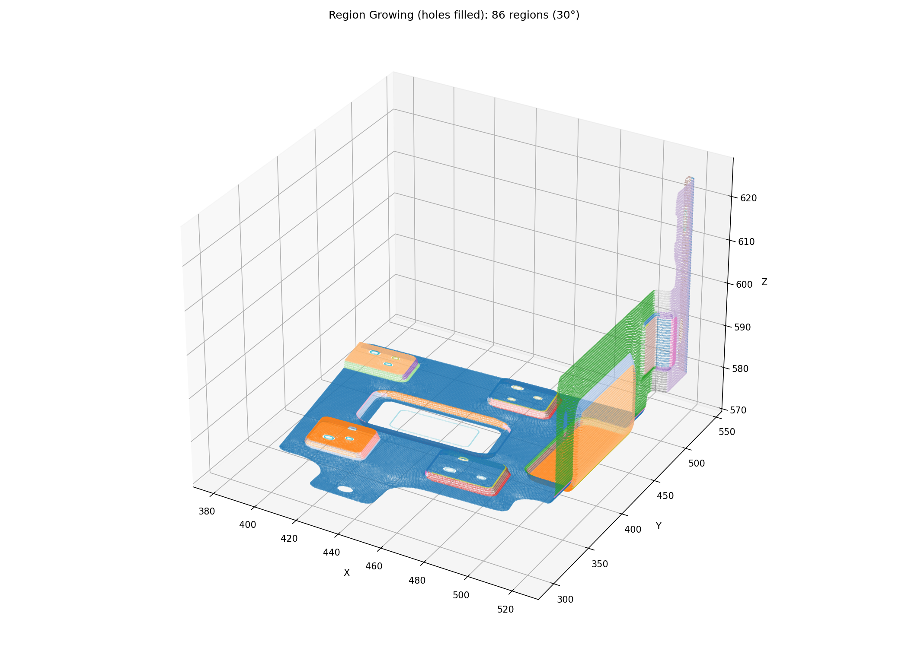

### Region Growing 64 regions 30° (2026-04-21 16:40 KST)

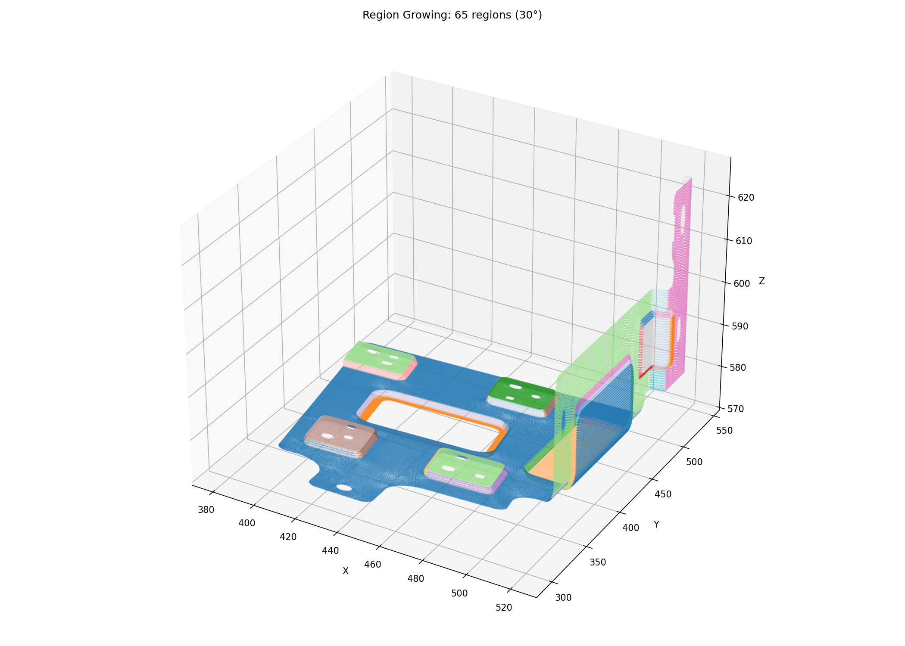

### Outer Loop Visualization (2026-04-21 15:58 KST)

