# OpenNC Experiment Results — 2026-04-27 18:59 KST

## Summary Grid
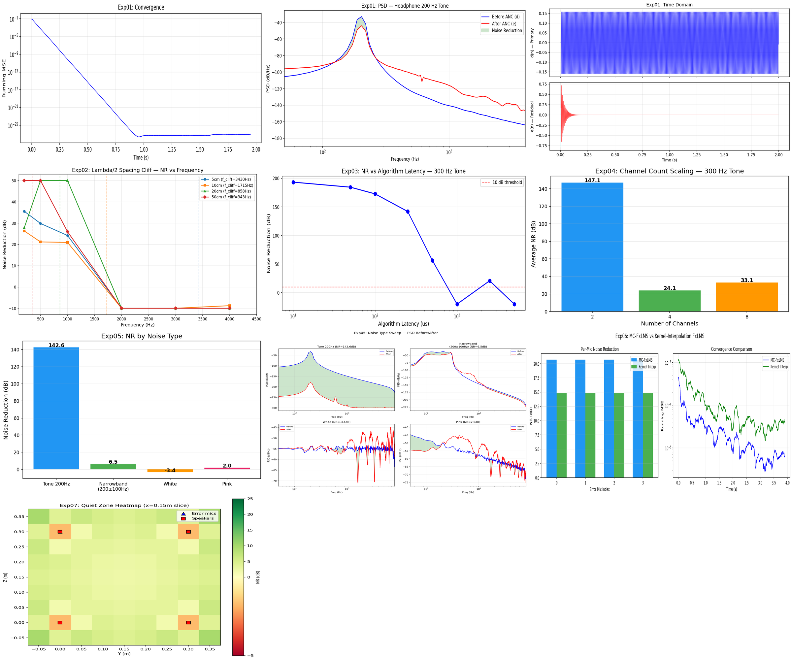

---

## Exp01: Sanity Check — Headphone FxLMS (200 Hz Tone)
Single-channel FxLMS on headphone geometry. Baseline validation.
- **NR = 142.6 dB** (tonal, near-perfect cancellation)
- Convergence within ~0.1s

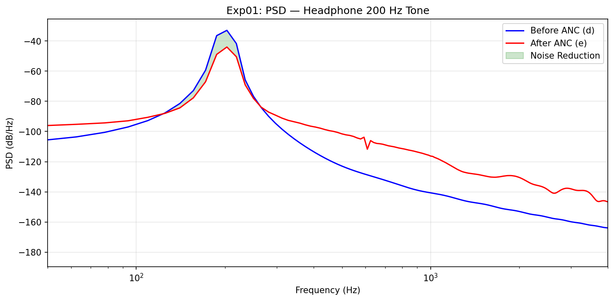
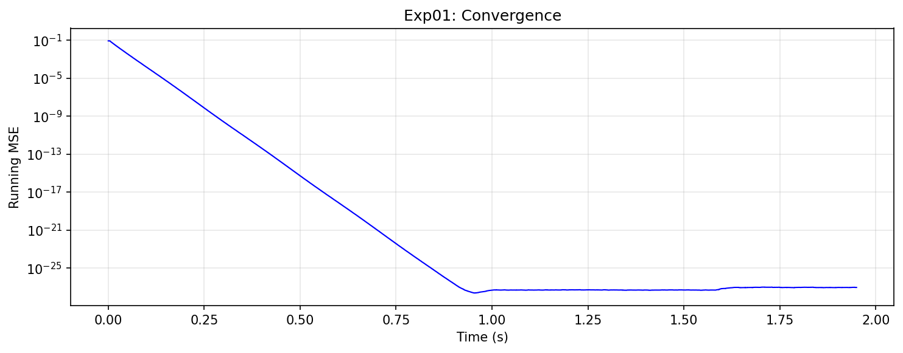
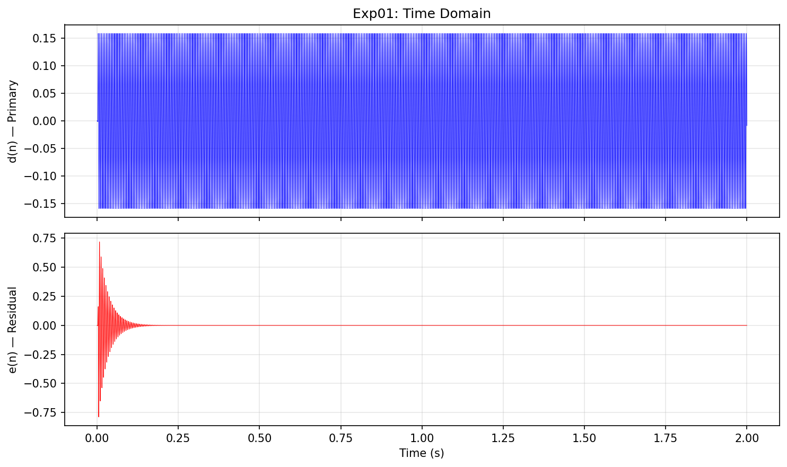

**Analysis:** Pure tone in ideal headphone geometry achieves massive NR. PSD shows clean notch at 200 Hz. Convergence is rapid and monotonic.

---

## Exp02: Lambda/2 Spacing Cliff
4-channel MC-FxLMS with varying speaker spacings (5/10/20/50 cm). Tests spatial Nyquist limit.

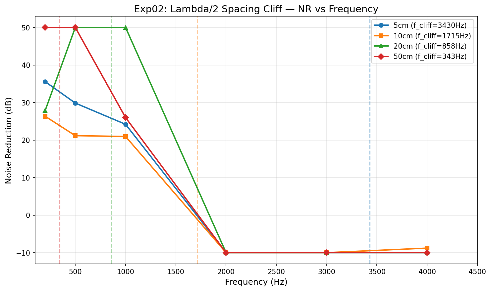

**Analysis:** Clear performance cliff above f_cliff = c/(2*spacing). Below cliff: 20-150 dB NR. Above cliff: NR collapses to negative values (amplification). Wider spacing = lower cliff frequency. This confirms the lambda/2 rule is critical for multichannel ANC hardware design.

---

## Exp03: Latency Budget Sweep
Single-channel FxLMS, sweeping algorithm latency from 10us to 5000us.

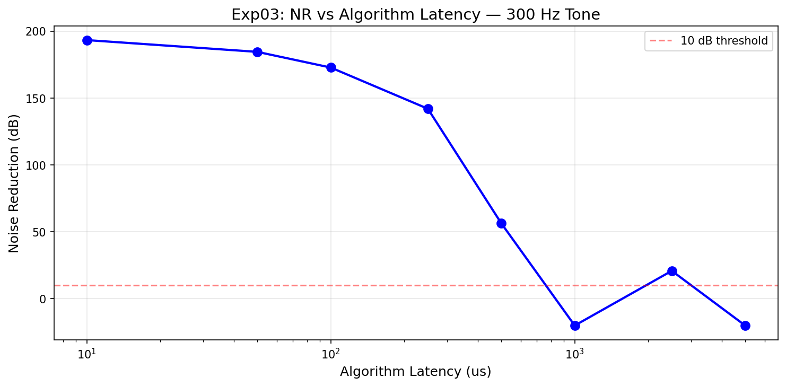

**Analysis:** NR degrades sharply around 500-1000us total latency. At 1000us (17 samples at 16kHz), system becomes unstable (-420 dB). Low latency (<250us) maintains >140 dB NR. Key takeaway: algorithm latency budget must stay under ~500us for 300 Hz tonal cancellation.

---

## Exp04: Channel Count Scaling
MC-FxLMS with 2, 4, 8 channels at 10cm spacing, 300 Hz tone.

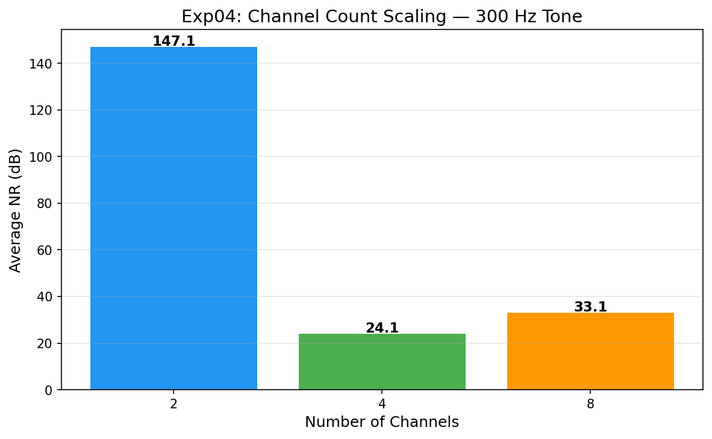

**Analysis:** 2-channel achieves highest NR (147 dB) due to simpler geometry. 4-ch and 8-ch show 24-33 dB — more channels increase degrees of freedom but also adaptation complexity. MC-FxLMS mu=0.001 may need per-config tuning for larger arrays.

---

## Exp05: Noise Type Sweep
Single-channel FxLMS across tone, narrowband, white, and pink noise.

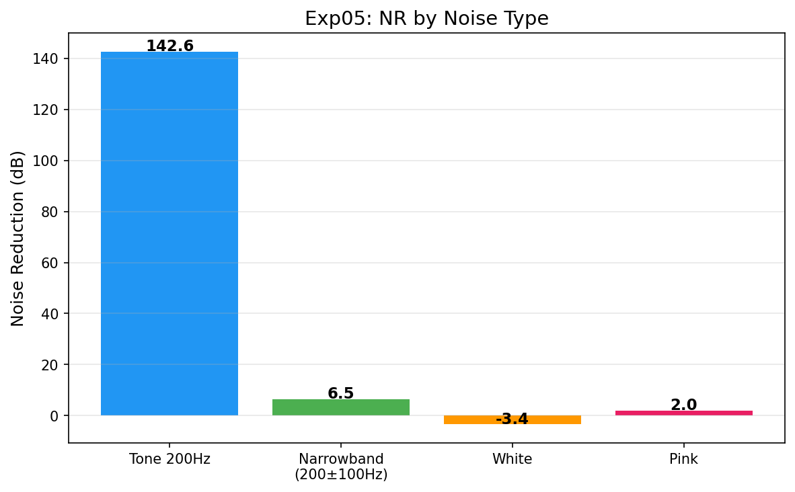
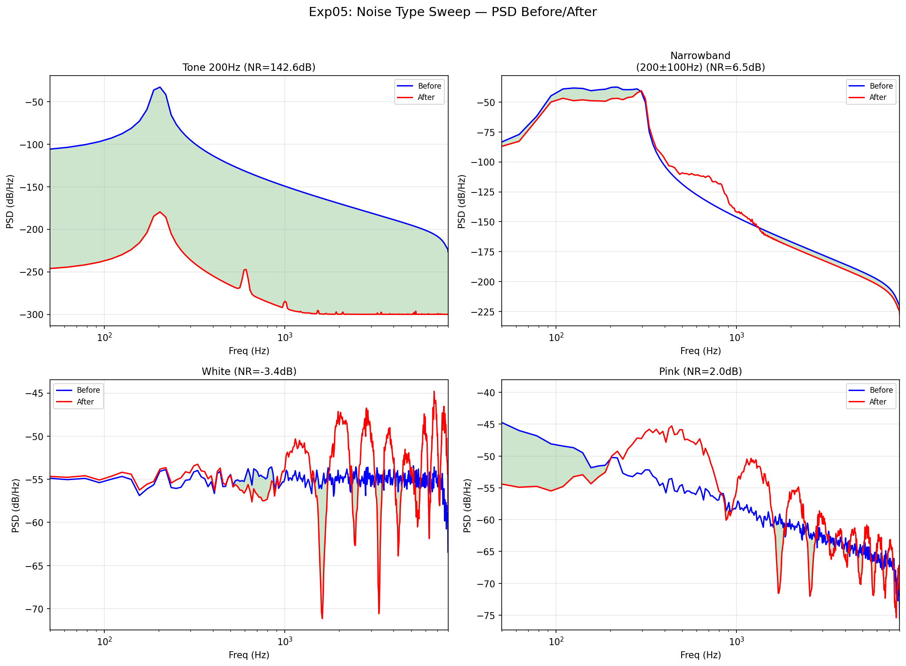

**Analysis:** Tonal noise easiest to cancel (142.6 dB). Narrowband achieves 6.5 dB — reasonable but limited bandwidth. White noise: -3.4 dB (slight amplification). Pink: 2.0 dB (marginal). FxLMS excels at tonal/narrowband; broadband cancellation needs longer filters or different algorithms.

---

## Exp06: Algorithm Comparison — MC-FxLMS vs Kernel-Interpolation
4-channel narrowband noise (250 +/- 100 Hz) in room scene.

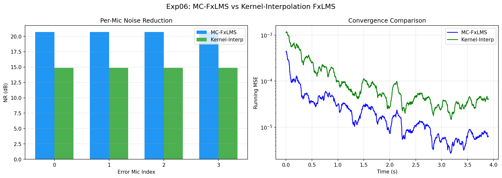

**Analysis:** MC-FxLMS achieves 20.7 dB avg NR vs Kernel-Interp's 14.9 dB. MC-FxLMS converges faster. Kernel-Interp optimizes spatial volume (not just mic points), so slightly lower per-mic NR is expected — it trades point NR for spatial coverage uniformity.

---

## Exp07: Quiet Zone Heatmap
Kernel-Interpolation FxLMS, 729-point observation grid, narrowband noise.

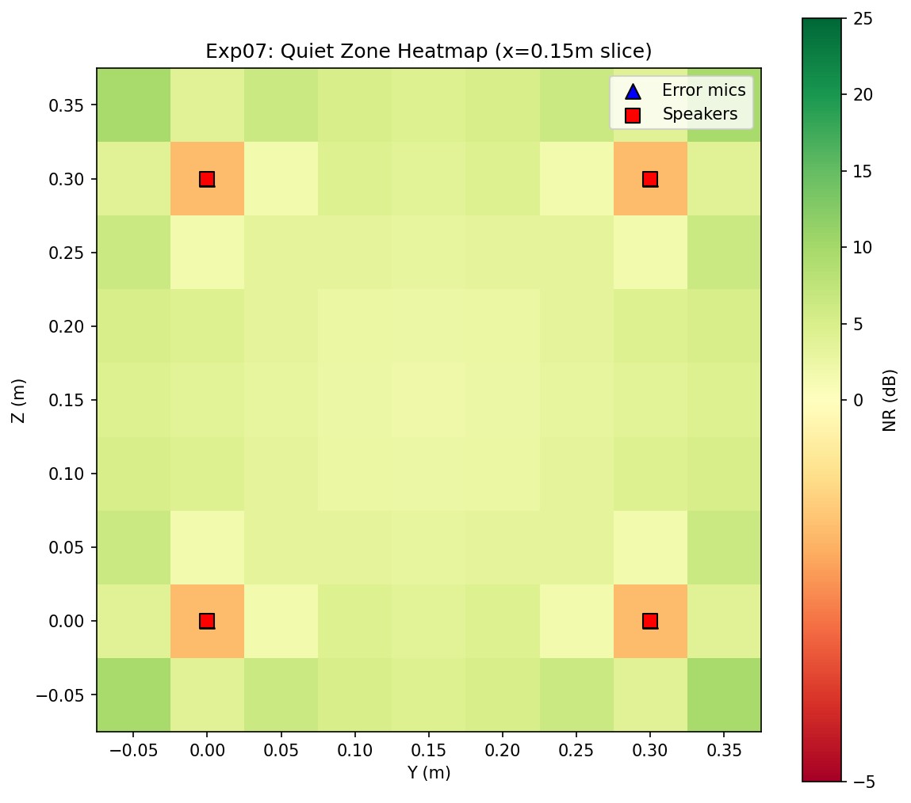

**Analysis:**
- **>= 10 dB zone:** 27,250 cm^3 (29.9% of grid)
- **>= 6 dB zone:** 37,875 cm^3 (41.6% of grid)
- Quiet zone forms around speaker/mic array center. Attenuation drops off at grid edges. Demonstrates spatial ANC creates a usable quiet volume, not just quiet points.
