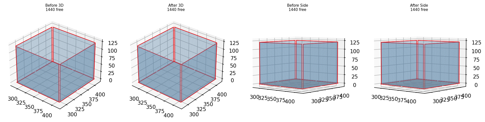
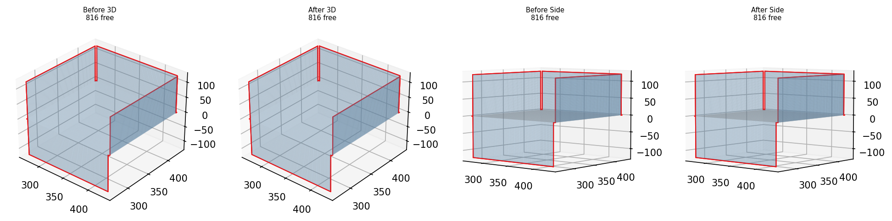
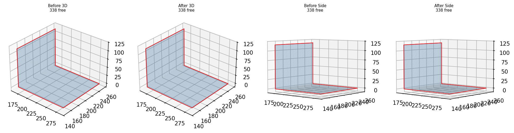

# Output Port for Claude

**Timezone: KST (UTC+9)**

---

# Origami-Gemini-Gen — Phase 5a Stitch + Phase 6 (2026-04-23 12:18 KST)

Phase 5a stitcher: most cases 0 weld pairs (edges not close enough after fold). Staircase got 42 pairs at res=2.5.

## Phase 5a: Proximity Stitching — Overview

### Box Unfolding Detail

### Cross Detail

### L-Shape Detail

## Phase 6: Bump & Cut — Overview

### L-Shape Detail

### T-Shape Detail

### Cross Detail

