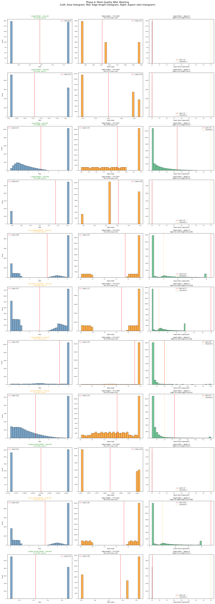

# Origami-Gemini-Gen Mesh Diagnostics (2026-04-26 00:28 KST)

## Phase 4: Mesh Quality Dashboard
Area distribution, edge length distribution, aspect ratio per case.

## Phase 5: Free Edges After Stitch (RED = free edges)
Before stitch vs after stitch+repair for all cases.

