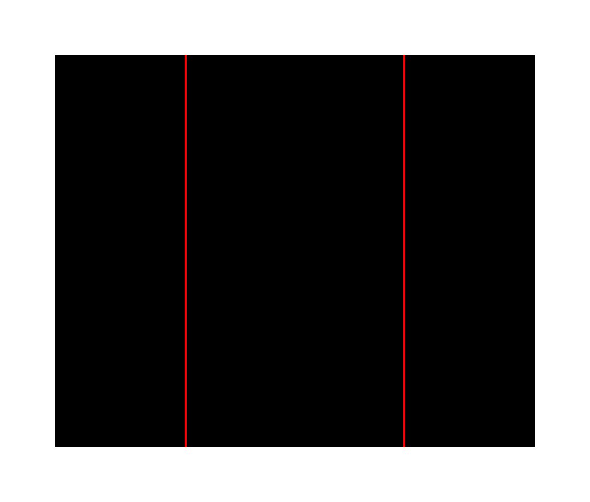
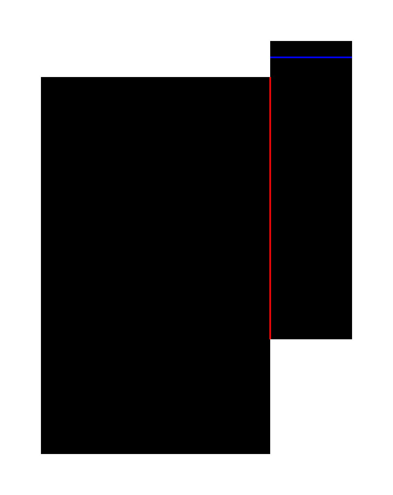
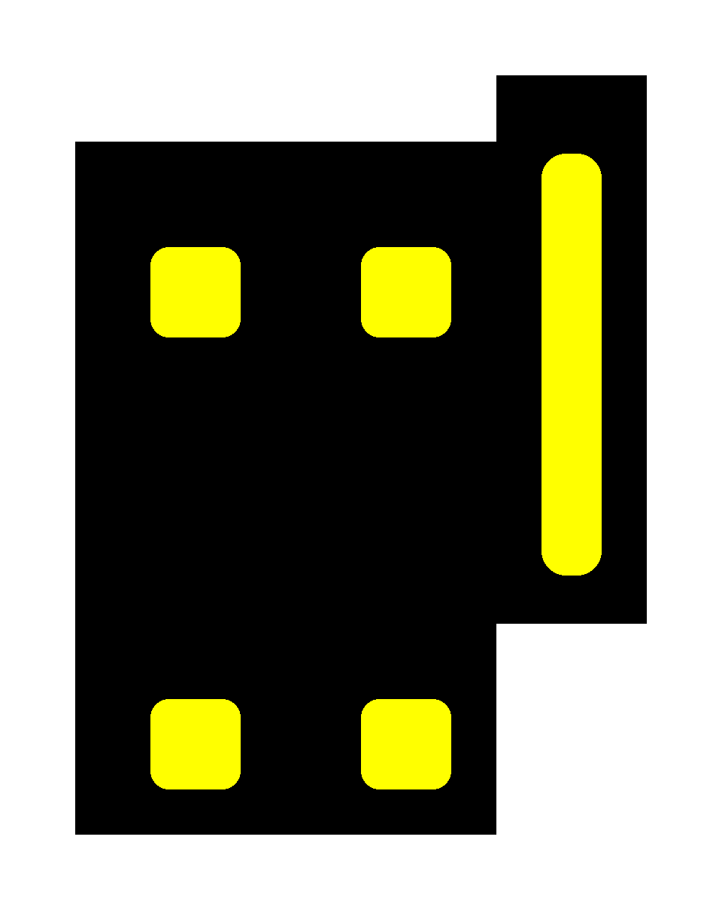
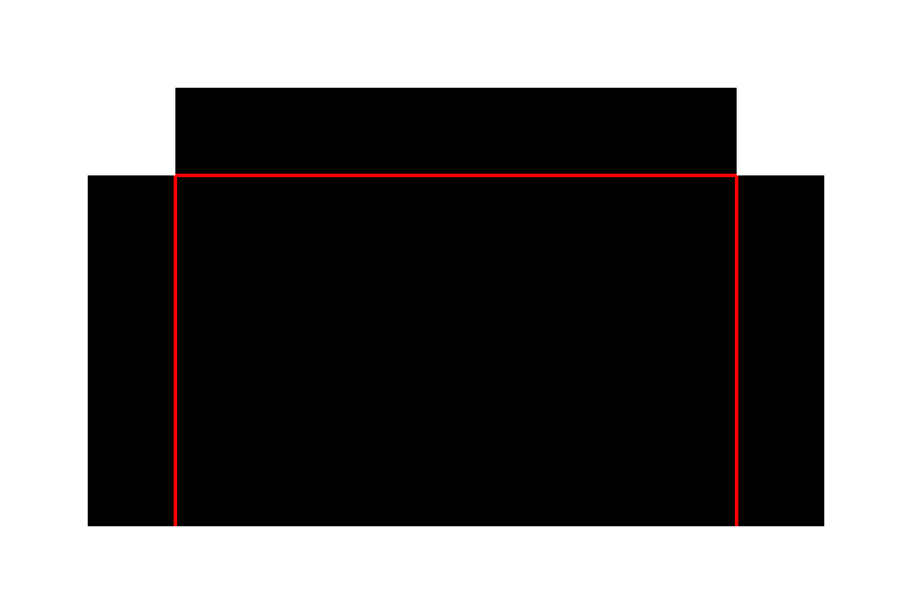
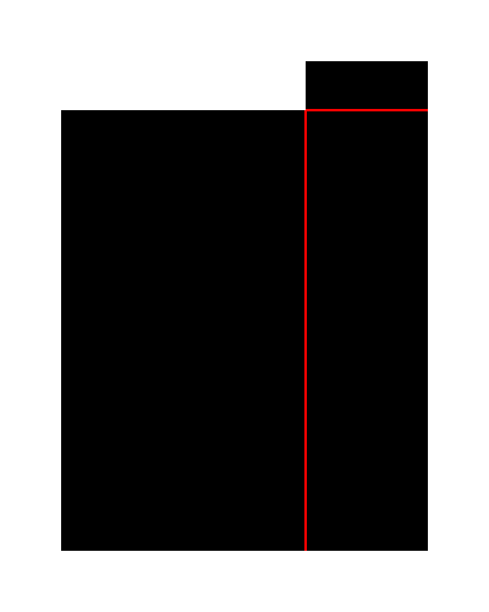
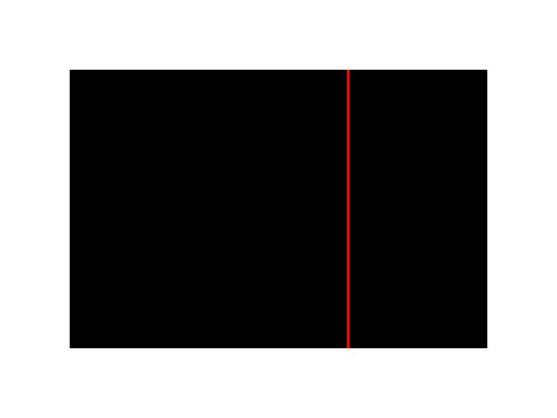
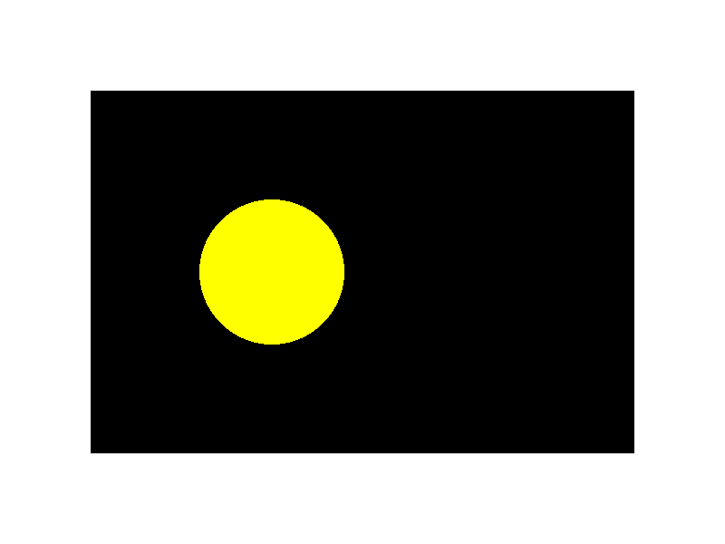

# Origami_Gen — Gemini-emits-Python bracket generator (v3-gen)

A code-generation pipeline for the [Origami_Gen](https://github.com/voltwin-dev/Origami_Gen)
v3 toolchain. Gemini 2.5 Pro is given a complete pixel + drawing
contract plus reference corpus cases (Python source + rendered
PNGs), and emits a `make_bracket()` Python module whose three
RGB layers (main / bump / hole) feed the v3 folding pipeline.

The code is sandbox-execed (no filesystem, no subprocess, no
arbitrary imports), then the returned `CaseBundle(name,
main_rgb, bump_rgb, hole_rgb)` is saved as 3 PNGs alongside the
source `.py` file.

This page is the project's output port — all live Gemini runs
land here as artifacts (.py + .png + summary.json) so you can
audit what the model actually emitted.

Branch: <https://github.com/voltwin-dev/Origami_Gen/tree/v3-gen>
PR-ready: <https://github.com/voltwin-dev/Origami_Gen/pull/new/v3-gen>

---

## Why a code generator instead of a schema?

The previous YAML-recipe generator (kept as an API description
at the bottom of this page) let Gemini emit
`outline_carves` / `corner_fillets` that chipped the panel
silhouette into non-rectangles. The downstream parser tolerated
those, but the visual output didn't match the user's "strictly
rectangular panels" requirement.

The new approach: take the existing `corpus/` hand-coded Python
bracket files as the source of truth (panels are literally
`d.rectangle(...)` calls — there's no way to draw a
non-rectangle), and have Gemini emit a new `.py` file in the
same style. The pipeline contract — palette, fold thickness,
drawable shapes — is enforced by the **system prompt** and by
the **sandbox**, not by a downstream schema.

Net effect:
- Panel silhouette is forced rectangular at the API level.
- Bumps / holes / carves remain free-form (they're drawn into
  `bump_rgb` / `hole_rgb` overlays, not the panel rect itself).
- Schema parse errors disappear — either the code runs or
  it doesn't.

---

## Live Gemini results

All four runs below used `gemini-2.5-pro`, `n_references=5`,
sandbox timeout 30 s. The model returns one Python module text;
we exec it; we save the resulting `CaseBundle` and the source.
No retries.

### Run 1 — simple L-bracket (`code-from-intent`)

Intent (`code_api/run1_l_bracket_intent.txt`):

> Design a simple L-bracket: 120x100 mm main plate with one
> flange folding up off the right edge, single mountain fold.
> No bumps or holes — just panels + fold.

Result: case `simple_l_bracket_basic`, 28.7 s wall-clock,
source 2,821 chars.

main | bump | hole
:--:|:--:|:--:
 |  | 

Emitted source: [`code_api/run1_l_bracket.py`](./code_api/run1_l_bracket.py).

### Run 2 — U-channel mounting bracket

Intent (`code_api/run2_u_bracket_intent.txt`):

> Design a U-channel mounting bracket: 180x100 mm main plate
> with two flanges folding up off the left and right long
> edges, each flange 60 mm wide. Mountain folds on both sides.
> Add a single circular bolt hole on the main plate.

Result: case `u_channel_mount`, 75.5 s wall-clock, source
larger (3 panels + drawing helpers + bolt hole on hole.png).

main | bump | hole
:--:|:--:|:--:
 |  | 

Emitted source: [`code_api/run2_u_bracket.py`](./code_api/run2_u_bracket.py).

### Run 3 — feature-rich automotive L-bracket

Intent (`code_api/run3_auto_intent.txt`):

> Design a feature-rich automotive L-bracket modeled after the
> HD Mobis style: main plate 140x230 mm, right flange 50x172
> mm folding up via mountain fold, plus a small cap on top of
> the flange via valley fold. Add 4 yellow boss-stiffener
> bumps with bolt holes on the main plate, one yellow long
> stiffener bead on the right flange, and 2 purple bolt
> circles plus a purple rounded-rect cutout on the main plate.

Result: case `automotive_l_bracket_simple`, 54.9 s wall-clock,
source 5,168 chars. Three panels, two fold colors (mountain +
valley), yellow bumps on bump.png, purple bolt holes + pocket
cutout on hole.png — all features the intent asked for, panels
stay strictly rectangular.

main | bump | hole
:--:|:--:|:--:
 |  | 

Emitted source: [`code_api/run3_auto.py`](./code_api/run3_auto.py).

### Run 4 — `code-batch 3` (deterministic random intents)

`code-batch N` walks N intents from a parametric template + seed
(`scripts/generate_bracket.py code-batch`). Run 4 used `--seed 0
--n-references 5`. **3 / 3 keepers**, total wall-clock 154.9 s.

| seed | case_name                  | wall  |
|------|----------------------------|-------|
| 0    | channel_bracket_simple     | 61.9s |
| 1    | l_bracket_3_panel_simple   | 54.7s |
| 2    | simple_hinge_100x100       | 38.2s |

#### seed 0 — channel bracket
main | bump | hole
:--:|:--:|:--:
 |  | 

Source: [`code_api/run4_seed0.py`](./code_api/run4_seed0.py).

#### seed 1 — 3-panel L-bracket
main | bump | hole
:--:|:--:|:--:
 |  | 

Source: [`code_api/run4_seed1.py`](./code_api/run4_seed1.py).

#### seed 2 — 2-panel hinge
main | bump | hole
:--:|:--:|:--:
 |  | 

Source: [`code_api/run4_seed2.py`](./code_api/run4_seed2.py).

Batch summary CSV: [`code_api/run4_batch_summary.csv`](./code_api/run4_batch_summary.csv).

---

## API surface (code-gen)

### Top-level: `GeminiCodeAuthor`

```python
from origami_gen.code_gen.author import GeminiCodeAuthor

author = GeminiCodeAuthor(
    n_references=5,          # few-shot corpus cases per call
    sandbox_timeout_sec=30.0, # SIGALRM kill at this wall-clock
)

result = author.design(
    intent="Design a U-bracket: 180x100 mm main plate with two flanges…",
)
# result is a CodeDesignResult:
#   bundle: CaseBundle | None   (name, main_rgb, bump_rgb, hole_rgb)
#   source_code: str            (Gemini's emitted module text)
#   success: bool
#   error: str | None           (sandbox or SDK failure)
#   elapsed_sec: float

if result.success:
    bundle = result.bundle
    # bundle.main_rgb is a uint8 [H, W, 3] numpy array — feed
    # straight to the v3 parser, or save with PIL:
    from PIL import Image
    Image.fromarray(bundle.main_rgb, mode="RGB").save("main.png")
    Image.fromarray(bundle.bump_rgb, mode="RGB").save("bump.png")
    Image.fromarray(bundle.hole_rgb, mode="RGB").save("hole.png")
```

The refine-turn helper:

```python
result2 = author.refine(
    prior_source=result.source_code,
    instruction="Add two more bolt holes on the flange.",
    # Optional multimodal context — pass the previous PNGs so
    # Gemini can SEE what it just produced.
    prior_main_png=open("main.png", "rb").read(),
    prior_bump_png=open("bump.png", "rb").read(),
    prior_hole_png=open("hole.png", "rb").read(),
)
```

### The sandbox contract

`src/origami_gen/code_gen/sandbox.py` is the security perimeter.
Every Gemini-emitted module runs through `exec_bracket_module(source)`:

```python
from origami_gen.code_gen.sandbox import exec_bracket_module

result = exec_bracket_module(source_text, timeout_sec=30.0)
# result.bundle: CaseBundle | None
# result.error:  str | None     (None ⇒ success)
# result.elapsed_sec: float
```

Restrictions enforced inside the sandbox:

| Restriction               | Mechanism                                            |
|---------------------------|------------------------------------------------------|
| Whitelisted imports       | `__import__` replaced; whitelist = `numpy`, `PIL.Image`, `PIL.ImageDraw`, `math`, `dataclasses`, `typing`, `collections`, `itertools`, `functools`, `__future__`. Everything else raises `CodeGenSandboxError`. |
| No `open` / `eval` / `exec` / `compile` / `__import__` | Stripped from builtins. |
| Wall-clock timeout        | `signal.SIGALRM` at `timeout_sec` seconds.            |
| Validated return value    | Must be a `CaseBundle` (namedtuple injected as a global) with `name ∈ [a-z0-9_]{1..64}`, 3 `uint8 [H, W, 3]` arrays, `H, W ∈ [64, 4096]`, matching shape across layers. |
| Duck-typed objects        | Any object with attributes `name / main_rgb / bump_rgb / hole_rgb` is coerced into the strict `CaseBundle`. |

The sandbox does **not** pre-validate the pixel palette — the v3
parser does that downstream. We trust the model on shape +
structure, then let the pipeline reject anything pixel-illegal
at parse time.

### Reference pack

`src/origami_gen/code_gen/references.py` builds the few-shot
material every Gemini call sees:

```python
from origami_gen.code_gen.references import build_reference_pack

pack = build_reference_pack(n=5)
# pack is a list of ReferenceCase:
#   name: str               (e.g. "hd_mobis_bracket")
#   source_path: str        ("mobis_bracket/bracket.py")
#   source_code: str        (the .py file verbatim)
#   main_png, bump_png, hole_png: bytes
```

Default 5 cases (simple → complex):

| #  | case               | source file                             |
|----|--------------------|-----------------------------------------|
| 1  | `single_fold`      | `simple_examples/simple.py`             |
| 2  | `corner_3panel`    | `simple_examples/simple.py`             |
| 3  | `l_shape`          | `simple_examples/chains.py`             |
| 4  | `simple_l_bracket` | `mobis_bracket/bracket_examples.py`     |
| 5  | `hd_mobis_bracket` | `mobis_bracket/bracket.py`              |

`cached_reference_pack(n)` is the LRU-cached version used by the
prompt builder, so multiple `design()` calls share the same
PNG-encoded reference bytes.

### Prompts module

`src/origami_gen/code_gen/prompts.py` builds two pieces:

```python
sys_prompt = code_author_system_prompt(n_references=5)
# str — 6 sections: ROLE, PIXEL CONTRACT, DRAWING TOOLKIT,
# OUTPUT CONTRACT, STYLE GUIDE, REFERENCE CASES (with full
# corpus .py source code inline), then EMIT-ONLY reminder.

user_parts = code_author_user_contents(
    intent="design intent here",
    n_references=5,
)
# list[str | google.genai.types.Part] — text intro + (text label
# + 3 image Parts) per reference + final text with the user's
# intent.
```

Key contract excerpts the system prompt enforces (the model is
told these are HARD rules — violation crashes the pipeline):

- Only 7 RGB triples are legal across all 3 layers: white,
  black, mountain red, valley blue, bump yellow, bump green,
  hole/carve purple.
- Fold lines are exactly 4 px wide, axis-aligned, on `main.png`
  only.
- Panels are axis-aligned rectangles. NO outline carves on the
  panel rect itself. If the user asks for a "diagonal cut at
  the corner", that's a PURPLE feature on `hole.png`, not
  geometry that breaks the panel rectangle.
- The emitted module must define `make_bracket() -> CaseBundle`
  and return three matching-shape `uint8 [H, W, 3]` arrays.

### CLI

`scripts/generate_bracket.py` exposes the two surfaces:

```bash
# Single design from an intent string.
conda run -n SML_env python scripts/generate_bracket.py code-from-intent \
    "Design an L-bracket with one flange" \
    -o /tmp/my_bracket \
    --n-references 5 \
    --sandbox-timeout 30

# Random-intent batch of N keepers.
conda run -n SML_env python scripts/generate_bracket.py code-batch 3 \
    -o /tmp/my_batch \
    --seed 0 \
    --n-references 5
```

`code-from-intent` writes `<name>_main.png`, `<name>_bump.png`,
`<name>_hole.png`, `<name>.py`, plus `summary.json` (intent +
success + elapsed_sec + case_name + source_chars). On failure
it also writes `FAILED_source.py` so you can diagnose Gemini's
output.

`code-batch` writes one `keepers/seed_NNNN/` per intent and a
top-level `batch_summary.csv`.

---

## Previous YAML-recipe generator (kept as API description)

The pre-code-gen v3-gen branch shipped a YAML-recipe generator
(`gemini/recipe_author.py`, `gemini/self_correct.py`, etc.)
that asked Gemini to emit a Pydantic-validated YAML recipe
which a separate `recipe/render.py` then drew. That code was
hard-reverted off v3-gen (commit `7fad18f`) — the rectangular-
panels-only requirement was easier to enforce in the new code-
generator approach than to fix the schema escape hatches in the
YAML path. The API description is retained here for reference:

```python
# (Historical) GeminiRecipeAuthor.design(intent) returned a
# BracketRecipe pydantic object, which a Track-A renderer
# converted to 3 PNGs. The recipe schema let Gemini emit
# outline_carves / corner_fillets that chipped the panel
# silhouette into non-rectangles even when the panel rect
# itself was preserved.

from origami_gen.gemini.recipe_author import GeminiRecipeAuthor
from origami_gen.gemini.self_correct import GeminiSelfCorrectingAuthor
from origami_gen.recipe.render import render_recipe

author = GeminiRecipeAuthor(few_shot_n=3)
corrector = GeminiSelfCorrectingAuthor(author=author, max_retries=3)
result = corrector.design(intent="...")     # → CorrectionResult
bundle = render_recipe(result.recipe)        # → CaseBundle
```

It also shipped:
- `GeminiSequentialAuthor` (3-pass skeleton → bumps → holes
  pipeline).
- `BracketDesignerAgent` (propose / refine REPL).
- `sample-batch N` CLI subcommand.
- A 25-case YAML library (`recipe/library/`) — 5 hand-authored
  + 20 parametric variants.
- Imagen 4 image-gen `experiment_run` (palette-snap on raw
  Imagen output).

All of that lives in `archive_pre_codegen_20260601/` for
historical reference (PNG outputs from prior runs) and
`archive_v3_audit_20260531_1916/` (the full v3-audit visualization
snapshot — 602 files).

---

## Repo layout (v3-gen current)

```
src/origami_gen/
├── code_gen/                 ← NEW: code-generator entry points
│   ├── sandbox.py            ← restricted-exec; CaseBundle injected
│   ├── references.py         ← few-shot pack (5 corpus cases)
│   ├── prompts.py            ← system prompt + multimodal user list
│   ├── client.py             ← thin google.genai wrapper
│   └── author.py             ← GeminiCodeAuthor (design + refine)
├── corpus/                   ← KEPT: reference brackets (mobis +
│   │                            simple_examples). Used both as
│   │                            corpus fixtures AND as few-shot
│   │                            references for the code generator.
│   ├── mobis_bracket/{bracket,bracket_examples,bracket_variants}.py
│   └── simple_examples/{simple,chains,cascades,junctions,…}.py
├── parser/  topology/  folder/  mesher/  fillet/  bumper/
│   stitcher/  dihedral/  mapper/  pipeline/  …
│                              (v3 folding pipeline — unchanged)
└── viz/ export/ io/ logging_config.py …

scripts/
├── generate_bracket.py       ← code-from-intent + code-batch
├── audit.py                  ← v3 pipeline audit
├── perf_measure.py
├── regen_corpus.py
├── verify_visualize.py
└── check_determinism.sh

tests/code_gen/                ← 43 tests
├── test_sandbox.py           (20 sandbox guard tests)
├── test_references.py        (7 reference-pack tests)
├── test_prompts.py           (8 prompt-builder tests)
└── test_author_mock.py       (8 author tests w/ fake SDK)
```

---

## Build & test

```bash
# Run the code-gen test suite (no API key needed — every test
# uses a fake SDK).
PYTHONHASHSEED=0 conda run -n SML_env pytest tests/code_gen/ -q
# Expected: 43 passed.

# Smoke test the CLI without burning API credits — uses a
# fake client. (TODO: add an --offline flag.)
```

A real run needs `GEMINI_API_KEY` in `.env`:

```
GEMINI_API_KEY=AIza...
GEMINI_TEXT_MODEL=gemini-2.5-pro
GEMINI_IMAGE_MODEL=imagen-4.0-generate-001
GEMINI_TEMPERATURE=0.0
```

---

## Prior snapshots

- `archive_pre_codegen_20260601/` — every PNG and JSON from the
  YAML-recipe-generator runs (live API v1 + sequential v2 +
  the 25 hand-authored / parametric library renders).
- `archive_v3_audit_20260531_1916/` — full v3 pipeline audit
  visualization (42 cases × 3 res, 602 files preserved verbatim).
