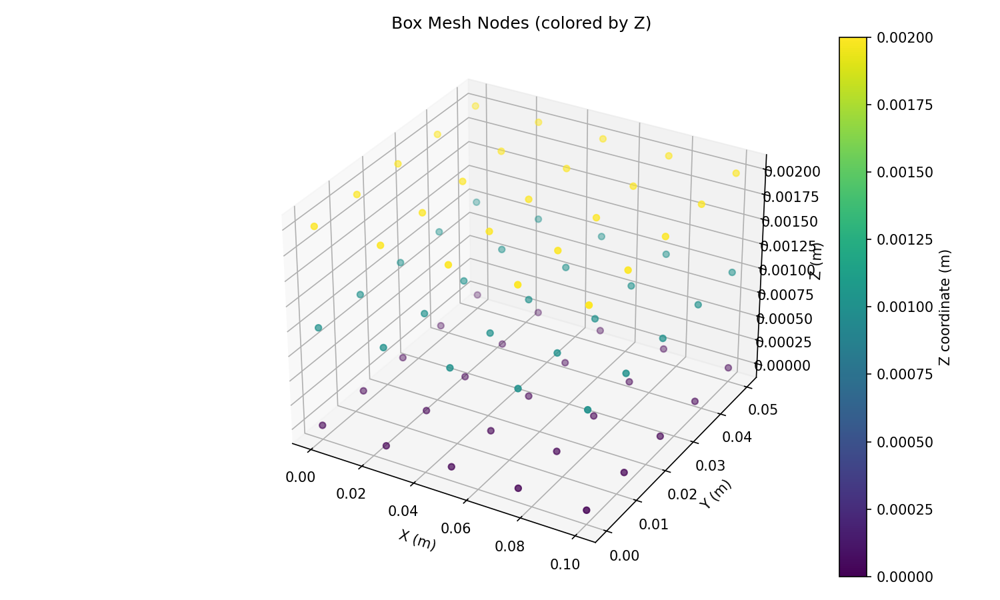
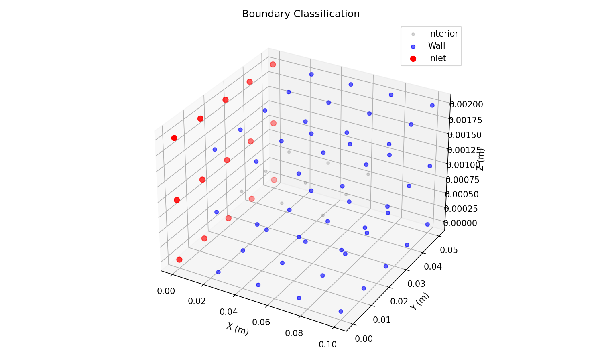
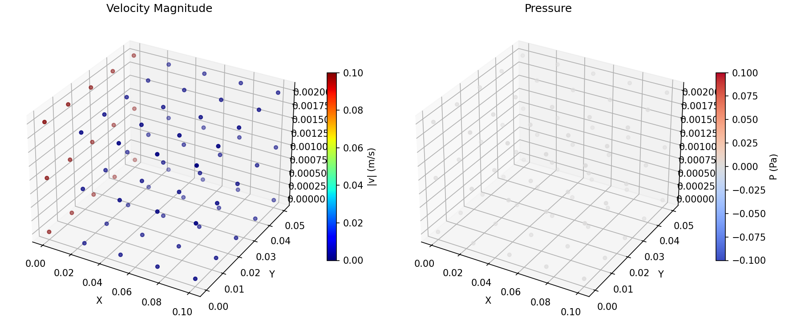
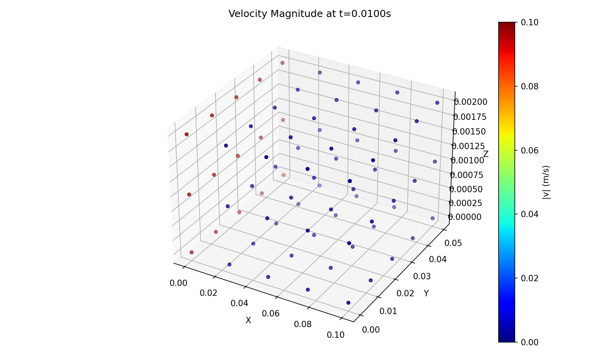
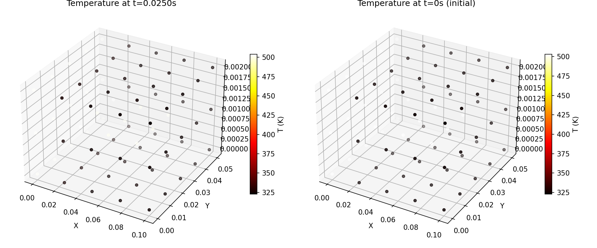
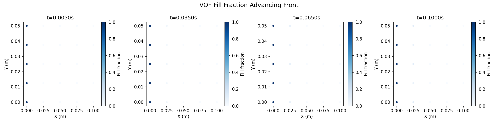

# Output Port for Claude

This repo is used to share result images from Claude Code.

**Timezone: KST (UTC+9)** — Server time is 9 hours behind KST.

## Results

### Migrated from Claude_Authorized

### Moldflow FEM Filling Solver — Test Results

**Cell 3: Mesh Generation** — 75 nodes, 160 tet elements, volume verified

**Cell 4: Boundary Classification** — Inlet (red), Wall (blue), Interior (gray)

**Cell 7: Stokes Solve** — Velocity magnitude & pressure (isothermal, constant viscosity)

**Cell 8: Isothermal Filling Pipeline** — 10 timesteps

**Cell 9: Cross-WLF Viscosity** — log10(viscosity) and log10(shear rate) distributions

**Cell 10: Thermal Coupling** — Temperature at final vs initial time

**Cell 11: VOF Fill Front** — Fill fraction advancing from inlet over 20 timesteps

