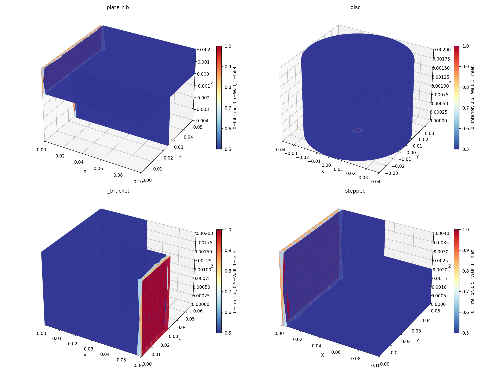
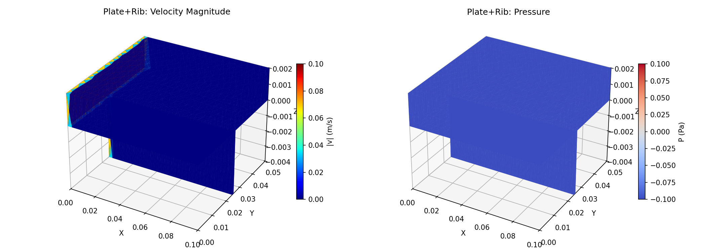
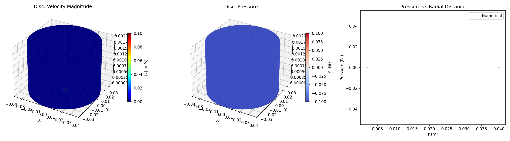
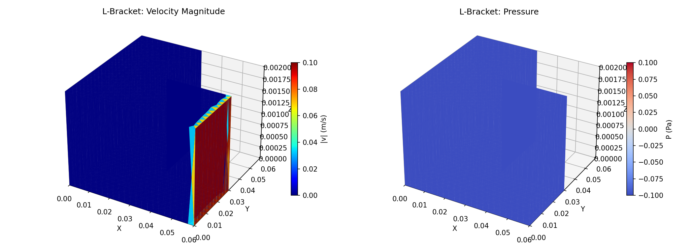
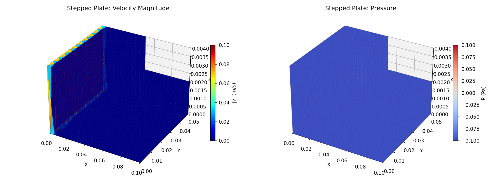
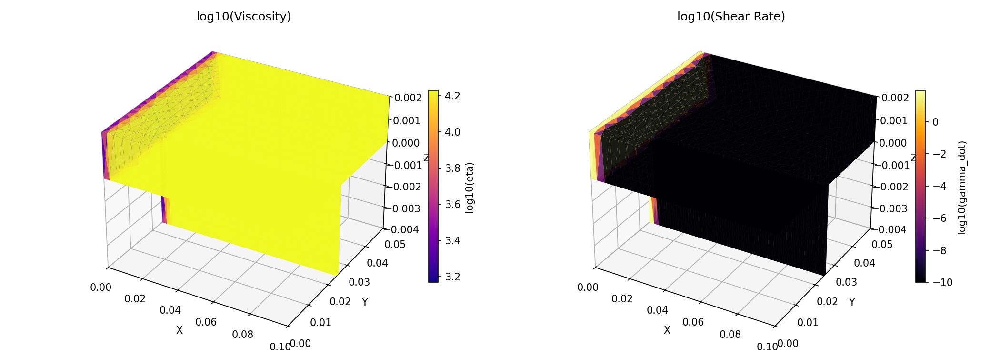

# Output Port for Claude

This repo is used to share result images from Claude Code.

**Timezone: KST (UTC+9)** — Server time is 9 hours behind KST.

## Results

### Moldflow Solver — Gmsh Test Cases (Element-based Viz) (2026-03-19 23:34 KST)

#### Cell 4: Boundary Classification (All 4 Geometries)

#### Cell 5: Plate with Rib — Isothermal, Constant Viscosity

#### Cell 6: Center-Gated Disc — Isothermal, Constant Viscosity

#### Cell 7: L-Bracket — Isothermal, Constant Viscosity

#### Cell 8: Stepped Plate — Isothermal, Constant Viscosity

#### Cell 9: Cross-WLF on Plate with Rib

