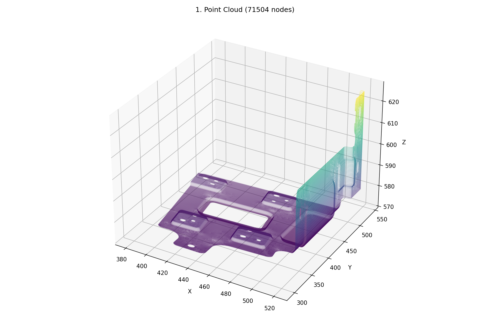
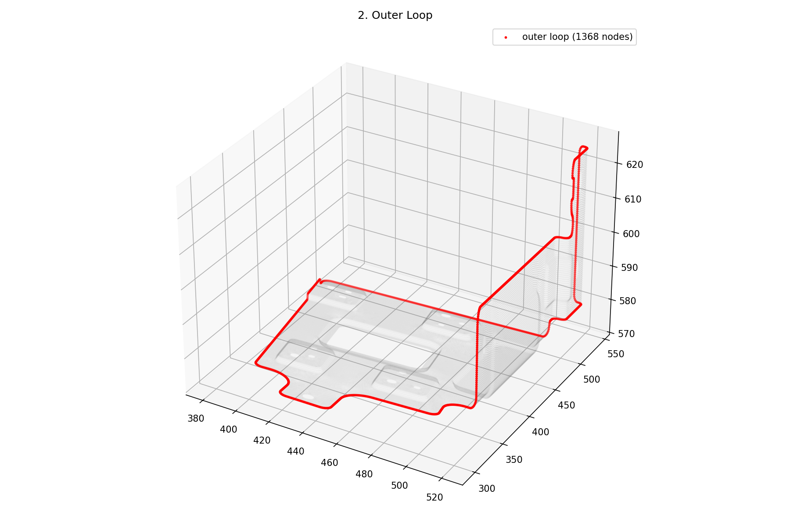
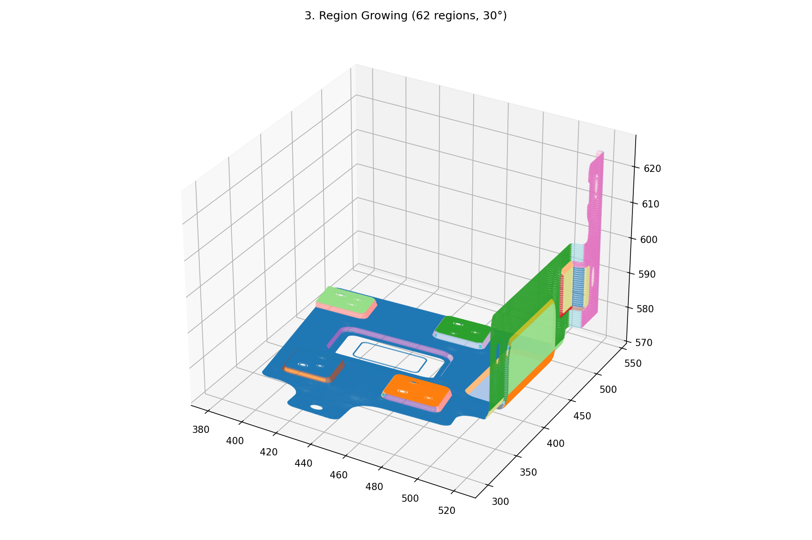
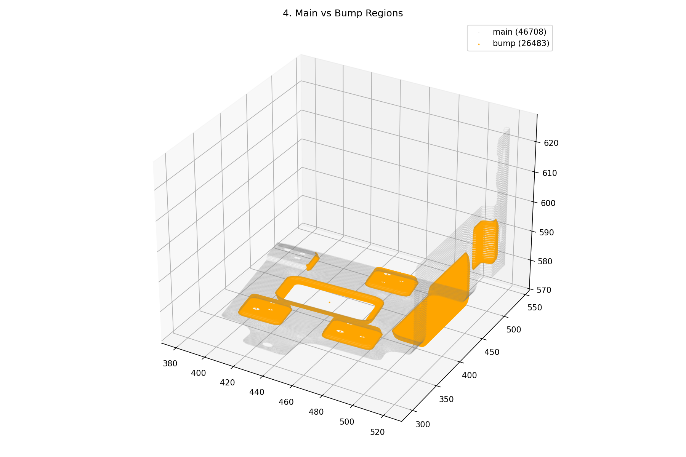
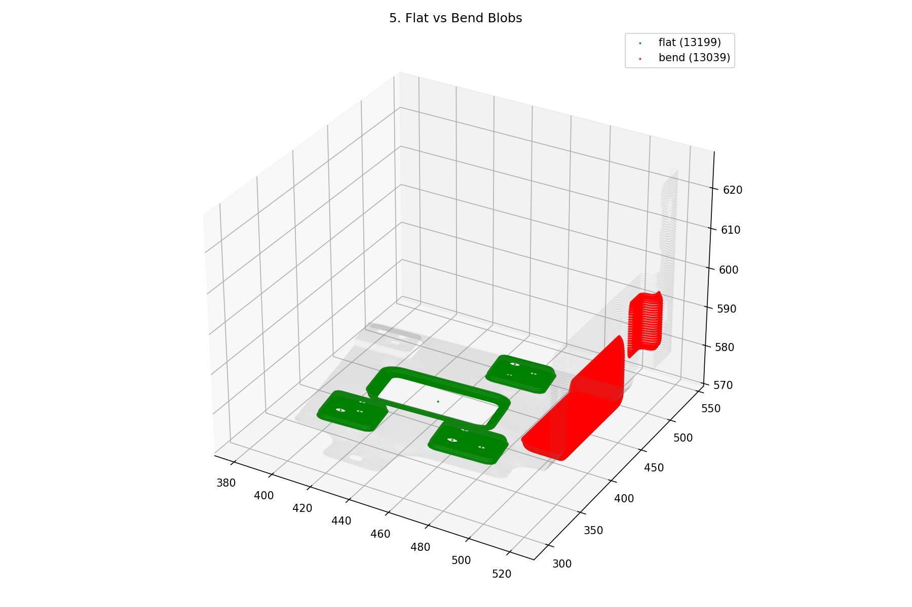
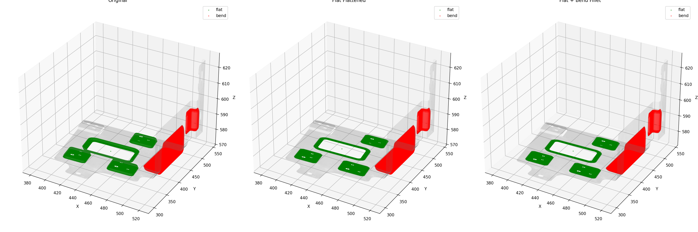
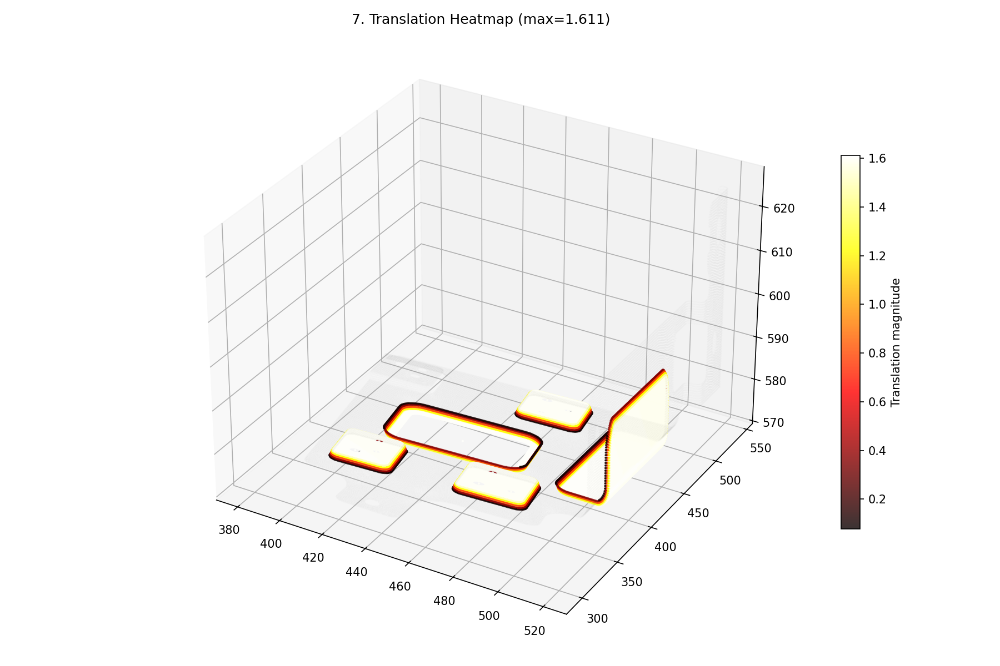

# Output Port for Claude

This repo is used to share result images from Claude Code.

**Timezone: KST (UTC+9)** — Server time is 9 hours behind KST.

## Bump Flattening Pipeline Run (2026-04-21 23:13 KST)

### 1. Point Cloud (71504 nodes)

### 2. Outer Loop

### 3. Region Growing (62 regions, 30°)

### 4. Main vs Bump Regions

### 5. Flat vs Bend Blobs (4 flat, 2 bend)

### 6. Flatten Result (Original → Flat → Flat+Bend)

### 7. Translation Heatmap

