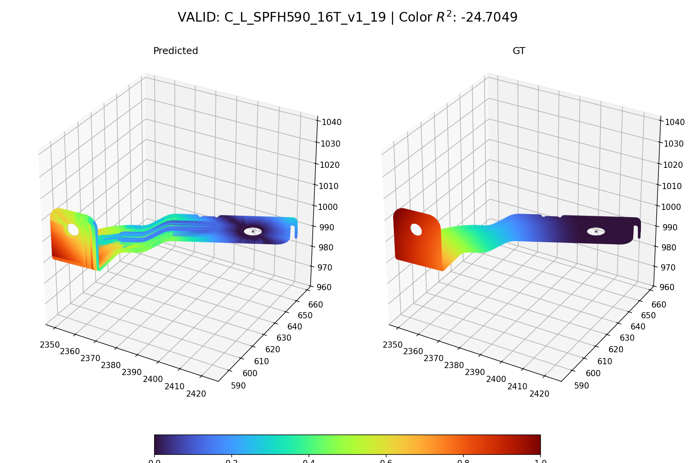
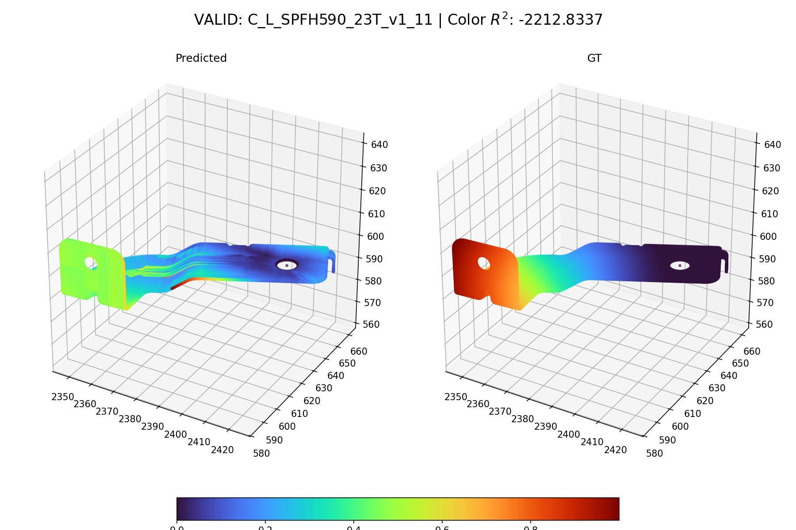
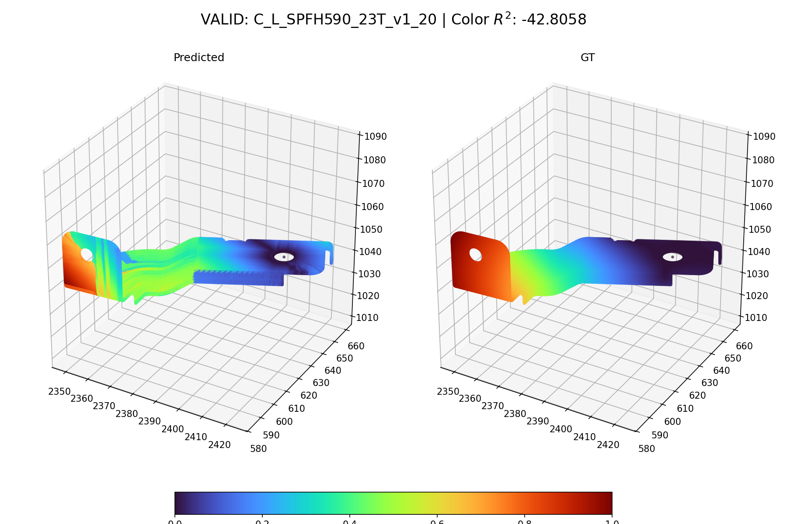
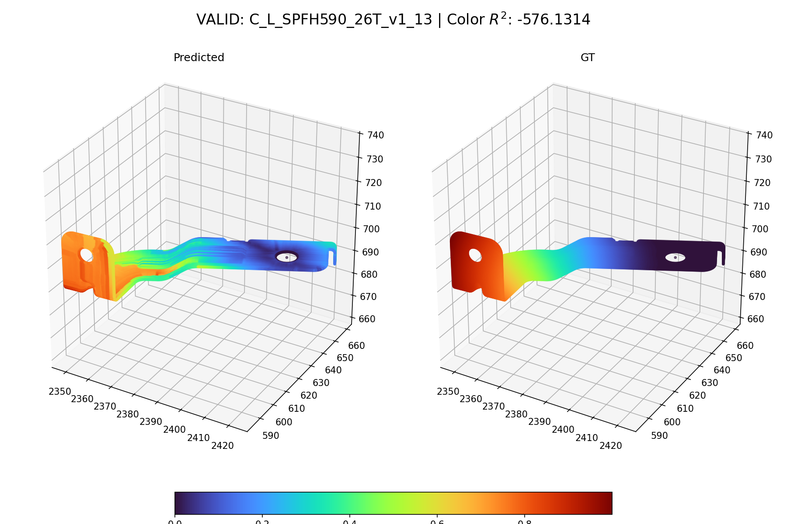

# Output Port for Claude

This repo is used to share result images from Claude Code.

**Timezone: KST (UTC+9)** — Server time is 9 hours behind KST.

## Results

### PyG Trainer — Result Images (2026-03-19 22:18 KST)

#### Validation Samples

#### Inference

#### Error Distribution

