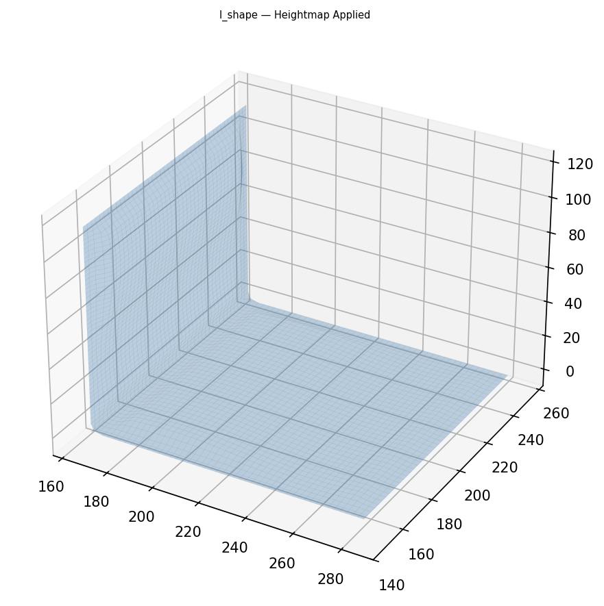

# Origami-Gemini-Gen Pipeline Results (2026-04-24 17:30 KST)

ALL 11 CASES PASSED | HEIGHTMAP VALIDATION ALL PASSED

## Phase 0: Input Main

### l_shape

### t_shape

### cross

### u_shape

### box_unfolding

### branching_tree

### h_shape

### staircase

### l_shape_nonrect

### cross_nonrect

### t_shape_nonrect

---

## Phase 0: Input Bump

### l_shape

### t_shape

### cross

### u_shape

### box_unfolding

### branching_tree

### h_shape

### staircase

### l_shape_nonrect

### cross_nonrect

### t_shape_nonrect

---

## Phase 0: Input Hole

### l_shape

### t_shape

### cross

### u_shape

### box_unfolding

### branching_tree

### h_shape

### staircase

### l_shape_nonrect

### cross_nonrect

### t_shape_nonrect

---

## Phase 0: Input Heightmap

### l_shape

### t_shape

### cross

### u_shape

### box_unfolding

### branching_tree

### h_shape

### staircase

### l_shape_nonrect

### cross_nonrect

### t_shape_nonrect

---

## Phase 1: Parsed Panels + Folds

### l_shape

### t_shape

### cross

### u_shape

### box_unfolding

### branching_tree

### h_shape

### staircase

### l_shape_nonrect

### cross_nonrect

### t_shape_nonrect

---

## Phase 2: Fold Tree

### l_shape

### t_shape

### cross

### u_shape

### box_unfolding

### branching_tree

### h_shape

### staircase

### l_shape_nonrect

### cross_nonrect

### t_shape_nonrect

---

## Phase 3: Folded Panels 3D

### l_shape

### t_shape

### cross

### u_shape

### box_unfolding

### branching_tree

### h_shape

### staircase

### l_shape_nonrect

### cross_nonrect

### t_shape_nonrect

---

## Phase 4: Quad Mesh

### l_shape

### t_shape

### cross

### u_shape

### box_unfolding

### branching_tree

### h_shape

### staircase

### l_shape_nonrect

### cross_nonrect

### t_shape_nonrect

---

## Phase 5: Stitched

### l_shape

### t_shape

### cross

### u_shape

### box_unfolding

### branching_tree

### h_shape

### staircase

### l_shape_nonrect

### cross_nonrect

### t_shape_nonrect

---

## Phase 5.5: Heightmap Applied

### l_shape

### t_shape

### cross

### u_shape

### box_unfolding

### branching_tree

### h_shape

### staircase

### l_shape_nonrect

### cross_nonrect

### t_shape_nonrect

---

## Phase 6: Final Bump+Cut

### l_shape

### t_shape

### cross

### u_shape

### box_unfolding

### branching_tree

### h_shape

### staircase

### l_shape_nonrect

### cross_nonrect

### t_shape_nonrect

---
