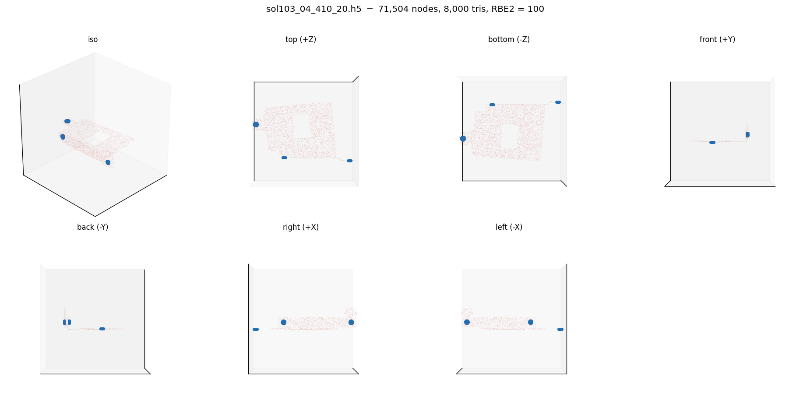
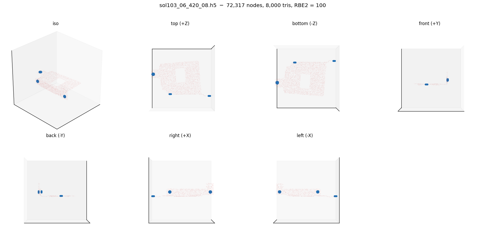
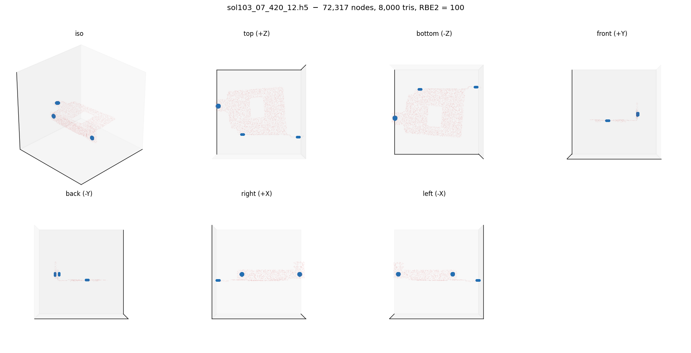
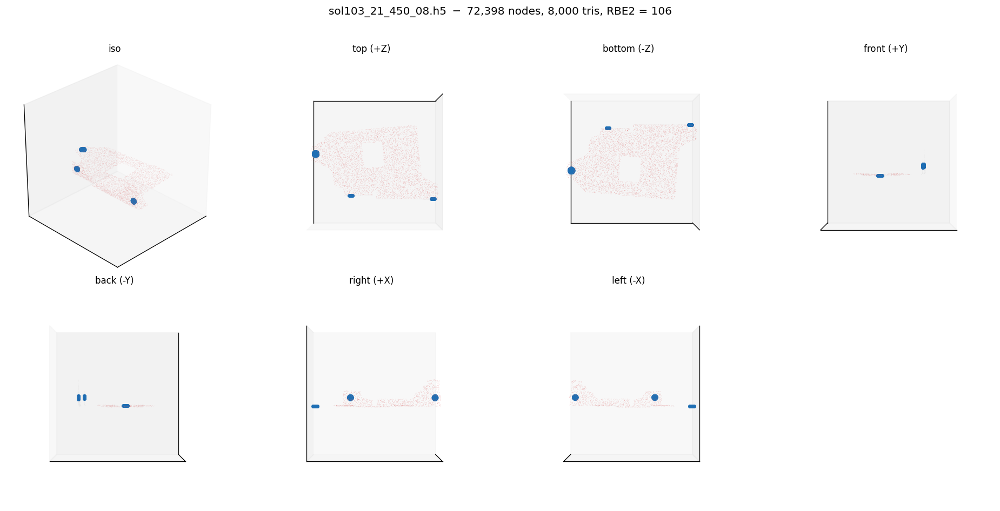
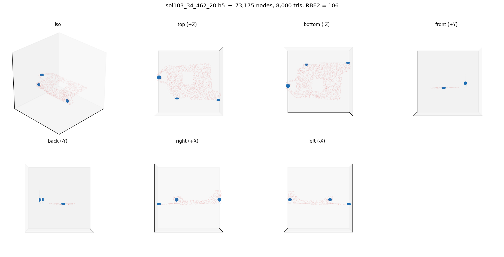
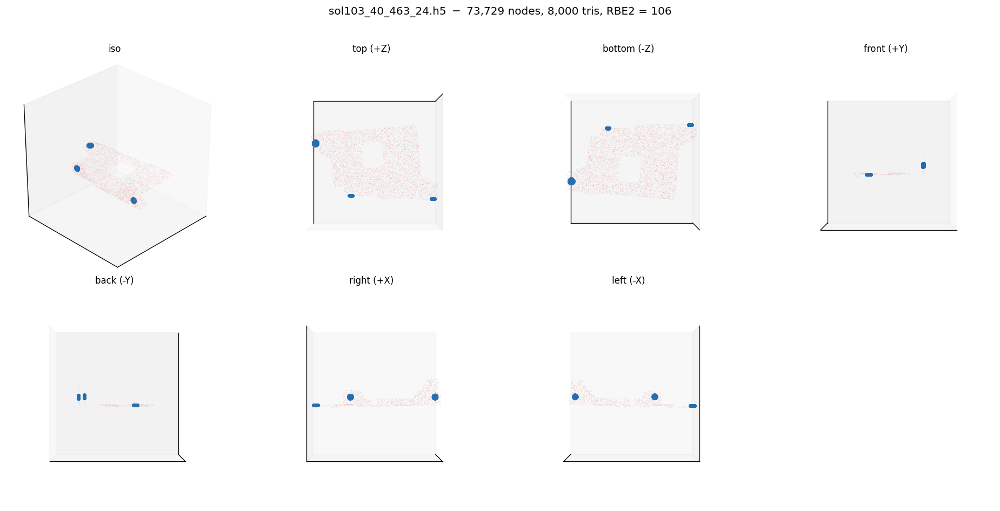

# HD Mobis bracket source-mesh views

Multi-view renders of every `sol103_*.h5` bracket from the data port. Each image grid shows seven viewpoints (iso + top / bottom / front / back / left / right). RBE2 (NSET) bolt-cluster nodes are blue dots; the editable sheet-metal surface is red.

Filenames follow the original `sol103_<idx>_<code>_<thk>` scheme: `<idx>` = sample index 01..40, `<code>` = geometry-variant code (410..463), `<thk>` = sheet thickness (08..24). Meshes decimated to 8,000 tris for render speed; "tris" column shows the original count.

Rendered with `origami_gen.corpus.mobis_bracket.visualize_source_mesh`.

## Sample summary

| # | Sample | Nodes | Tris | RBE2 |
|---:|---|---:|---:|---:|
| 1 | `sol103_01_410_08` | 71,504 | 140,912 | 100 |
| 2 | `sol103_02_410_12` | 71,504 | 140,912 | 100 |
| 3 | `sol103_03_410_16` | 71,504 | 140,912 | 100 |
| 4 | `sol103_04_410_20` | 71,504 | 140,912 | 100 |
| 5 | `sol103_05_410_24` | 71,504 | 140,912 | 100 |
| 6 | `sol103_06_420_08` | 72,317 | 142,503 | 100 |
| 7 | `sol103_07_420_12` | 72,317 | 142,503 | 100 |
| 8 | `sol103_08_420_16` | 72,317 | 142,503 | 100 |
| 9 | `sol103_09_420_20` | 72,317 | 142,503 | 100 |
| 10 | `sol103_10_420_24` | 72,317 | 142,503 | 100 |
| 11 | `sol103_11_430_08` | 75,457 | 148,793 | 106 |
| 12 | `sol103_12_430_12` | 75,457 | 148,793 | 106 |
| 13 | `sol103_13_430_16` | 75,457 | 148,793 | 106 |
| 14 | `sol103_14_430_20` | 75,457 | 148,793 | 106 |
| 15 | `sol103_15_430_24` | 75,457 | 148,793 | 106 |
| 16 | `sol103_16_440_08` | 83,735 | 165,249 | 106 |
| 17 | `sol103_17_440_12` | 83,735 | 165,249 | 106 |
| 18 | `sol103_18_440_16` | 83,735 | 165,249 | 106 |
| 19 | `sol103_19_440_20` | 83,735 | 165,249 | 106 |
| 20 | `sol103_20_440_24` | 83,735 | 165,249 | 106 |
| 21 | `sol103_21_450_08` | 72,398 | 142,715 | 106 |
| 22 | `sol103_22_450_12` | 72,398 | 142,715 | 106 |
| 23 | `sol103_23_450_16` | 72,398 | 142,715 | 106 |
| 24 | `sol103_24_450_20` | 72,398 | 142,715 | 106 |
| 25 | `sol103_25_450_24` | 72,398 | 142,715 | 106 |
| 26 | `sol103_26_461_08` | 74,302 | 146,501 | 106 |
| 27 | `sol103_27_461_12` | 74,302 | 146,501 | 106 |
| 28 | `sol103_28_461_16` | 74,302 | 146,501 | 106 |
| 29 | `sol103_29_461_20` | 74,302 | 146,501 | 106 |
| 30 | `sol103_30_461_24` | 74,302 | 146,501 | 106 |
| 31 | `sol103_31_462_08` | 73,175 | 144,071 | 106 |
| 32 | `sol103_32_462_12` | 73,175 | 144,071 | 106 |
| 33 | `sol103_33_462_16` | 73,175 | 144,071 | 106 |
| 34 | `sol103_34_462_20` | 73,175 | 144,071 | 106 |
| 35 | `sol103_35_462_24` | 73,175 | 144,071 | 106 |
| 36 | `sol103_36_463_08` | 73,729 | 145,334 | 106 |
| 37 | `sol103_37_463_12` | 73,729 | 145,334 | 106 |
| 38 | `sol103_38_463_16` | 73,729 | 145,334 | 106 |
| 39 | `sol103_39_463_20` | 73,729 | 145,334 | 106 |
| 40 | `sol103_40_463_24` | 73,729 | 145,334 | 106 |

## All views

### `sol103_01_410_08`

71,504 nodes · 140,912 triangles · 100 RBE2 nodes

### `sol103_02_410_12`

71,504 nodes · 140,912 triangles · 100 RBE2 nodes

### `sol103_03_410_16`

71,504 nodes · 140,912 triangles · 100 RBE2 nodes

### `sol103_04_410_20`

71,504 nodes · 140,912 triangles · 100 RBE2 nodes

### `sol103_05_410_24`

71,504 nodes · 140,912 triangles · 100 RBE2 nodes

### `sol103_06_420_08`

72,317 nodes · 142,503 triangles · 100 RBE2 nodes

### `sol103_07_420_12`

72,317 nodes · 142,503 triangles · 100 RBE2 nodes

### `sol103_08_420_16`

72,317 nodes · 142,503 triangles · 100 RBE2 nodes

### `sol103_09_420_20`

72,317 nodes · 142,503 triangles · 100 RBE2 nodes

### `sol103_10_420_24`

72,317 nodes · 142,503 triangles · 100 RBE2 nodes

### `sol103_11_430_08`

75,457 nodes · 148,793 triangles · 106 RBE2 nodes

### `sol103_12_430_12`

75,457 nodes · 148,793 triangles · 106 RBE2 nodes

### `sol103_13_430_16`

75,457 nodes · 148,793 triangles · 106 RBE2 nodes

### `sol103_14_430_20`

75,457 nodes · 148,793 triangles · 106 RBE2 nodes

### `sol103_15_430_24`

75,457 nodes · 148,793 triangles · 106 RBE2 nodes

### `sol103_16_440_08`

83,735 nodes · 165,249 triangles · 106 RBE2 nodes

### `sol103_17_440_12`

83,735 nodes · 165,249 triangles · 106 RBE2 nodes

### `sol103_18_440_16`

83,735 nodes · 165,249 triangles · 106 RBE2 nodes

### `sol103_19_440_20`

83,735 nodes · 165,249 triangles · 106 RBE2 nodes

### `sol103_20_440_24`

83,735 nodes · 165,249 triangles · 106 RBE2 nodes

### `sol103_21_450_08`

72,398 nodes · 142,715 triangles · 106 RBE2 nodes

### `sol103_22_450_12`

72,398 nodes · 142,715 triangles · 106 RBE2 nodes

### `sol103_23_450_16`

72,398 nodes · 142,715 triangles · 106 RBE2 nodes

### `sol103_24_450_20`

72,398 nodes · 142,715 triangles · 106 RBE2 nodes

### `sol103_25_450_24`

72,398 nodes · 142,715 triangles · 106 RBE2 nodes

### `sol103_26_461_08`

74,302 nodes · 146,501 triangles · 106 RBE2 nodes

### `sol103_27_461_12`

74,302 nodes · 146,501 triangles · 106 RBE2 nodes

### `sol103_28_461_16`

74,302 nodes · 146,501 triangles · 106 RBE2 nodes

### `sol103_29_461_20`

74,302 nodes · 146,501 triangles · 106 RBE2 nodes

### `sol103_30_461_24`

74,302 nodes · 146,501 triangles · 106 RBE2 nodes

### `sol103_31_462_08`

73,175 nodes · 144,071 triangles · 106 RBE2 nodes

### `sol103_32_462_12`

73,175 nodes · 144,071 triangles · 106 RBE2 nodes

### `sol103_33_462_16`

73,175 nodes · 144,071 triangles · 106 RBE2 nodes

### `sol103_34_462_20`

73,175 nodes · 144,071 triangles · 106 RBE2 nodes

### `sol103_35_462_24`

73,175 nodes · 144,071 triangles · 106 RBE2 nodes

### `sol103_36_463_08`

73,729 nodes · 145,334 triangles · 106 RBE2 nodes

### `sol103_37_463_12`

73,729 nodes · 145,334 triangles · 106 RBE2 nodes

### `sol103_38_463_16`

73,729 nodes · 145,334 triangles · 106 RBE2 nodes

### `sol103_39_463_20`

73,729 nodes · 145,334 triangles · 106 RBE2 nodes

### `sol103_40_463_24`

73,729 nodes · 145,334 triangles · 106 RBE2 nodes

