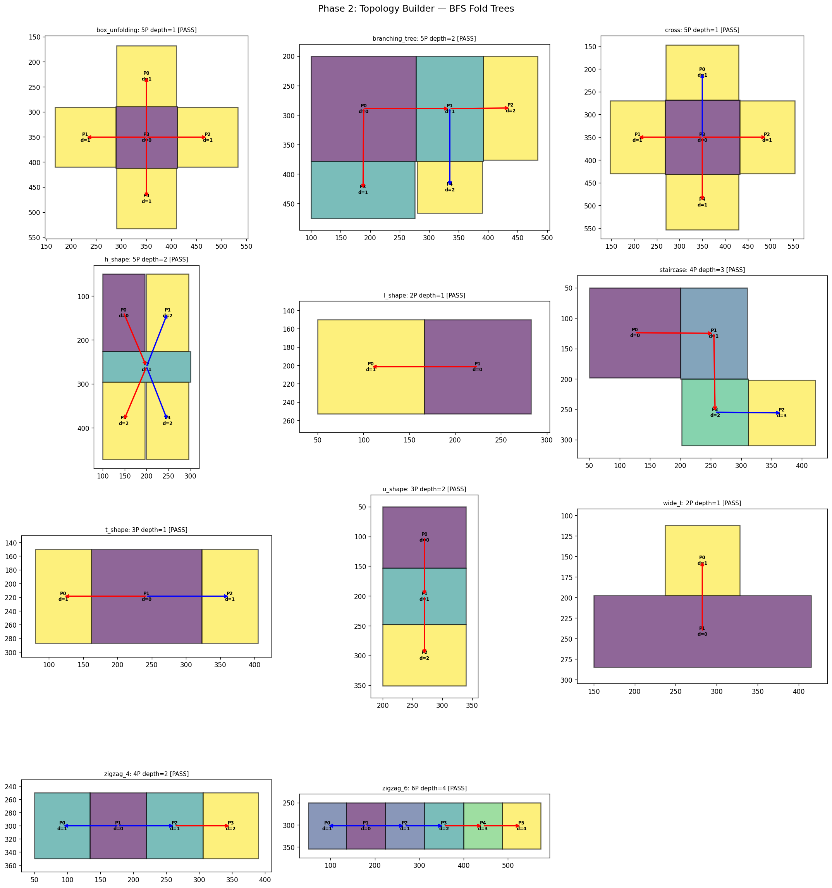
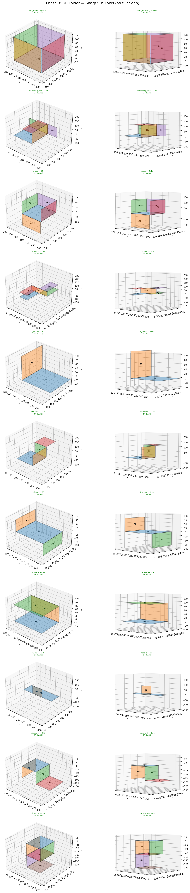
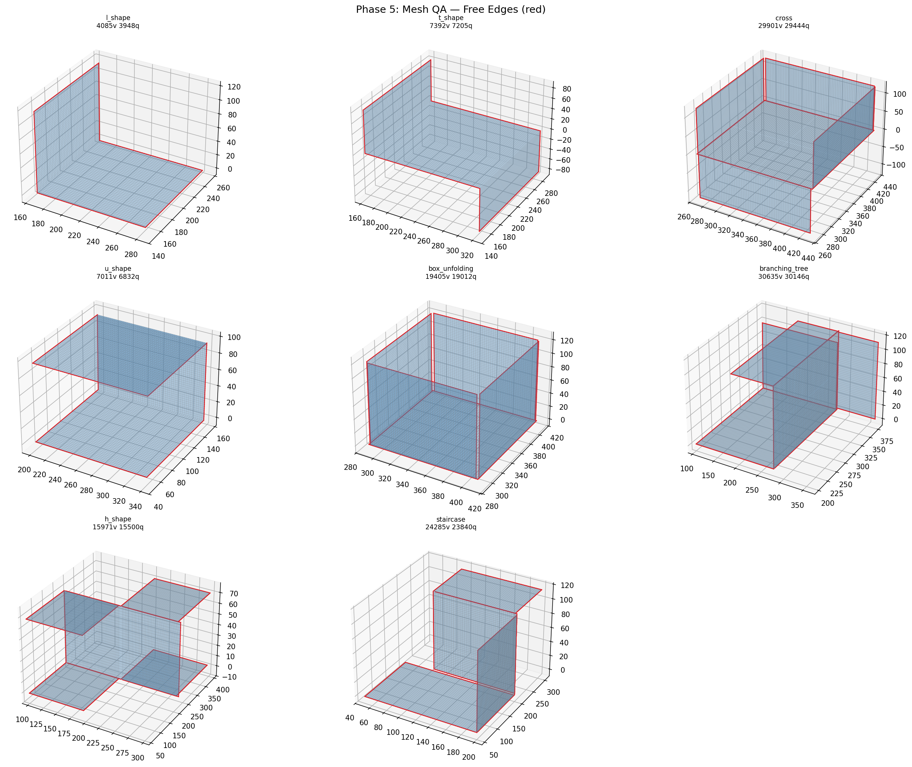
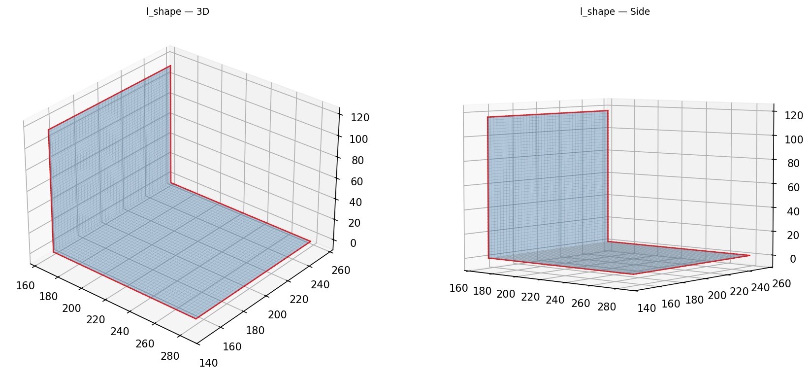
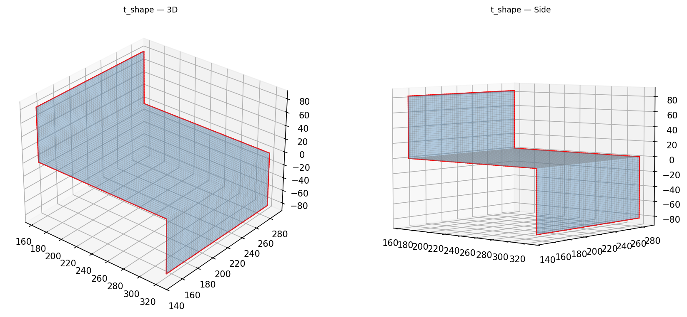
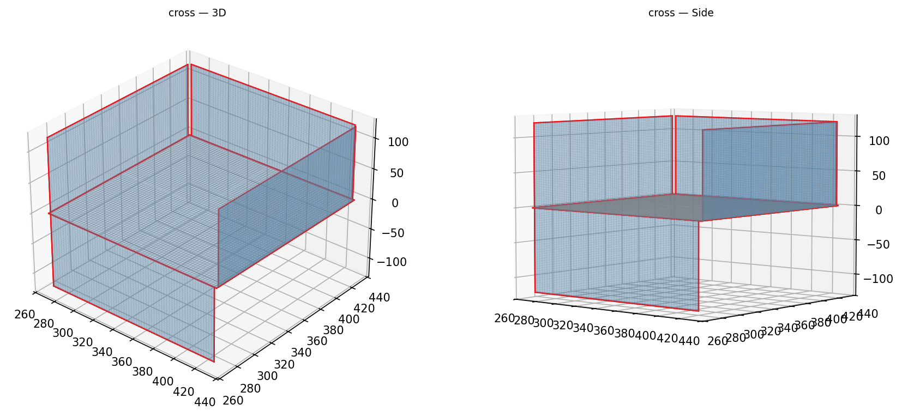
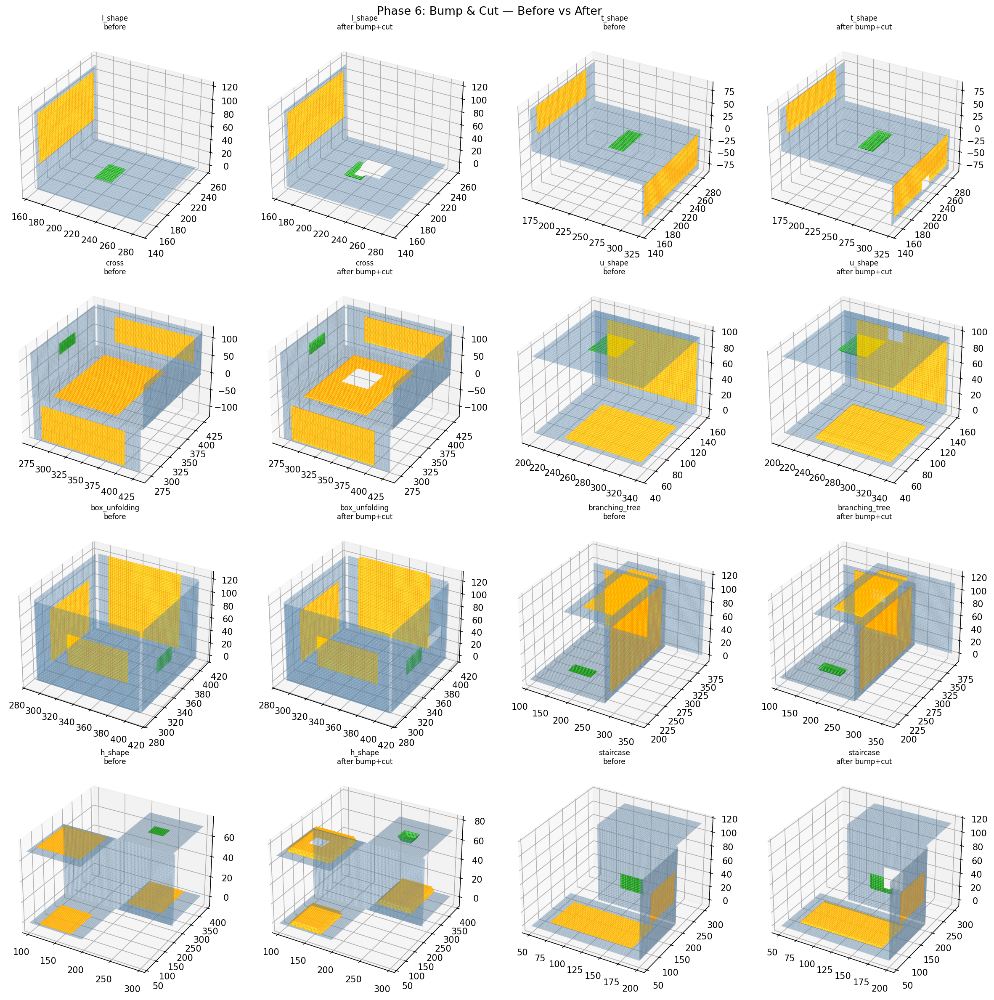
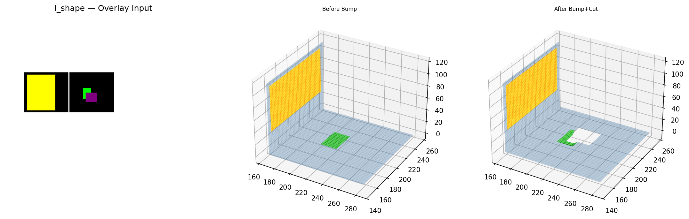
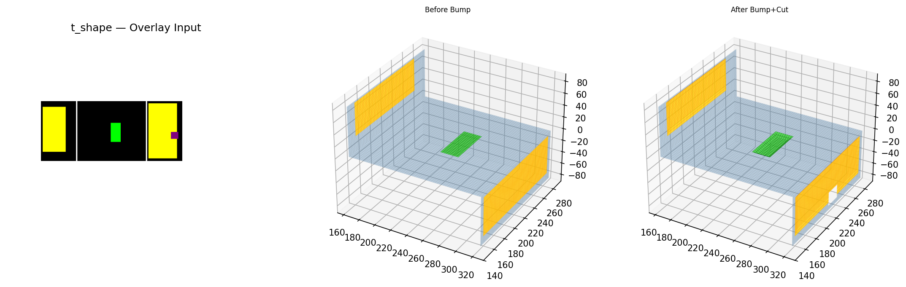
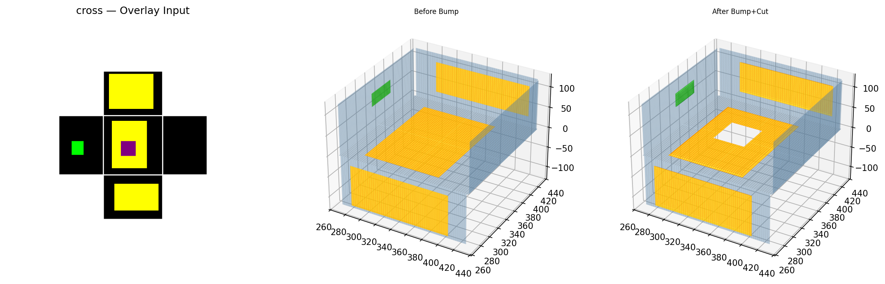

# Output Port for Claude

**Timezone: KST (UTC+9)**

---

# Origami-Gemini-Gen — Full Pipeline (2026-04-23 11:47 KST)

Structural vertex sharing at fold edges. All 33 folds connected. Phases 0-6.

## Phase 0: Test Image Generator

## Phase 1: Image Parser

## Phase 2: Topology Builder

## Phase 3: 3D Folder

## Phase 4: Mesh Generator

## Phase 5: Free Edge QA

### L-Shape Detail

### T-Shape Detail

### Cross Detail

## Phase 6: Bump & Cut

### L-Shape Detail

### T-Shape Detail

### Cross Detail

