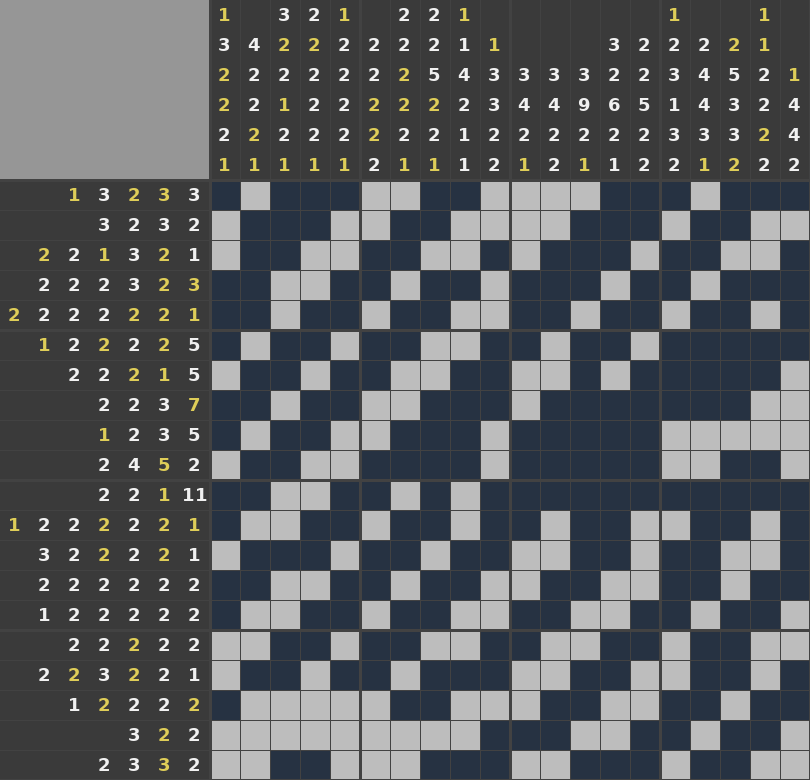
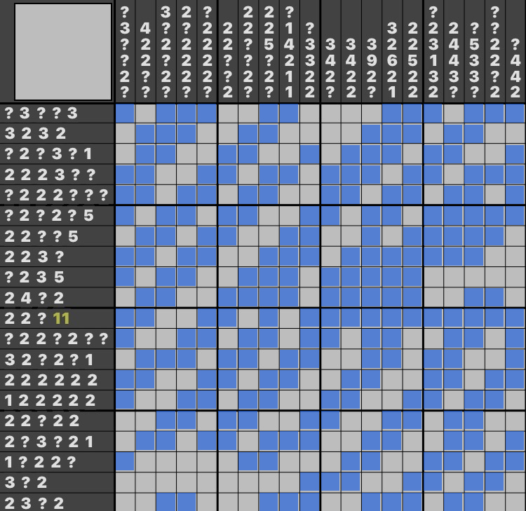
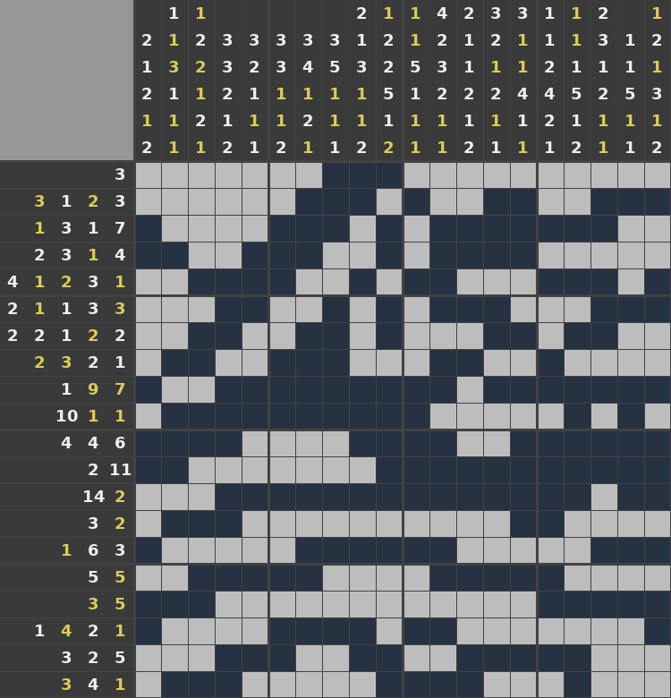
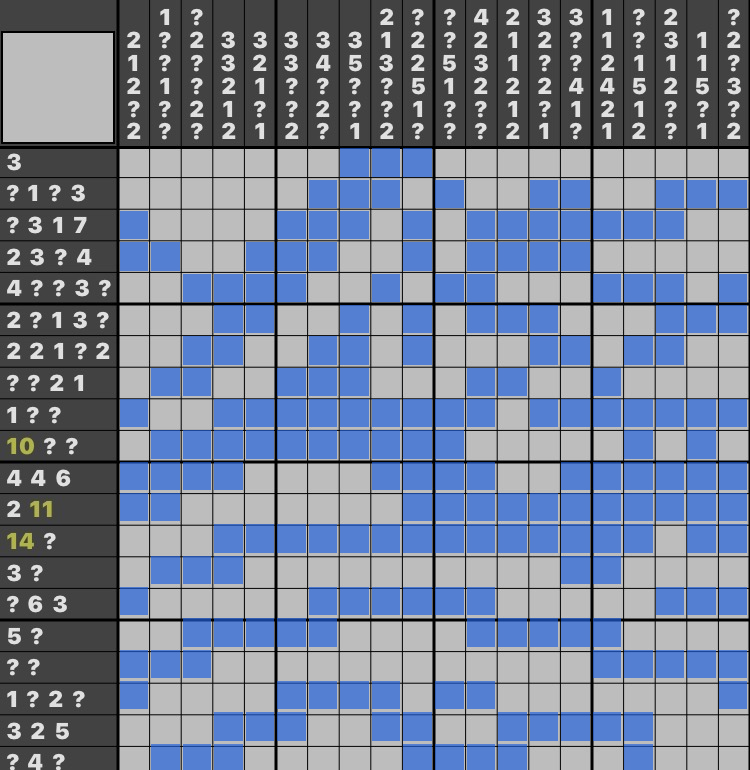

# Nonogram pipeline — results

Repo: private `SungminLee511/Nonogram`.

Read with OpenCV template matching (no OCR engine), solved with CP-SAT.
Both boards 20x20, every clue number read correctly, and each board has
**exactly one solution** (verified by full enumeration: 400/400 cells forced).

Amber clue numbers = the ones hidden behind `?` on screen, printed as the
length they turned out to be.

## `IMG_3374.jpeg`

solved 0.38 s

## `IMG_3377.jpeg`

solved 0.45 s — the harder read: two-digit clues (`10`, `11`, `14`) and the
only `0`/`7`/`9` glyphs in the set.

## Correction

An earlier run reported 654 solutions for `IMG_3374`. That was wrong: one
template in the glyph bank was labelled `?` but was really a `6`, so two column
clues lost their digits. A misread digit-to-`?` only widens the search space,
so nothing downstream could contradict it. Bank rebuilt from both screenshots;
both boards are now unique.
