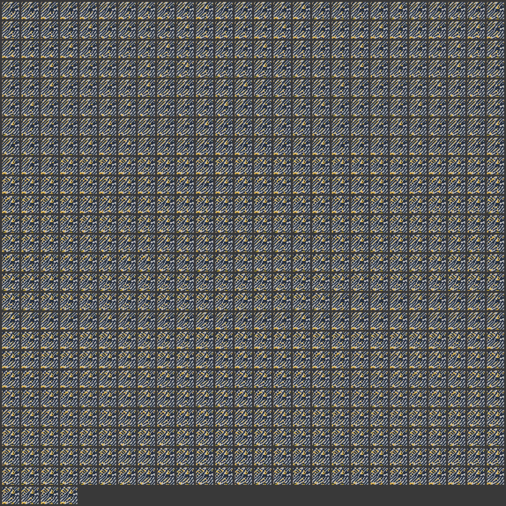
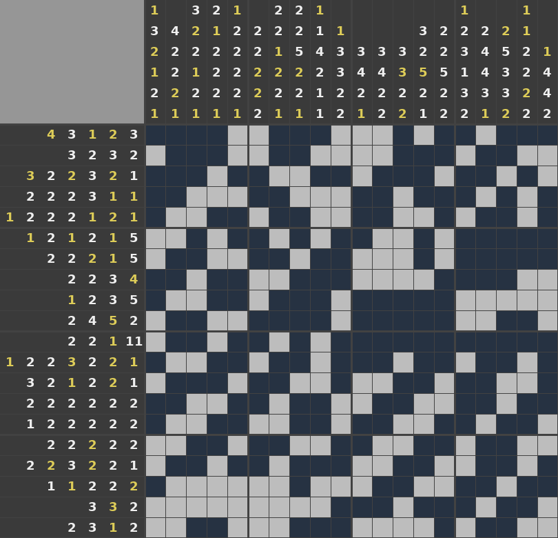
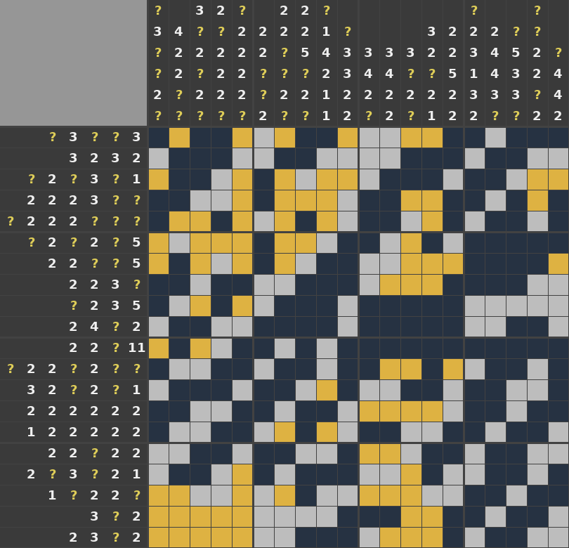
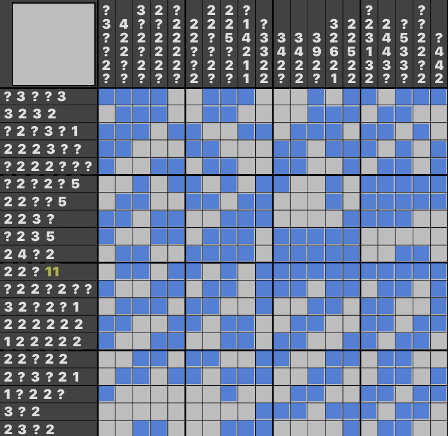

# Nonogram pipeline — results for `input/IMG_3374.jpeg`

Repo: private `SungminLee511/Nonogram`.

Read with OpenCV template matching (no OCR engine), solved with CP-SAT.
Grid detected as 20x20; all 208 clue numbers read correctly (min NCC 0.756),
68 of them are `?`.

**The board is under-determined**: the clues admit **exactly 654** valid
pictures — enumerated and proved complete by CP-SAT in 0.95 s.
316 of 400 cells are provably forced, 84 are genuinely free.

## All 654 solutions

`python -m nonogram all input/IMG_3374.jpeg` — every solution as a thumbnail.
Nearly the same picture each time; amber marks the 84 free cells.

## One valid solution

## What is provably true

dark = filled in every solution, light = empty in every solution,
amber = the clues cannot decide.

## Solution painted onto the original screenshot

