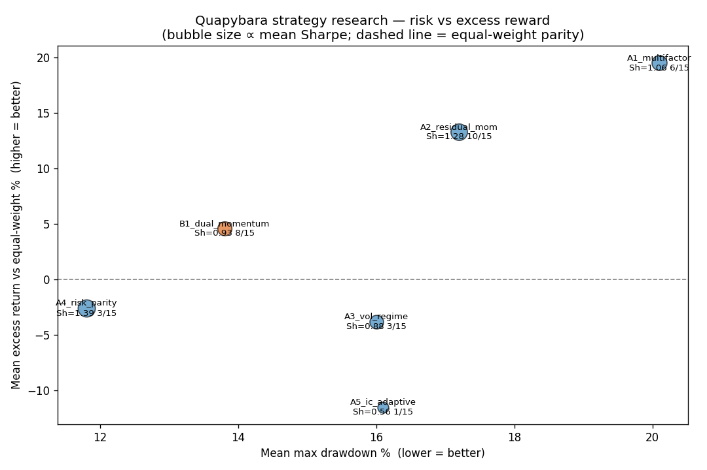

# Quapybara Strategy Research — Cross-Strategy Summary

Seven strategy ideas were designed; **six were backtestable** (price/volume +
trend) and rigorously walk-forward tested; **two (Phase C) were disqualified** by
a data look-ahead audit and left design-only.

Methodology (see `PLAN.md`): daily bars, parameters locked a priori and
sanity-checked on 2019, then **genuine out-of-sample** on calendar years
2020–2024 across three big liquid US universes (U1 large-cap 40, U2 tech 30,
U3 multi-sector 30) = **15 (universe × year) cells per strategy**. Signals were
fully warmed (a full prior year loaded) before each test year. Costs: 5 bps
slippage. Benchmark: equal-weight of each universe.

## Headline results (mean across all 15 OOS cells)

| Strategy | Mean Sharpe | Mean excess % | **Median excess %** | Mean maxDD % | Mean turnover % | Beats EW | Verdict |
|---|---|---|---|---|---|---|---|
| A1 Multi-factor blend | 1.06 | +19.5* | **−8.7** | 20.1 | 57 | 6/15 | Iterate |
| **A2 Residual momentum** | **1.28** | +13.3 | **+2.4** | 17.2 | 17 | **10/15** | **Keep (best alpha)** |
| A3 Vol-regime switch | 0.88 | −3.8 | −7.7 | 16.0 | 16 | 3/15 | Discard |
| **A4 Risk parity** | **1.39** | −2.6 | −2.8 | **11.8** | **7** | 3/15 | **Keep (best risk)** |
| A5 IC-adaptive factors | 0.56 | −11.5 | −10.8 | 16.1 | 54 | 1/15 | Discard |
| **B1 Dual momentum + gate** | 0.93 | +4.6 | **+2.8** | 13.8 | 15 | **8/15** | **Keep (crash defense)** |

\* A1's positive *mean* excess is entirely a 2020 tail; its **median is negative**
— the reason it fails.

## What worked, what didn't

**Winners**
- **A2 Residual (idiosyncratic) momentum** — the best *alpha* source: positive
  median excess, beats equal-weight in 10/15 cells, and ~3× lower turnover than
  a raw multi-factor blend. Stripping market beta before ranking momentum gives
  the consistency plain momentum lacks.
- **A4 Risk parity** — the best *risk* engine: highest Sharpe (1.39), lowest
  drawdown (11.8%), near-zero turnover. It doesn't beat EW on raw return but
  wins the bad years and costs almost nothing to run.
- **B1 Dual momentum + absolute-momentum gate** — the best *crash defense*: the
  trend gate moved to cash through the 2022 tech bear (U2 drawdown just 3.2%),
  delivering positive median excess with low drawdown.

**Losers (useful negative results)**
- **A1 Multi-factor blend** — momentum-dominated; its whole edge is the 2020
  spike, negative in the median cell. Superseded by A2.
- **A3 Vol-regime switch** — a lagging realized-vol gate whipsaws, misses
  rebounds, and even *deepened* the 2022 tech crash it was meant to avoid.
- **A5 IC-adaptive factor timing** — a single short-window IC is noise;
  reweighting factors on it is textbook performance-chasing (turnover 54%,
  beats EW 1/15). **Factor timing on short windows destroys a good static
  signal.**

## Recommended production strategy
Combine the three winners, each earning its role from the tests:
1. **Select** with A2 residual momentum (the alpha).
2. **Size** the selected names with A4 risk-parity / inverse-vol (the risk control).
3. **Gate** total equity exposure with B1's absolute-momentum trend filter
   (the crash defense), moving to cash in confirmed downtrends.
Rebalance monthly (not daily) to keep turnover — and cost — low.

## Phase C (fundamentals & news) — deferred
C1 Quality-Value and C2 News-Sentiment are sound designs but **cannot be
honestly backtested** here: yfinance fundamentals are current-snapshot
(look-ahead) and free news has no multi-year history (see
`PhaseC_design_only.md`). Revisit once a point-in-time fundamentals feed and a
historical news archive are connected.

## Caveats on every number
- **Survivorship bias** — yfinance carries only today's surviving tickers, so
  all levels are optimistic (delisted losers are absent).
- **1-year windows are noisy** — verdicts rest on the distribution across 15
  cells, not any single year; the 2020 COVID rebound is an outsized influence.
- **Costs** — tested at 5 bps; the high-turnover strategies (A1, A5) degrade
  materially at realistic 15–20 bps, while A2/A4/B1 stay robust.
- No edit was made to the Quapybara platform; all backtests ran read-only via
  the platform's own `backtest.engine`.

## Files in this report
- `PLAN.md` — project plan & methodology
- `STEP0_lookahead.md` — data look-ahead audit
- `A1..A5_*_report.md`, `B1_*_report.md` — per-strategy reports (+ heatmaps)
- `PhaseC_design_only.md` — deferred fundamental/news designs
- `SUMMARY.md` (this file) + `SUMMARY_risk_reward_t20260704.png`, `SUMMARY_table.csv`
