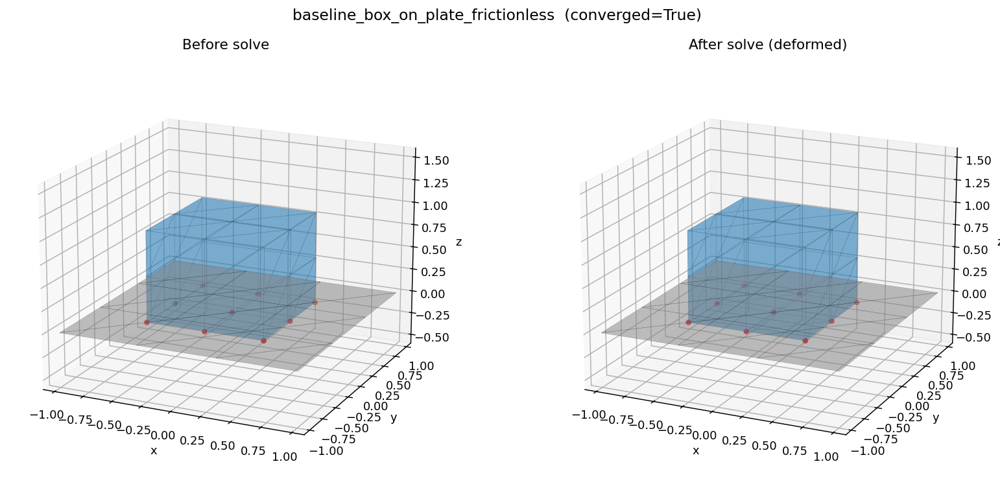
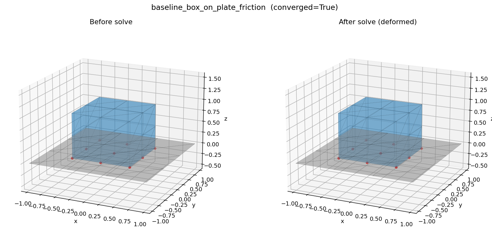
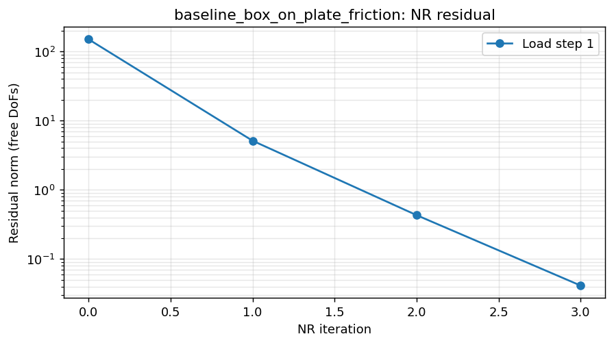
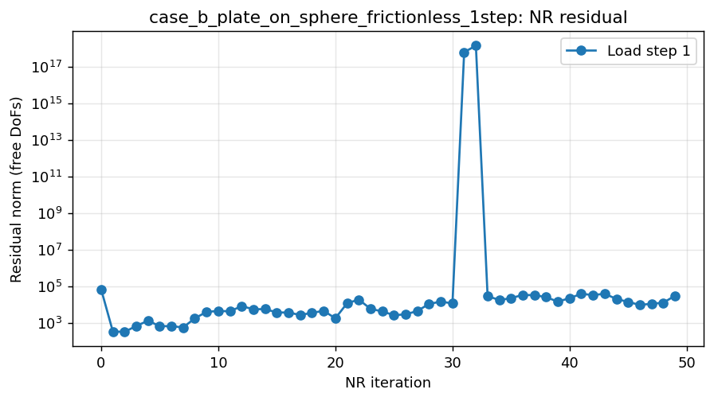
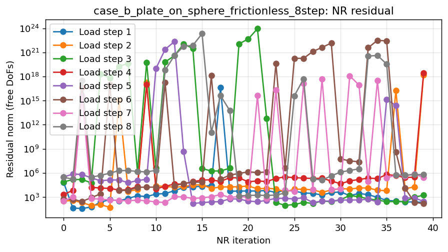
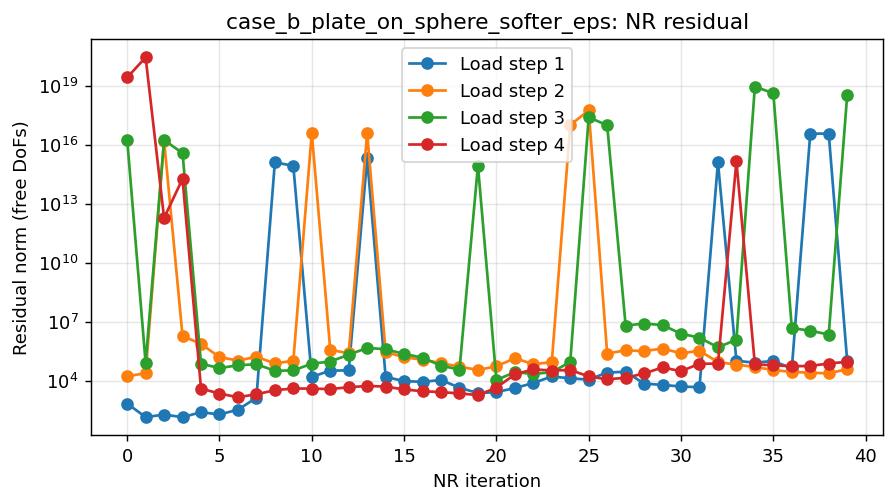

# Curved Contact Validation — MESHnSOLVERS

**Date:** 2026-05-27 KST
**Source:** `SOLVERX/MESHnSOLVERS/tests/curved_contact_validation/`
**Solver under test:** `static_structure_solver_with_contact` in `postprocess/solver.py`

---

## Background

A user reported:

> *"I'm using this solver to produce data for a robot hand grasping various
> objects. For right-angled objects, contact behaves well if set up correctly.
> But for things like **spheres**, it does not work well."*

This validation set reproduces the claim with four synthetic geometries,
captures full Newton-Raphson convergence logs, and diagnoses root causes.

---

## Verdict

**CLAIM CONFIRMED.** The penalty N2S contact solver has severe stability
problems whenever a curved master surface is involved, and friction breaks it
even further — including on a curved slave against a *flat* master.

See **[`FINDINGS.md`](FINDINGS.md)** for the full analysis.

---

## Results at a glance

| Case | Geometry | Friction | Converged | Final residual | Max ‖u‖ (m) |
|---|---|---|---|---|---|
| baseline | box ↔ flat plate | — | ✅ 2 iters | 7.3e-13 | 1.2e-4 |
| baseline | box ↔ flat plate | μs=0.3 | ✅ 4 iters | 4.1e-2 | 1.2e-4 |
| a-frictionless-1step | sphere(slave) ↔ flat plate | — | ✅ 2 iters | 1.0e-10 | 4.4e-3 |
| a-frictionless-4step | sphere(slave) ↔ flat plate | — | ✅ 8 iters | 7.1e-10 | 3.1e-2 |
| **a-friction-4step** | sphere(slave) ↔ flat plate | μs=0.3 | ❌ blew up | **1.1e+17** | **1.7e+14** |
| **b-frictionless-1step** | punch ↔ sphere master | — | ❌ | 3.0e+4 | 2.6e+13 |
| **b-frictionless-8step** | punch ↔ sphere master | — | ❌ | 6.1e+5 | 1.0e+14 |
| **b-friction-8step** | punch ↔ sphere master | μs=0.3 | ❌ | 2.7e+45 | 1.9e+39 |
| **c-frictionless-1step** | two pads ↔ sphere | — | ❌ | 5.8e+22 | 1.8e+18 |
| **c-friction-8step** | two pads ↔ sphere | μs=0.5 | ❌ | **5.8e+79** | 4.7e+73 |

Bold rows are the failures of interest.

---

## Geometry — before / after renders

### Baseline (works): box on plate

| Frictionless | With friction |
|---|---|
|  |  |

Both clean. Box settles into plate, deformations are small and physical.

### Case A: sphere on flat plate

Frictionless converges. With friction it blows up.

| 4-step frictionless (OK) | 4-step friction (BLEW UP) |
|---|---|
|  |  |

The friction "After" image shows the sphere flying off into 10¹⁴ m
displacement territory — this is the failure.

### Case B: punch on top of sphere (curved master)

Every variant fails. The frictionless single-step:


The punch passes straight through the sphere and continues to ‖u‖ ≈ 10¹³ m.
Eight load steps and a softer penalty do not fix this — only soften the
blow-up rate.

### Case C: two-finger grasp

Catastrophic across the board:


Residual reaches **10⁷⁹** — this is the worst case in the set.

---

## Convergence plots (residual vs NR iteration, log scale)

### Baseline — clean monotone decay

| Frictionless | Friction |
|---|---|
|  |  |

### Case A — friction detonation at step 3


Steps 1 and 2 converge fast; step 3 jumps from 10² to 10¹⁷ within 2 iters
and never recovers.

### Case B — frictionless, sphere master

| 1 step | 8 steps | softer ε |
|---|---|---|
|  |  |  |

Every variant oscillates in the 10³–10⁵ band, never reaches `nr_tol=1e-3`.

### Case C — two-finger grasp

| Frictionless 1-step | Frictionless 8-step | Friction 8-step |
|---|---|---|
|  |  |  |

Friction case climbs through **10⁷⁹** — total numerical blow-up.

---

## Why "boxes work"

In the baseline:
- Master = plate, 18 triangles, **all coplanar**.
- Every per-face normal is +ẑ.
- Closest-face index for each slave never changes → `n` is constant → `K_N`
  is constant → NR's linearization is exact in one step.

Any curved master breaks this immediately.

---

## Root-cause hypotheses (full analysis in `FINDINGS.md`)

1. **Per-face flat normals jump face-to-face on a curved master.**
   `igl.per_face_normals[f_idx]` flips between NR iters as the closest face
   changes → contact direction rotates by a finite amount → linearization is
   wrong.

2. **`compute_triangle_barycentric_gpu` clamps weights to [0,1]** (solver.py
   line 329). Closest points on edges/vertices of a faceted sphere get
   spurious 0/1 jumps in shape functions.

3. **Friction Δu_T has no history** and the tangent-plane projection
   `P = I - nnᵀ` flips with the normal. Even on a flat master (case A),
   friction blew up because the curved slave's Δu_T projection still flickers.

4. Simplified slip tangent ignores the non-symmetric `μ_d · ε_N · t̂ ⊗ n`
   term (already flagged in `MESHnSOLVERS/.claude/TODO/friction_contact.md`).

---

## Top recommended fix

**Smooth per-vertex normals on curved masters**, interpolated by barycentric
weight on the chosen triangle, instead of flat per-face normals. Standard
N2S-FEA fix. ~30 lines of code. Removes hypothesis #1 entirely. Highest
impact-per-effort.

---

## File layout

```
curved_contact_validation_t20260527/
├── README.md                # this file
├── README_original.md       # original in-repo README
├── FINDINGS.md              # full root-cause analysis
├── mesh_gen.py              # box / icosphere / plate / pad generators
├── runner.py                # NR-log capture, viz, JSON metrics
├── case_baseline_box_on_plate.py    ✅
├── case_a_sphere_on_plate.py        ✅ frictionless / ❌ friction
├── case_b_plate_on_sphere.py        ❌ all variants
├── case_c_two_finger_grasp.py       ❌ catastrophic
├── run_all.py
└── results/                 # 48 files: console logs + PNG + JSON per variant
```
