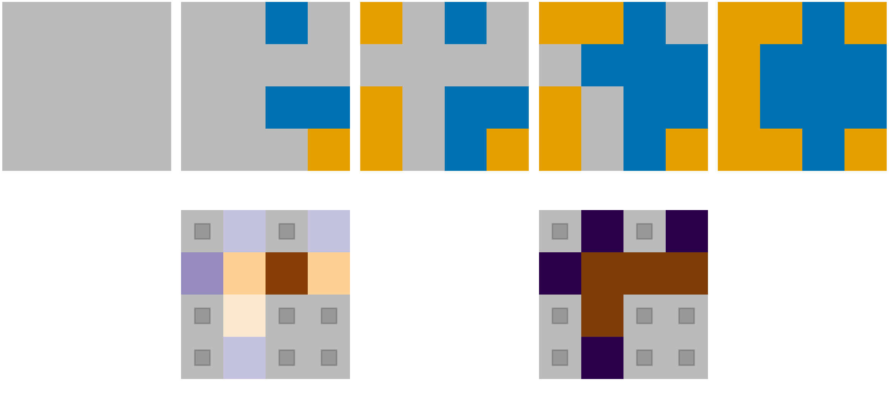
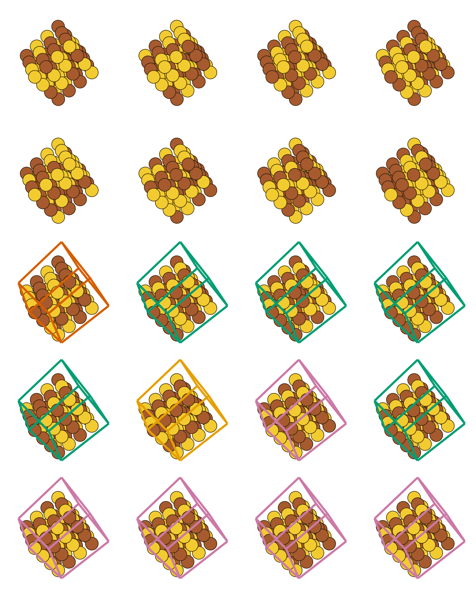

# TMLR figure drafts (evaluation only)

No retraining, no `ckpt/*/results.json` touched, nothing written into
`iasbs_tmlr`. Every panel is recorded in `manifest.json` with its checkpoint
dir, seed, weights (live for annealed-temperature runs, EMA otherwise), sample
RNG seed and selection rule. Sample RNG seed is 0 everywhere; no cherry-picking.

## F2 — demasking filmstrip (`demasking_ising4_beta0.5`, seed 0, EMA)

Top row: one trajectory after 0 / 4 / 8 / 12 / 16 reveals (grey = masked,
blue = +1, orange = −1). Bottom: the 8-reveal frame twice, masked sites shaded
by (left) the terminal operator's P(+1) and (right) the one-hot terminal
symbol. Raw: `frames.json` (states + urn counts per frame, reveal order),
`labels_8reveal.csv`.

## F3 — Cu–Au 4×4×4 supercells

Rows: reference 1200 K, learned 1200 K, reference 680 K, learned 680 K
(seed 2, coverage 0.01395 — closest to 0.014), collapsed 680 K seed 1
(coverage 0.667). Au gold, Cu copper; cell outline colours the L1₀ variant
(6 colours), no outline when LRO ≤ 0.5. Raw: `lro_variants.json/.csv`,
`<panel>/sample{0..3}.extxyz`.

## F4 — sphere samples, E = 6(1 − x₃²), τ = 1, Haar source, 500 steps

Left: reflection-trained (`sphere_haar_I_refl` seed 0), P(x₃>0) = 0.4988.
Right: no reflection, seed 2 — the largest |P(x₃>0) − ½| of the three seeds,
P(x₃>0) = 0.5574. Points coloured by x₃ (diverging PuOr), camera along −e₁ so
both poles are visible; front hemisphere drawn, all 5000 samples in the CSVs.

## F7 — 16×16 lattice snapshots

Learned (left 4) beside Swendsen–Wang reference (right 4). Rows: canonical
Ising β = 0.4407; free Ising β = 0.28 / 0.4407 / 0.6; free 3-state Potts
β = 0.5 / 1.005 / 1.2. Greyscale for Ising, three colours for Potts.
Raw: `samples.json`, `samples.csv`.
