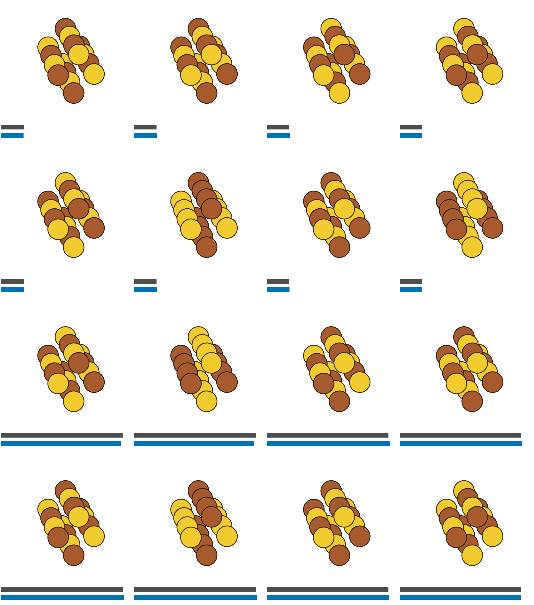
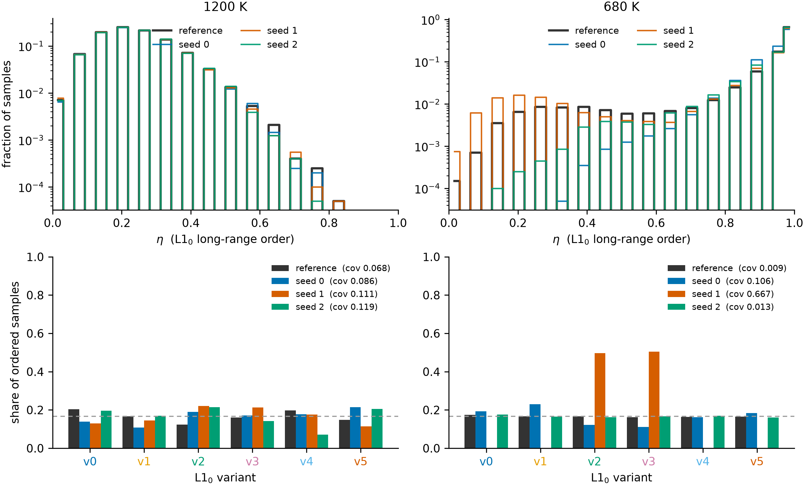

# TMLR figure drafts (evaluation only)

No retraining, no `ckpt/*/results.json` touched, nothing written into
`iasbs_tmlr`. Every panel is recorded in `manifest.json` with its checkpoint
dir, seed, weights (live for annealed-temperature runs, EMA otherwise), sample
RNG seed and selection rule. Sample RNG seed is 0 everywhere; no cherry-picking.

## F3 — Cu–Au 2×2×4, the four most probable configurations

16 fcc sites at x_Au = ½, so the canonical law is **enumerable**:
C(16,8) = 12870 states, p_exact = softmax(−E/τ) over the whole space. The
learned law is the empirical frequency of 500 000 draws (seed 0) matched to the
enumeration by an exact bit code — no binning, no kernel.

Four rows — exact and learned at 1200 K (τ = 0.1034), then exact and learned at
680 K (τ = 0.0586). **Every row is ranked by its own law**, so the rows agree
only if the model puts its mass on the same configurations; they do, and in both
cases the top four are exactly-degenerate L1₀ variants. Under each cell:
dark-grey bar = p_exact, blue bar = p_learned, one common scale for all four
rows, so the 5× mass concentration at 680 K is the visible difference.

| row | p_exact (each of 4) | p_learned | TV over all 12870 states |
|---|---|---|---|
| 1200 K exact | 0.02723 | 0.02697 – 0.02790 | 0.0592 |
| 1200 K learned | 0.02723 | 0.02708 – 0.02790 | 0.0592 |
| 680 K exact | 0.14846 | 0.14632 – 0.15032 | 0.0551 |
| 680 K learned | 0.14846 | 0.14827 – 0.15032 | 0.0551 |

Au gold, Cu copper, no cell outline. Raw: `top4.json`, `top4.csv`,
`law_<T>.npz` (p_exact, p_learned, count, energy, LRO, variant for all 12870
states), `<row>/top{0..3}.extxyz`.

## F5 — Cu–Au 4×4×4 order statistics (the non-enumerable companion to F3)

64 sites, so no enumeration: the model is judged on the order parameter and on
how it spreads over the six symmetry-equivalent L1₀ variants. Variant share is
the one statistic the symmetry cannot hide — E, η and α₁ are all invariant under
the operations that exchange variants. Reference = every stored symmetrised MC
sample; learned = 20 000 draws per seed (RNG seed 0, no filtering).

Top: η histogram (log y). Bottom: variant shares among ordered samples
(η > 0.5), dashed line = 1/6.

| T | source | coverage TV | ordered frac | mean η | α₁ |
|---|---|---|---|---|---|
| 1200 K | reference | 0.068 | — | — | — |
| 1200 K | seeds 0/1/2 | 0.087 / 0.111 / 0.119 | 0.008 / 0.007 / 0.006 | 0.225 | −0.053 |
| 680 K | reference | 0.009 | — | — | — |
| 680 K | seeds 0/1/2 | 0.106 / **0.667** / 0.013 | 0.998 / 0.923 / 0.988 | 0.956 / 0.909 / 0.955 | −0.308 / −0.291 / −0.308 |

Seed 1 at 680 K collapses onto two variants (v2, v3 ≈ 0.5 each) while its η and
α₁ look healthy — exactly the failure the share plot is there to expose. Raw:
`order_stats.json`, `variant_shares.csv`. This figure keeps its axes because it
is quantitative.

## F4 — sphere samples, E = 6(1 − x₃²), τ = 1, Haar source, 500 steps

Left: reflection-trained (`sphere_haar_I_refl` seed 0), P(x₃>0) = 0.4988.
Right: no reflection, seed 2 — the largest |P(x₃>0) − ½| of the three seeds,
P(x₃>0) = 0.5574. Points coloured by x₃ (diverging PuOr), camera along −e₁ so
both poles are visible; front hemisphere drawn, all 5000 samples in the CSVs.

## F7 — 16×16 lattice snapshots

Learned (left 4) beside Swendsen–Wang reference (right 4). Rows: canonical
Ising β = 0.4407; free Ising β = 0.28 / 0.4407 / 0.6; free 3-state Potts
β = 0.5 / 1.005 / 1.2. Greyscale for Ising, three colours for Potts.
Raw: `samples.json`, `samples.csv`.
